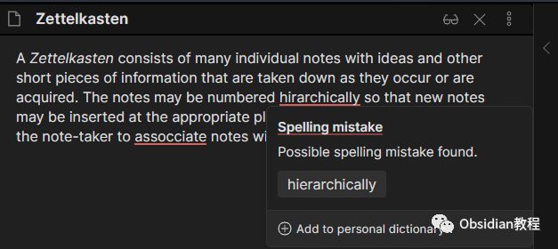
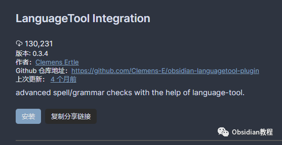
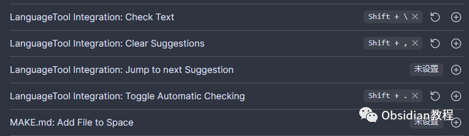
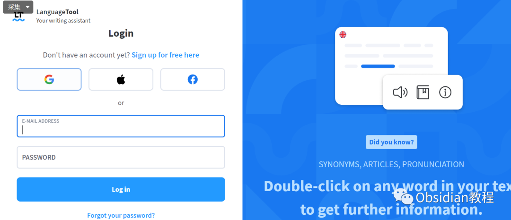
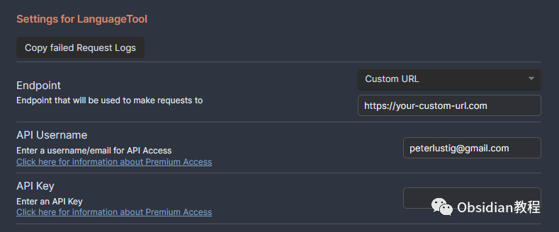

# Obsidian插件：LanguageTool高级语法和拼写检查工具

Obsidian LanguageTool 插件是一个用于 Obsidian.md 的插件，集成了 LanguageTool 功能，为用户提供高级语法和拼写检查。  

下面是这个插件的详细使用教程，适用于不同水平的用户。

#### 

1插件简介

  * 维护模式：该插件目前处于维护模式，除非出现问题，否则不会进一步更新。但开发者欢迎用户提交问题或建议，并接受 Pull Request。
  * 隐私考虑：如果担心笔记隐私问题，建议在本地PC或服务器上自行托管 LanguageTool。可以使用 Docker 镜像来实现。

#### 2插件安装步骤

  
**禁用安全模式：** 在 Obsidian 的“设置/社区插件”中，禁用“安全模式”（请注意阅读安全警告）。  
**安装插件：**  

### **1.在线安装**（需要科学上网） ：****

### ****  
****

### 点击“社区插件”下的“浏览”按钮，在左上角的搜索框中搜索“LanguageTool Integration”，然后点击“安装”按钮。

  
启用插件：安装成功后，点击“启用”以启用插件。  

  
**2.离线安装：****  
****因为网络原因很多同学无法直接在线安装obsidian插件，这里我已经把obsidian所有热门插件下载好了**  
只需要关注下方公众号，后台回复：**插件** 即可获取  

#### **设置与使用**

  
**设置快捷键：** 安装并启用插件后，你可以在“设置/快捷键”下为 LanguageTool 设置三个快捷键。这些快捷键在“LanguageTool Integration”描述下可通过筛选搜索字段快速找到，确保这些快捷键与 Obsidian 内置的拼写检查功能（如果启用）不冲突。  

**检查文本 ：**选中特定文字后按下快捷键，即可检查选中的单词、句子或段落。点击 LanguageTool 标记为可能拼写错误的红色下划线单词，将显示一个弹出窗口，提供纠正建议，还可以将该单词添加到个人词典中。  
**清除建议 ：**清除文档或选中文本中所有未更正或更改的红色下划线单词或段落。  
**切换自动检查 ：**打开/关闭在写作或更改文档内容时的自动拼写检查功能。  
**语言自动检测：** LanguageTool 会尝试自动检测使用的语言。通常不需要手动选择特定语言（在“设置/插件选项/LanguageTool Integration/静态语言”下选择），这一功能使用户能够在同一文档中进行多种语言的拼写检查（例如，用英语撰写的论文中包含外语引用），这通常是 Obsidian 内置拼写检查功能无法实现的。

#### 

3高级账户支持

  * 支持 LanguageTool 高级账户：要使用高级功能，你需要一个高级账户和一个 API 密钥。可以在 Lang‍uageTool 设置页面 生成 API 密钥。

  * 配置邮箱、API 密钥和新 URL：在插件设置中配置你的邮箱、API 密钥以及新的 URL（https://api.languagetoolplus.com）。

####   

#### **手动安装插件**

####   

  * ####  将最新版本中的 main.js、styles.css 和 manifest.json 文件复制到你的保险库 VaultFolder/.obsidian/plugins/obsidian-languagetool-plugin/ 目录下。

#### 

#### **使用注意**

**  
**

  * 自托管 LanguageTool：如果决定自行托管服务，需要相应更改配置中的链接。
  * 问题和建议：请将与此插件相关的任何错误、问题或建议直接报告给开发者（通过 GitHub 仓库），而不是 LanguageTool 支持，因为这是一个非官方的社区插件。

  
通过以上步骤，你可以在 Obsidian 中高效地使用 LanguageTool 插件，提升你的笔记编写和编辑效率。同时，记得定期检查插件更新，以保证功能的稳定性和安全性。  
  
  
1**扫码购买****《 Obsidian实战教程》****从入门到精通， 链接您的每一个思维瞬间。****  
**  
往 期精彩[1.](http://mp.weixin.qq.com/s?__biz=MzkyMDUyMDM2Mg==&mid=2247484437&idx=1&sn=56d072590a221e82421f806bd14f9d01&chksm=c190d7d0f6e75ec6a112fc672ce1daca289b70893334e5c5bbd4d406836c641ef294bbdeace2&scene=21#wechat_redirect)[Obsidian插件：Full Calendar一款强大的日历管理工具](http://mp.weixin.qq.com/s?__biz=MzkyMDUyMDM2Mg==&mid=2247484667&idx=1&sn=71771d53ce789f60774ef370afde63cf&chksm=c190d73ef6e75e28d4a84c3b1f209f14e77e207bcb92d48c70874374b120951c37a9fda71659&scene=21#wechat_redirect)[2.Obsidian插件：Dictionary一款用于Obsidian软件的多语言词典插件](http://mp.weixin.qq.com/s?__biz=MzkyMDUyMDM2Mg==&mid=2247484666&idx=1&sn=b25fa3a8306a1b6433b4a80992f8a708&chksm=c190d73ff6e75e29223595bdb744efa35d6e904d2d17b297c60a5836b1be2549b7f85c51f794&scene=21#wechat_redirect)  
[3.Obsidian插件：Citation学术写作者的得力助手](http://mp.weixin.qq.com/s?__biz=MzkyMDUyMDM2Mg==&mid=2247484589&idx=1&sn=925c1cda10039f629ec64135cf01293b&chksm=c190d768f6e75e7e907221b8624378ff8abff315d787e51a1851ab1a1ef9b02c1cbc8b15b558&scene=21#wechat_redirect)  

点分享

点点赞

点在看
