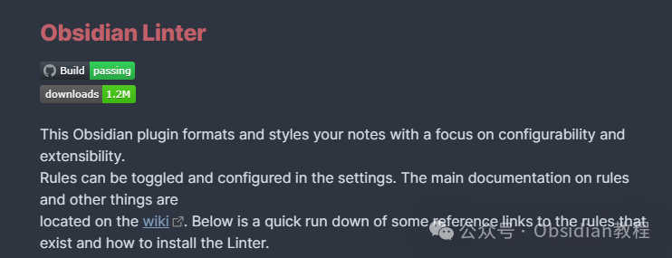
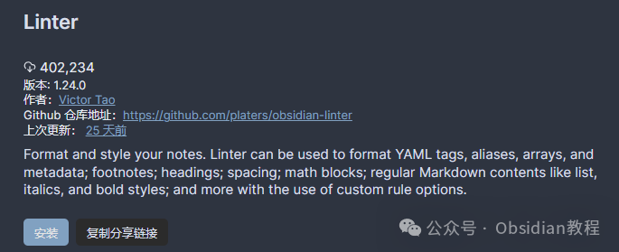
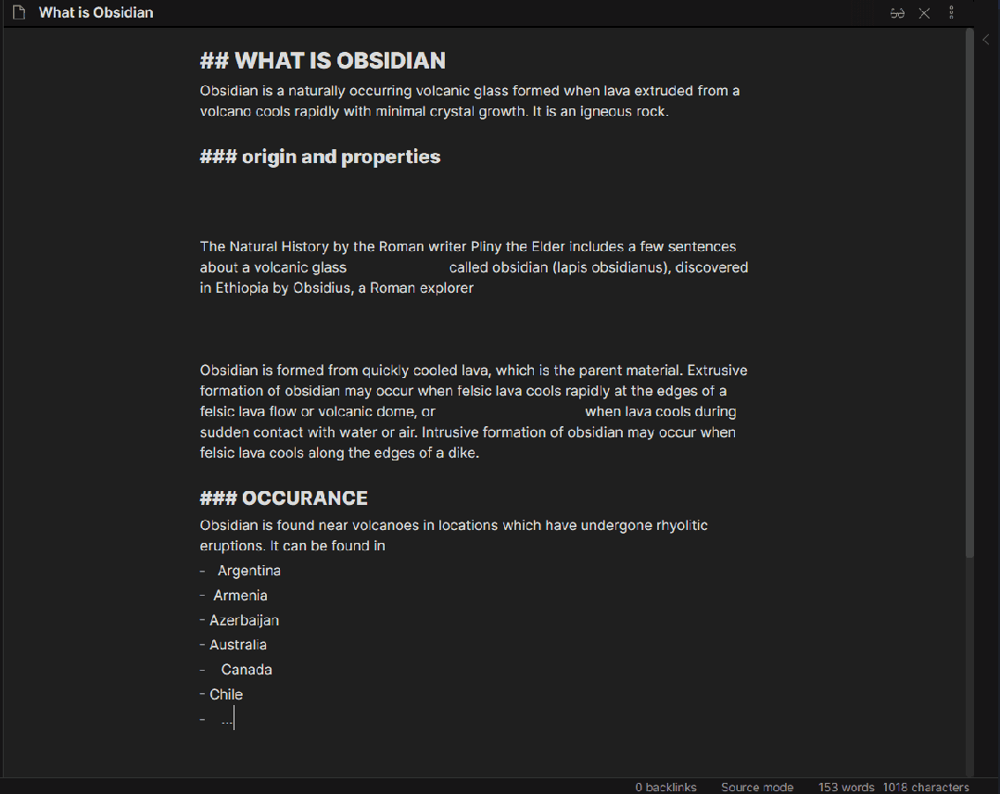

# Obsidian插件：Linter专门用于格式化和美化 Obsidian 笔记

嗨，我是鬼哥，10年+老程序员一枚。今天咱们聊聊一个能把你 Obsidian 笔记格式和样式打理得井井有条的插件——Obsidian Linter。  
相信不少朋友都有过这样的烦恼：写了一堆笔记，格式乱七八糟，内容看起来很不顺眼。手动去调整吧，费时费力；不调整吧，看着实在糟心。好在，Obsidian Linter这个插件来解救我们了。  

### **Obsidian Linter 插件简介**

  
Obsidian Linter 是一款专门用于格式化和美化 Obsidian 笔记的插件。它最大的特点就是高度可配置和可扩展。你可以在设置里自由开关和配置各种规则，完全按照你的需求来整理笔记。  

### **安装指南**

  
在开始安装之前，咱们先得确保 Obsidian 是已经安装好的。如果还没装，可以去 Obsidian 官网下载并安装最新版的 Obsidian。  
**安装 Obsidian Linter 插件的步骤如下：**  

  1. 打开 Obsidian，点击左下角的“设置”按钮。
  2. 在设置菜单中，找到“社区插件”选项并点击。
  3. 点击“浏览”按钮，在搜索框中输入“Obsidian Linter”。
  4. 找到 Obsidian Linter 插件后，点击“安装”按钮。
  5. 安装完成后，点击“启用”按钮激活插件。

### 

### **2.离线安装：****  
****很多同学无法直接在线安装obsidian插件，这里我已经把obsidian所有热门插件下载好了**  
只需要关注下方公众号，后台回复：**插件** 即可获取

### 

###   

### **规则配置**

  
Obsidian Linter 的强大之处在于它提供了众多的规则，每一条规则都有自己独立的逻辑，可以单独运行。你可以根据自己的需求来启用或禁用这些规则。不过要注意，有些规则在同时启用时可能会产生冲突，例如“段落空行”和“内容行之间两空格”这两条规则。  
如果同时启用，可能会导致一些意想不到的结果，因为它们在处理目标上有部分重叠。  
具体的规则配置可以在插件的设置中找到，官方的文档和规则说明可以在插件的 wiki 页面查看。这里鬼哥给大家简单介绍几个常用的规则：  

  1. 段落空行：在段落之间自动添加空行，让内容看起来更清晰。
  2. 内容行之间两空格：在内容行之间插入两个空格，这在一些特定的 Markdown 语法中非常有用。
  3. 删除多余空行：自动删除多余的空行，让笔记更紧凑。
  4. 自动格式化代码块：根据代码语言的语法高亮自动格式化代码块。

###   

### **使用方法**

  
安装好插件并配置好规则后，使用起来就很简单了。  
在 Obsidian 中打开一篇笔记，然后点击工具栏上的 Linter 图标，插件就会根据你配置的规则自动格式化和美化笔记内容。如果你希望更进一步的自动化，也可以设置为每次保存笔记时自动运行 Linter，这样就不用每次手动点击了。  

  

### **插件带来的好处**

  
Obsidian Linter 的主要好处就在于它能大大节省你的时间和精力。想象一下，以前需要花大量时间去手动调整笔记格式，现在只需轻轻一点，瞬间搞定。  
对于内容创作者、学生以及任何需要频繁整理笔记的人来说，这简直就是一大福音。  
此外，Obsidian Linter 的高度可配置性也让它非常灵活。无论你的需求多么独特，总能找到适合的规则组合。插件还在不断更新，新的功能和规则会源源不断地加入进来。  

### **应用场景**

  
Obsidian Linter 的应用场景非常广泛。无论是日常笔记整理、学习笔记编写、项目文档管理还是博客内容创作，都能派上大用场。  
特别是对于那些对笔记格式有高要求的朋友，Obsidian Linter 更是不可或缺。

###   

### **总结**

  
Obsidian Linter 是一个非常实用的 Obsidian 插件，它的高度可配置和可扩展性让它能够满足各种不同的需求。安装和使用都非常简单，即使是小白用户也能轻松上手。  
通过自动化的方式来整理和美化笔记内容，不仅提高了效率，还能让你的笔记看起来更专业、更赏心悦目。  
鬼哥作为一个长期使用 Obsidian 的忠实粉丝，对这个插件赞不绝口。每次打开笔记，看着那整齐划一的格式，心情也跟着舒畅起来。如果你也有类似的需求，不妨试试 Obsidian Linter，相信你会爱上它的。  
好啦，今天的分享就到这里。如果你有任何问题或需要进一步的帮助，欢迎留言讨论。我们下次再见，拜拜！  
  
  
1******扫码购买****《 Obsidian实战教程》****从入门到精通， 链接您的每一个思维瞬间。**  

