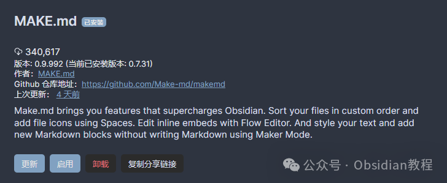
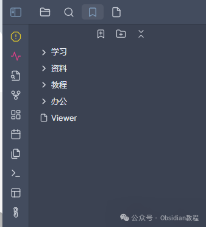
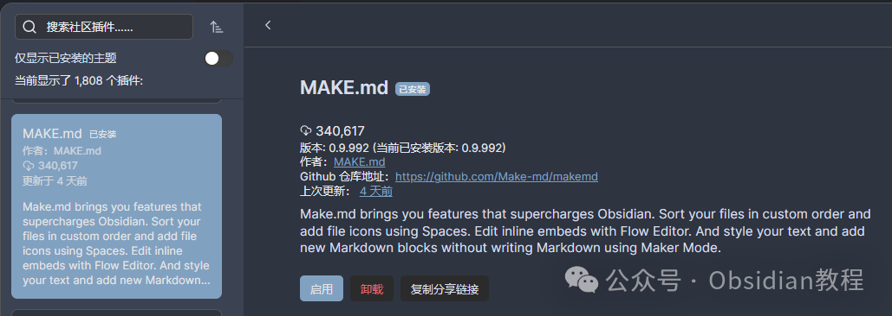
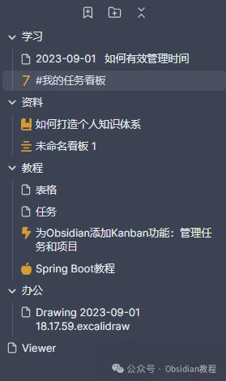

# Obsidian插件：Make.md为你量身打造一个完美的个人系统。

今天我想跟大家聊聊一个能让你的 Obsidian 体验提升到新高度的插件——Make.md。  
作为一个 Obsidian 用户，你可能已经对它的双链笔记、插件扩展性等特性耳熟能详，但如果你还没尝试过 Make.md，那可真是错过了一个宝藏插件。  

Make.md 结合了直观且强大的功能，帮助你追踪进度、保持专注。  
无论你是一个喜欢极简风格的用户，还是一个喜欢用复杂数据表格的人，Make.md 都能为你量身打造一个完美的个人系统。  

### **🍱 Spaces：自定义工作空间**

  
Spaces 功能允许你创建自定义的工作空间，让你的项目和笔记井井有条。  
当你需要查找信息时，只需打开相应的工作空间，所有相关内容尽在眼前。就像整理房间一样，把不同用途的东西放在对应的位置，这样使用起来更加得心应手。

### **🧩 Contexts：强大的数据连接和可视化**

  
Contexts 功能让你可以使用简单的表格或强大的数据库，将数据连接在一起，并以不同的方式进行可视化。  
通过这种方式，你可以对自己的知识有更深层次的理解。  
想象一下，你的笔记不仅仅是孤立的文字，而是一个个相互关联的知识节点，通过 Contexts，你可以清晰地看到这些节点之间的关系。  

### **🤩 Blink：快速编辑**

  
Blink 功能真的是效率提升神器。它让你可以快速打开并直接编辑工作空间中的任何内容。无论你在 Obsidian 的哪个角落，只需一个简单的操作，就能瞬间进入编辑模式。就像瞬间移动一样，省去了大量切换和寻找的时间。  

### **⌛ Flow：流畅的编辑体验**

  
Flow 功能旨在帮助你在写作和编辑过程中保持专注和流畅。你可以直接在线编辑笔记、画布或上下文内容，而不需要跳出当前的工作环境。  
这种无缝的编辑体验，让你可以专注于内容本身，而不是工具的操作。  

### **下载和安装 Make.md**

  
虽然说了这么多，还是要教大家如何下载和安装这个神器。  
**1.在线安装**  
如何安装 Obsidian 插件，通常可以通过以下步骤进行安装：

  1. 打开 Obsidian 的设置页面。
  2. 导航到“社区插件”部分。
  3. 点击“浏览”按钮，搜索“Make.md”。
  4. 找到插件后，点击“安装”按钮。
  5. 安装完成后，返回插件列表，启用该插件。

### 

**  
****2.离线安装：****  
****很多同学无法直接在线安装obsidian插件，这里我已经把obsidian所有热门插件下载好了**  
只需要关注下方公众号，后台回复：**插件** 即可获取

### 

  
安装完成后，别忘了在插件列表中启用它。这样，你就可以开始体验 Make.md 带来的强大功能了。  

### **使用 Make.md 的好处**

  
Make.md 最吸引人的地方在于它的灵活性和高效性。无论是管理项目、组织笔记，还是快速编辑和数据可视化，Make.md 都能轻松应对。  
特别是对于那些需要处理大量信息和数据的用户，Make.md 提供的功能无疑是如虎添翼。  

### **体验感受**

  
Make.md 是一个能极大提升你 Obsidian 使用体验的插件。它不仅帮助你更高效地管理笔记和项目，还能让你在编辑过程中保持专注和流畅。如果你还没试过，强烈推荐你赶紧安装体验一下。  
今天的分享就到这里，希望对大家有帮助。如果你对 Make.md 或其他 Obsidian 插件有任何疑问或想法，欢迎随时在评论区交流。下期再见！

> **对obsidian感兴趣的同学，可以链接我微信：hls404 拉你进入“obsidian交流社群”。**

  
**热门推荐**  
**  
**

  * [Obsidian插件：Editing Toolbar 让笔记编辑变得更加简单和直观](http://mp.weixin.qq.com/s?__biz=MzkyMDUyMDM2Mg==&mid=2247485885&idx=1&sn=fdd0b6299765f6149bd0b6c538716552&chksm=c190da78f6e7536ef9827d3f5cff76054bb7653626368c89f711e79ee8819b6207e1f5d83210&scene=21#wechat_redirect)

  * [ Obsidian插件：Better Word Count统计文档的字数、字符数、句子数等](http://mp.weixin.qq.com/s?__biz=MzkyMDUyMDM2Mg==&mid=2247485865&idx=1&sn=e34c00104214d18c4fa94789ab03124a&chksm=c190da6cf6e7537a7bbdaa5be8071e072261cba86faeeeae9f1e29afe57c27150ae5a3588fa0&scene=21#wechat_redirect)

  * [Obsidian插件：Annotator在Obsidian中直接打开并标注PDF和EPUB文件](http://mp.weixin.qq.com/s?__biz=MzkyMDUyMDM2Mg==&mid=2247485853&idx=1&sn=10ae2c37607dd3bff27a2012e051ef77&chksm=c190da58f6e7534e2226647327b95c64331fb1cfca8127cd1cc443f1d4efd989d01ab784ad53&scene=21#wechat_redirect)  

