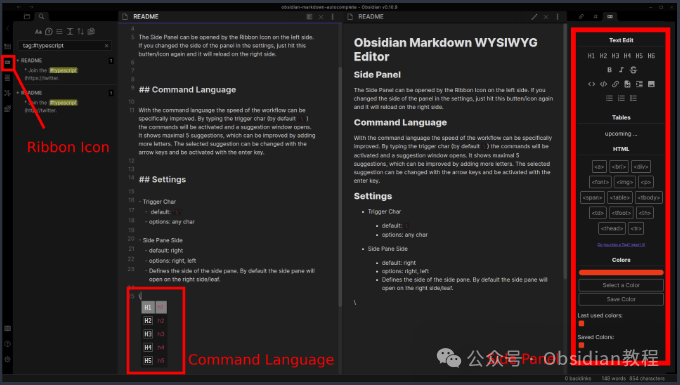
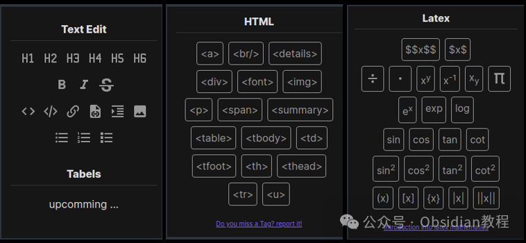
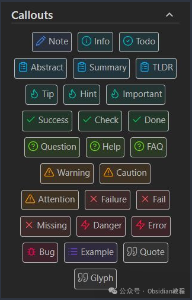
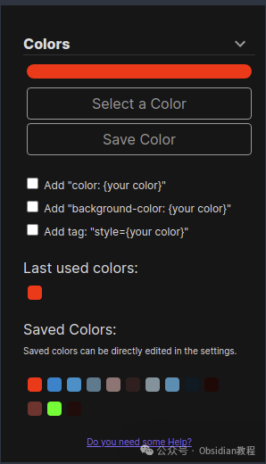
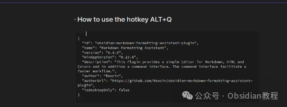
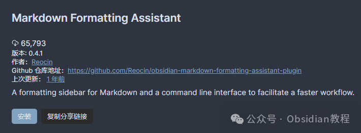

# Obsidian插件：Markdown Formatting Assistant简化和加速文档的格式化过程

Obsidian是一款广受欢迎的知识管理和笔记软件，以其灵活性和强大的扩展功能而著称。今天，我们将深入探讨一个特别有用的插件——Markdown Formatting Assistant。  
这个插件为使用Markdown、HTML和Latex提供了便捷的代码片段支持，同时还集成了颜色选择器，使得文档的格式化和美化变得更加简单直接。  
  
  

### 1**插件概述**   

Markdown Formatting Assistant插件是一个为Obsidian用户设计的工具，旨在简化和加速文档的格式化过程。它提供了一系列易于使用的Markdown、HTML和Latex代码片段，以及一个颜色选择器功能，后者还能保存和回溯最近使用的颜色。

####   

#### **特点和功能**

  

  * **代码片段支持：** 提供Markdown、HTML和Latex的快速插入片段，极大地提高了编辑效率。

  

  * **颜色选择器：** 允许用户快速选择颜色，并将其应用于文本或背景，同时支持保存颜色和查看最近使用的颜色历史。

  
  

  * **侧边栏面板：** 通过左侧的Ribbon图标可打开插件的侧边栏面板，用户可以在设置中调整面板位置，并可自定义各个部分的顺序和展开状态。

  

  * **快捷键支持：** 默认的ALT+Q快捷键可以唤出建议窗口，列出所有可用的插件命令，提高操作的便捷性。

  

  

  * **颜色管理：** 颜色选择器不仅支持选择颜色和查看颜色历史，还允许用户保存颜色、对保存的颜色进行排序和删除。

  

#### 2**安装和设置**   

#### 通过社区插件浏览器：  

###   

### **1.在线安装**（需要科学上网） ：****

### ****  
****

### 点击“社区插件”下的“浏览”按钮，在左上角的搜索框中搜索“ Markdown Formatting”，然后点击“安装”按钮。

###   
启用插件：安装成功后，点击“启用”以启用插件。  
  
**2.离线安装：****  
****因为网络原因很多同学无法直接在线安装obsidian插件，这里我已经把obsidian所有热门插件下载好了**  
只需要关注下方公众号，后台回复：**插件** 即可获取

  
安装后，你可以通过“插件选项”对其进行配置，例如更改快捷键、调整侧边栏位置、管理保存的颜色等。

###  3**使用教程**   

#### **代码片段插入**

**  
**

  * **Markdown片段：** 插件提供了一系列Markdown格式化的快速插入选项，如标题、列表、代码块等，帮助你快速构建文档结构。
  * **HTML片段：** 对于需要更复杂格式化的内容，你可以利用HTML片段功能，如插入
和
标签来创建可折叠的部分。
  * **Latex片段：** Latex部分特别适用于需要插入数学公式和符号的场景，插件提供了方便的代码片段，让复杂的数学公式输入变得简单。

####   

#### **颜色选择和应用**

  
使用颜色选择器可以非常直观地为你的文本添加颜色，只需点击选择颜色按钮，然后在弹出的颜色选择器中挑选或输入你想要的颜色，点击后该颜色即被应用于光标所在位置。此外，颜色历史功能让你能够快速回溯并重新使用之前选定的颜色。  

#### **快捷键与建议窗口**

  
通过ALT+Q和ALT+C快捷键，你可以分别调出插件命令和标注（Callouts）的建议窗口。这些窗口将根据你的输入提示可用的命令或标注类型，极大地提高了选择和应用格式化选项的速度。  

#### **个性化设置**

  
你可以在插件的设置中调整侧边栏位置、管理保存的颜色、更改快捷键等，以满足你的个人偏好。这些设置的灵活性使得Markdown Formatting Assistant能够更好地融入你的工作流程中。

###  4**结论**   

Markdown Formatting Assistant为Obsidian用户提供了一个强大而灵活的工具，通过其提供的代码片段、颜色选择器和便捷的快捷键操作，极大地提升了Markdown文档的编辑效率和体验。  
无论你是Obsidian的新手还是资深用户，这个插件都值得一试，它将为你的笔记和文档编辑带来前所未有的便利和效率。  
  
  
1******扫码购买****《 Obsidian实战教程》****从入门到精通， 链接您的每一个思维瞬间。**  
  

