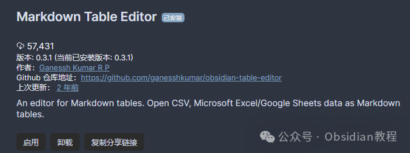
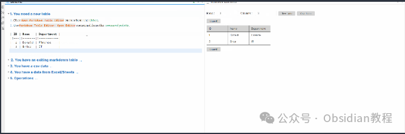
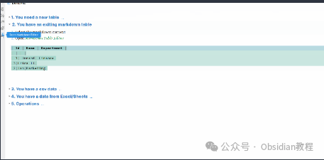
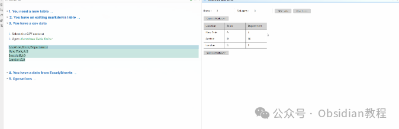
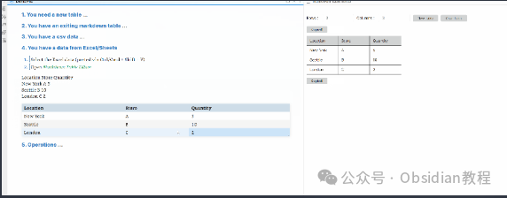
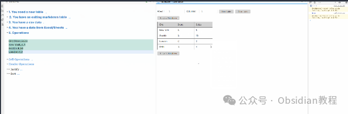

# Obsidian插件：Markdown Table Editor创建、编辑和格式化Markdown表格

Obsidian Markdown Table Editor插件的强大功能及其对Obsidian用户工作流的积极影响，这个插件不仅让Markdown表格的编辑变得前所未有的简单，而且通过提供对CSV和Excel数据的支持，极大地扩展了Obsidian的用途。

### 

  

1**Markdown Table Editor插件简介**

Obsidian作为一款知识管理和笔记软件，其强大之处在于对Markdown的原生支持以及通过插件扩展功能。  
Markdown Table Editor是一个专为Obsidian设计的插件，它提供了一个高效的编辑器用于创建、编辑和格式化Markdown表格。无论是手动创建表格还是将现有的CSV、Excel或Google Sheets数据转换为Markdown表格，这个插件都能提供无缝的支持。  

### 2**安装方法**

安装Markdown Table Editor插件是一个简单的过程，但需要遵循一定的步骤确保正确安装。  

#### 通过社区插件浏览器：  

###   

### **1.在线安装**（需要科学上网） ：****

### ****  
****

### 点击“社区插件”下的“浏览”按钮，在左上角的搜索框中搜索“ Markdown Table Editor”，然后点击“安装”按钮。

###   
启用插件：安装成功后，点击“启用”以启用插件。  
**  
****2.离线安装：****  
****因为网络原因很多同学无法直接在线安装obsidian插件，这里我已经把obsidian所有热门插件下载好了**  
只需要关注下方公众号，后台回复：**插件** 即可获取  

### 3**功能特点与操作指南**

####   

#### **1\. 创建新表格**

**  
**

  * 操作方式：用户可以通过点击Obsidian顶部工具栏的按钮或通过命令面板使用"Markdown Table Editor: Open Editor"命令来创建新表格。

  

#### **2\. 编辑和格式化现有Markdown表格**

  

  * 简化编辑：通过选择表格内容或将光标放在表格内，使用Markdown Table Editor，用户可以轻松地对表格进行编辑和格式化，无需手动调整Markdown代码。

#### 

#### **3\. 转换CSV数据为Markdown表格**

  

  * 数据导入：该插件支持将CSV格式的数据直接转换为Markdown表格，极大地简化了数据导入过程。

  

#### 

#### **  
**

#### **4\. 转换Excel或Sheets数据为Markdown表格**

  

  * 无缝转换：通过简单的复制粘贴操作，用户可以将Excel或Google Sheets中的数据转换成Markdown表格，使得数据整理和分享变得更加高效。

  
  

### 

### 4高级功能与操作

#### **单元格操作**

**  
**

  * 行列管理：添加、删除、移动行或列的功能让表格的结构调整变得简单直观。

####   

#### **表头操作**

**  
**

  * 格式化选项：包括对齐（左、中、右）和排序（文本或数字，升序或降序），提供了丰富的表格格式化工具。

#### 

  

#### **高级编辑技巧**

**  
**

  * 选择表格：通过特定命令选择整个表格，便于进行批量操作。
  * 分屏编辑：支持在活动视图下方打开编辑器，实现分屏编辑，提高工作效率。

### 

  

### 5小结

Obsidian的Markdown Table Editor插件通过提供强大的表格编辑功能，极大地提升了用户在Obsidian中处理表格数据的能力。  
从创建新表格到编辑和格式化现有表格，再到将CSV和Excel数据无缝转换为Markdown格式，这个插件都展现了其不可或缺的价值。  
随着更多用户发现并开始使用这个插件，我们相信它将成为Obsidian生态系统中一个重要的组成部分，帮助用户更高效地管理和分享他们的知识与信息。  
  
  
1******扫码购买****《 Obsidian实战教程》****从入门到精通， 链接您的每一个思维瞬间。**

