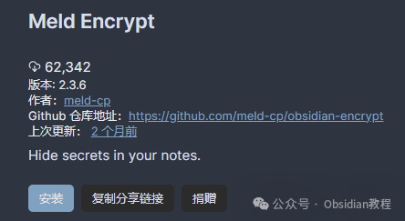
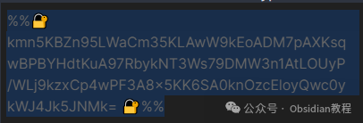
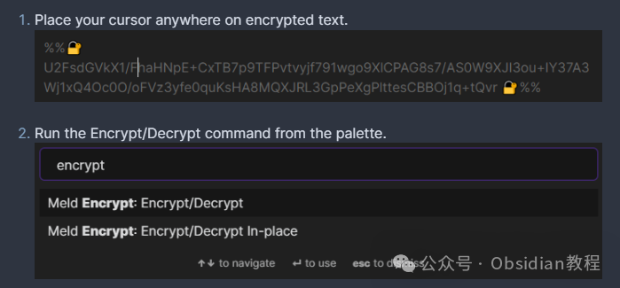
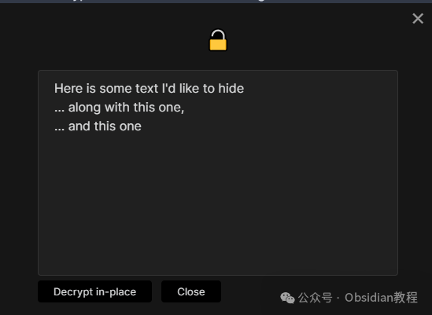

# Obsidian插件：Meld Encrypt为用户提供加密笔记内容的方法，确保信息安全。

Obsidian是一个功能强大的知识管理和笔记软件，通过插件系统，用户可以扩展其功能以适应各种需求。

  

Meld Encrypt插件为Obsidian用户提供了一种加密笔记内容的方法，确保敏感信息的安全。

  

本教程将详细介绍如何安装和使用Meld Encrypt插件，以及提供一些使用技巧和注意事项。

##  1**安装Meld Encrypt插件**

#### 通过社区插件浏览器：  

###   

### **1.在线安装**（需要科学上网） ：****

### ****  
****

### 点击“社区插件”下的“浏览”按钮，在左上角的搜索框中搜索“ Meld Encrypt”，然后点击“安装”按钮。

###   
启用插件：安装成功后，点击“启用”以启用插件。  
  
**2.离线安装：****  
****因为网络原因很多同学无法直接在线安装obsidian插件，这里我已经把obsidian所有热门插件下载好了**  
只需要关注下方公众号，后台回复：**插件** 即可获取  

## 2**使用Meld Encrypt创建加密笔记**

### **创建新的加密笔记**

**  
**

  * 打开命令面板（Ctrl+P或Cmd+P），搜索并选择“创建加密笔记”命令。
  * 输入并确认密码，你也可以输入一个提示信息以帮助记忆密码。
  * 编辑你的笔记，完成后它会自动加密并保存到磁盘。

  

### 

### **查看和编辑加密笔记**

**  
**

  * 通过导航树正常打开加密笔记。
  * 输入笔记密码以解密查看或编辑。
  * 完成编辑后，笔记会再次加密保存。

  

### 

### **修改加密笔记的密码和提示**

**  
**

  * 打开加密笔记并输入密码。
  * 点击标签标题栏或标签上下文菜单中的“更改密码”图标。
  * 输入新的密码和提示信息。

###   

### **加密或解密现有笔记**

  

  * 右键点击文件选择“加密笔记”或“解密笔记”。
  * 或者，点击工具栏图标“转换为加密笔记或非加密笔记”来切换当前文件的状态。
  * 另外，也可以通过命令面板执行“转换为加密笔记或非加密笔记”命令，甚至可以绑定快捷键以便快速操作。

## **部分加密文本**

**  
**

  * 选择你希望加密的文本。
  * 运行命令面板中的加密/解密命令，或绑定并使用快捷键。
  * 输入并确认密码及可选的提示信息。
  * 选中的文本现在应该已被加密。

##   

## **显示加密文本**

**  
**

  * 在加密文本上放置光标。
  * 运行命令面板中的加密/解密命令。
  * 输入正确的密码。
  * 解密后的文本将在对话窗口中显示。点击“解密到编辑器”将加密文本替换为解密文本。

##   

## **插件设置**

**  
**

  * 确认密码：加密时建议确认密码。
  * 记住密码：为本次会话记住上次使用的密码。
  * 记住密码超时：设置记住密码的分钟数。
  * 记住密码方式：可以通过文件名或父文件夹匹配来记住密码。
  * 整篇笔记加密：设置新加密笔记标签页的默认视图。
  * 部分加密：部分选择将扩展到整行。
  * 默认显示加密标记：在阅读视图中加密内联文本时，是否默认显示加密标记。

##   

## **注意事项**

  

  * 使用Meld Encrypt时需谨慎，因为密码不会被存储。如果忘记密码，将无法解密笔记。
  * 尽管Meld Encrypt提供了加密功能，但其加密方法的安全性未经审计，存在被第三方解密的风险。
  * 插件可能随时更新，引入新的bug，因此建议定期备份笔记。

  
通过Meld Encrypt插件，Obsidian用户可以有效保护其笔记内容的安全性，但同时也需要留意密码管理和数据备份等安全措施。  
希望本教程能帮助您高效使用Meld Encrypt插件，更好地保护您的知识产权和个人隐私。  
  
  
1******扫码购买****《 Obsidian实战教程》****从入门到精通， 链接您的每一个思维瞬间。**  

