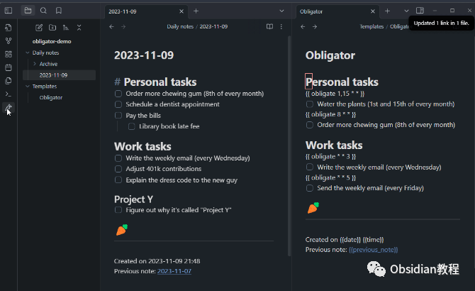
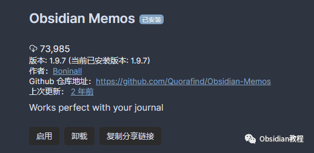
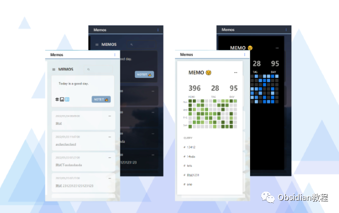

# Obsidian插件：Memos一个为Obsidian用户提供快速捕捉思想和管理日常笔记的工具

Obsidian Memos插件是一个为Obsidian用户提供快速捕捉思想和管理日常笔记的工具。  
该插件基于开源项目memos和服务flomo，并在此基础上进行了改进和扩展。本文将全面介绍Obsidian Memos的功能、使用方法和特点。  

### 1介绍

Obsidian Memos允许用户从日常笔记中提取和管理备忘录。  
这要求启用'Obligator Plugin'，因为所有的备忘录都来自您的日常笔记。  
备忘录是根据配置中的“Process Memos below”下的标题（默认为# Journal）提取的，并会在配置中设定的“Insert After”标题下创建（默认也是# Journal，现在你可以设置为你喜欢的任何其他标题）。  

2下载安装

### ****

### **1.在线安装**（需要科学上网） ：****

### ****  
****

### 点击“社区插件”下的“浏览”按钮，在左上角的搜索框中搜索“ Obsidian Memos”，然后点击“安装”按钮。

###   
启用插件：安装成功后，点击“启用”以启用插件。  

  
**2.离线安装：****  
****因为网络原因很多同学无法直接在线安装obsidian插件，这里我已经把obsidian所有热门插件下载好了**  
只需要关注下方公众号，后台回复：**插件** 即可获取

3如何使用

  * 启用日常笔记插件：确保已启用Obsidian的核心插件“Obligator”。
  * 配置标题：在设置中设置你的标题以处理和插入新备忘录，或留空以将条目写入日常文件的底部。
  * 打开Memos并点击'NOTEIT'：可以通过点击'NOTEIT'快速添加备忘录。
  * 如果允许评论备忘录：需要确保启用了'dataview'插件。
  * 备忘录的格式：将以项目符号格式和当前时间添加到你的日常笔记中。

### **特点**

**  
**

  * 备忘录列表：展示所有来自日常笔记的备忘录，方便用户在一个页面上阅读。
  * 分享备忘录和时间线：可以通过图片分享任何备忘录和每日备忘录。
  * 标签列表：为备忘录内置了标签列表，显示你备忘录中的标签。
  * 查询列表：可以设置包含多个变量的查询来查询备忘录，并可以添加、固定或删除它们。
  * 备忘录热力图：类似于GitHub热力图的视图，显示每天的备忘录数量，所有这些都是可点击的，用于过滤当天的备忘录。
  * 用户横幅：可以在设置中设置你的名字，并在点击用户名附近的三个点时找到备忘录的设置和垃圾箱。

###   

### **提示**

**  
**

  * 编辑备忘录：双击备忘录可进行编辑。
  * 跳转到备忘录源：Ctrl+点击可跳转到备忘录的源头。
  * 搜索和过滤：每次在Memos中搜索时都会过滤匹配的备忘录（显示在一个页面上），并且Memos中已经内置了四个过滤器，以便于使用。
  * 更多设置：在设置中可以找到许多有趣的功能，不要犹豫去尝试它们。

###   

总的来说，Obsidian Memos插件是一个功能强大且易于使用的工具，它极大地增强了Obsidian用户记录和管理日常备忘录的能力。  
无论是用于个人日常记录还是专业的笔记管理，Obsidian Memos都是一个值得尝试的优秀选择。  
  
  
1******扫码购买****《 Obsidian实战教程》****从入门到精通， 链接您的每一个思维瞬间。**  

