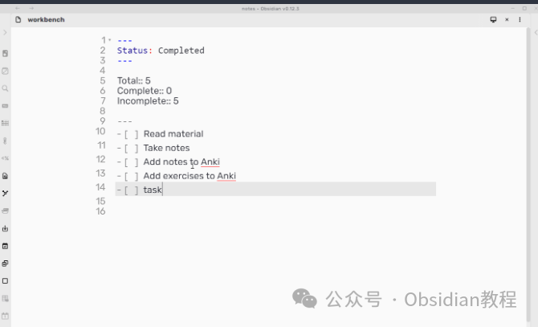
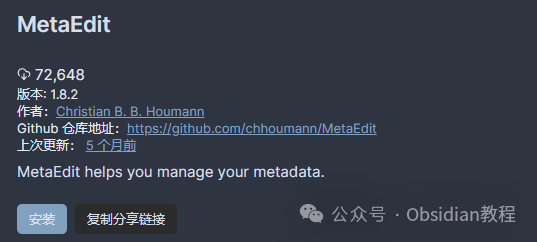
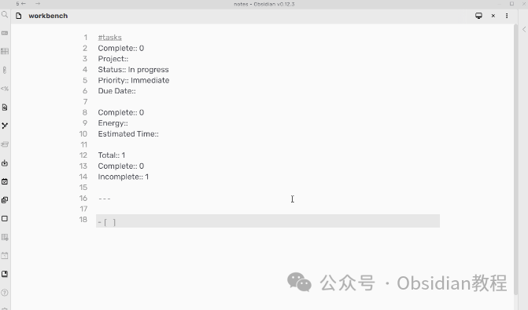
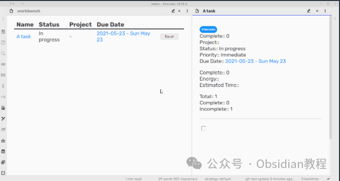

# Obsidian插件：MetaEdit专注于提高元数据的管理和编辑效率

《MetaEdit》作为Obsidian的一款插件，专注于提高元数据的管理和编辑效率，它具有一系列特色功能和灵活的使用场景，适合广大Obsidian用户，尤其是那些需要精细管理笔记元数据的高级用户。  

#### 1核心功能

  * **YAML和Dataview字段的编辑：** 用户可以轻松添加或更新YAML头部的属性，以及Dataview插件可识别的字段，使笔记的元数据更加丰富和有序。
  * **隐藏属性功能：** 对于一些不常用或不希望展示的属性，用户可以设置为隐藏状态，使编辑界面更加简洁。
  * **自动属性及建议器：** 自动属性功能允许用户预定义一组属性值，在编辑时通过建议器快速选择，大大提高了输入效率。
  * **多值模式与数组处理：** 这一功能使用户能够轻松处理多值属性，如将一系列值转换为数组形式，便于后续的数据分析和展示。
  * **进度属性自动更新：** 对于任务管理而言，进度属性可以自动统计并更新任务的完成情况，如总任务数、已完成数等。
  * **YAML与Dataview格式转换：** 用户可以自由转换YAML和Dataview的格式，提高了数据的兼容性和灵活性。
  * **简易删除元数据：** 提供了快捷方便的方式来删除不再需要的元数据。
  * **看板插件集成：** 与看板插件集成，实现在看板的任务状态变更时自动更新相关文件的元数据。
  * **文件菜单编辑元数据：** 通过文件菜单直接编辑元数据，操作更为直观。
  * **编辑标签的最后一个值：** 与Obsidian Tracker插件兼容，方便进行标签数据的编辑和追踪。
  * **丰富的API接口：** 提供API接口，方便其他插件和Templater模板调用，实现更加复杂的自动化处理。

#### 

2安装步骤

通过社区插件浏览器：

###   

### **1.在线安装**（需要科学上网） ：****

### ****  
****

### 点击“社区插件”下的“浏览”按钮，在左上角的搜索框中搜索“ MetaEdit”，然后点击“安装”按钮。

###   
启用插件：安装成功后，点击“启用”以启用插件。  

  
**2.离线安装：****  
****因为网络原因很多同学无法直接在线安装obsidian插件，这里我已经把obsidian所有热门插件下载好了**  
只需要关注下方公众号，后台回复：**插件** 即可获取  

  * 下载最新发布的ZIP文件。
  * 解压至Obsidian的插件文件夹。
  * ### 确认main.js、manifest.json和styles.css文件均已正确放置。

#### 

3使用示例与指南

  * 看板助手：配合看板插件，MetaEdit能够在看板的任务状态变化时自动更新元数据，实现任务管理的自动化。
  * 任务模板：结合Templater插件，使用MetaEdit的API来自动填充任务的元数据，如状态、优先级、截止日期等。
  * Dataview表格任务管理：通过结合Dataview和Buttons插件，在表格中直接操作更新任务状态，提高任务管理的便捷性。
  * 自定义元数据处理：利用MetaEdit的API，用户可以在自己的插件或脚本中进行复杂的元数据处理，如数据分析、自动分类等。

#### 4API功能

《MetaEdit》的API为用户提供了丰富的功能，包括但不限于：  

  * autoprop：根据用户设置自动提供属性值的建议，简化选择过程。
  * update：更新指定文件中的特定属性值，提高数据一致性。
  * getPropertyValue：获取特定文件中的属性值，方便数据检索和分析。

### 

5结语

总体来说，《MetaEdit》插件是Obsidian用户管理和编辑元数据的强大工具。它不仅提供了丰富的功能和灵活的使用场景，还通过其API支持了与其他插件的集成，为Obsidian用户提供了更广泛的自动化处理能力。  
无论是对于日常笔记管理，还是复杂的数据处理，《MetaEdit》都是一个不可或缺的助手。  
  
  
1******扫码购买****《 Obsidian实战教程》****从入门到精通， 链接您的每一个思维瞬间。**  

