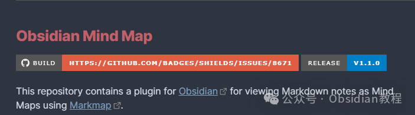
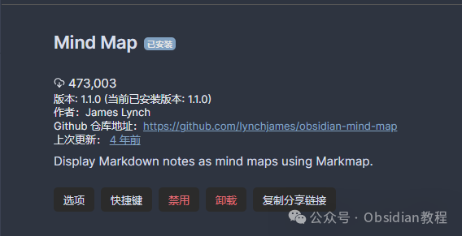

# Obsidian插件：Mind Map将笔记转换为思维导图

嗨，我是鬼哥，10年+老程序员一枚。  
今天咱们来聊聊 Obsidian 里的一个神器插件——Obsidian Mind Map。  
这个插件可以让你的Markdown笔记以思维导图的形式展现出来，让你的笔记瞬间变得高大上，而且逻辑清晰，条理分明。更酷的是，这个插件和Visual Studio Code上类似的插件有点异曲同工之妙。  

### **什么是Obsidian Mind Map？**

  
Obsidian Mind Map 是一个Obsidian插件，它能把Markdown笔记转换为思维导图。  
思维导图是一种很棒的工具，能帮助你更直观地组织和展示信息。如果你喜欢用脑图工具来梳理思路，那这个插件绝对是你的不二选择。  

### **插件特色**

**  
**

  * 实时预览：你可以在当前笔记中实时预览思维导图。就像Obsidian的Local Graph、Outline和Backlink窗格一样，Mind Map预览会根据你选择的不同窗格实时更新。
  * 固定预览：可以把思维导图预览窗格固定在当前笔记上，这样即使你选择其他笔记，当前的思维导图也不会变化。一个小图钉图标会出现在预览窗格的标题栏，点击它可以取消固定。
  * 截图复制：将思维导图的SVG格式图片复制到剪贴板，然后可以粘贴到Obsidian笔记或者任何图像编辑器中。

###   

### **使用方法**

####   

####  打开思维导图预览

  
你可以通过一个命令来打开当前笔记的思维导图预览。预览窗格有两个选项：  

  1. 固定预览：可以将思维导图预览窗格固定到当前笔记，方便你在查看其他笔记时保持思维导图不变。
  2. 截图复制：将思维导图的SVG图片复制到剪贴板，可以随意粘贴到其他笔记或者图像编辑器中。

###   

###   

### **安装步骤**

####   

在Obsidian中安装Mind Map非常简单：

### **1.在线安装：**

  * 打开Obsidian，点击左下角的“设置”图标。
  * 在设置菜单中，选择“第三方插件”选项。
  * 点击“浏览”按钮，搜索“Mind Map”。
  * 找到插件后，点击“安装”。
  * 安装完成后，切换插件的“启用”开关。

### **2.离线安装：****  
****很多同学无法直接在线安装obsidian插件，这里我已经把obsidian所有热门插件下载好了**  
只需要关注下方公众号，后台回复：**插件** 即可获取

  

### **总结**

  
Obsidian Mind Map 插件真的是一个让人爱不释手的工具。它不仅能帮你将笔记转化为直观的思维导图，还能实时预览和固定预览，让你的信息组织更加有序。  
如果你是一名经常需要整理思路、制作笔记的人，这个插件绝对是你不可或缺的利器。  
希望你们和鬼哥一样，能够充分利用这个插件，让你的Obsidian笔记更加生动、条理更加清晰！  
使用 Obsidian Mind Map 的体验真的是非常棒。  
每次看着自己的笔记像一棵大树一样展开，所有的信息点都清晰地展示出来，真的是一种视觉和思维的双重享受。快去试试吧，保证你会爱上它！  
  
  
1******扫码购买****《 Obsidian实战教程》****从入门到精通， 链接您的每一个思维瞬间。**  

