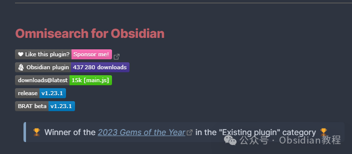
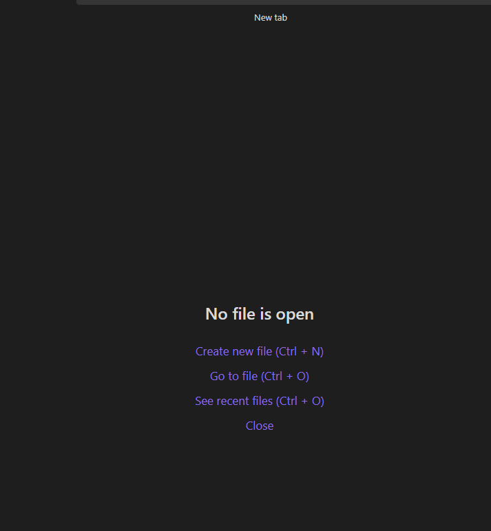
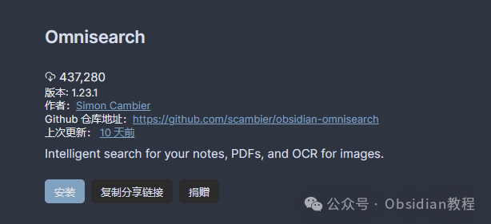

# Obsidian插件：Omnisearch让你的笔记搜索如虎添翼

嗨，我是鬼哥，10年+老程序员一枚。  
今天我要跟大家聊聊一个在Obsidian社区里超受欢迎的插件——Omnisearch。这可是2023年“年度最佳插件”奖的得主，实力不容小觑啊！  
Omnisearch是一个可以让你的笔记搜索如虎添翼的插件，用过它之后，你会觉得以前的搜索体验简直弱爆了。  

  
Omnisearch不仅速度快，而且结果超精准，这都要归功于它那智能加权算法。  
它的核心库是MiniSearch，一个相当出色的开源搜索库。Omnisearch完全免费，而且和那个收费的omnisearch.ai产品毫无关系，所以大家可以放心使用，不用担心有啥隐藏收费。  
  

### **Omnisearch的强大功能**

**  
**

  1. 超级快的文件定位：Omnisearch的首要目标就是快速找到你需要的文件，比Obsidian自带的“快速切换器”还要厉害。无论是笔记、PDF还是图片，统统秒搜。
  2. 文档评分算法：使用BM25算法自动给文档评分，结果更精准。文档的相关性取决于查询词在文档中的出现次数、文件名和标题。
  3. 键盘优先：全程用键盘操作，根本不用鼠标。这对于像鬼哥这样的键盘侠来说，简直就是福音。
  4. 强大的过滤和搜索表达式：支持使用引号表达式和排除选项，还能按文件类型过滤，比如.jpg或.md。
  5. 快速插入链接：直接从搜索结果中插入[[链接]]，简化操作流程。
  6. Vim导航键支持：对Vim爱好者非常友好，简直是量身定制。
  7. 本地HTTP服务器：可以从Obsidian外部查询Omnisearch，非常方便。
  8. 容错性高：对拼写错误有很好的抵抗力，再也不用担心打错字找不到东西了。

  
Omnisearch还支持中文搜索，但需要额外安装一个插件，具体信息可以查看官方文档。  

### **安装指南**

  
Omnisearch插件可以在Obsidian的官方社区插件库中找到。想尝鲜的朋友也可以通过BRAT（Beta Releases And Testing）安装测试版，不过要注意这些版本可能会有bug。  
**在线安装步骤如下：**  

  1. 打开Obsidian，进入设置页面。
  2. 点击“社区插件”，然后点击“浏览”。
  3. 在搜索栏输入“Omnisearch”，找到插件后点击“安装”。
  4. 安装完成后，返回设置页面，启用Omnisearch插件。

### 

### **2.离线安装：****  
****很多同学无法直接在线安装obsidian插件，这里我已经把obsidian所有热门插件下载好了**  
只需要关注下方公众号，后台回复：**插件** 即可获取

###   

### **使用方法**

  
使用Omnisearch非常简单，和Obsidian自带的“快速切换器”很类似。只需按下指定的快捷键，输入你要查找的内容，Omnisearch就会立即显示最相关的结果。  

### **Omnisearch的优势**

  
使用Omnisearch后，你会发现工作效率明显提升了。以前找个笔记要翻半天，现在几秒钟搞定。而且它还支持各种高级搜索功能，能更精准地找到你需要的内容。对于那些笔记特别多的朋友来说，这插件简直就是救星。  

### **鬼哥的体验**

  
作为一个Obsidian的重度用户，鬼哥对Omnisearch的评价非常高。以前用Obsidian自带的搜索功能，有时候真的是让人抓狂。但自从用了Omnisearch，整个世界都明亮了许多。  
搜索速度快，结果精准，关键是操作简便，全程键盘搞定，真的是省时省力。  
而且，Omnisearch不仅能搜索Obsidian里的内容，还能扩展到浏览器和其他应用。比如，有个Omnisearch Companion扩展，可以把搜索功能带到你的浏览器里，真的是无缝衔接。  

### **总结**

  
Omnisearch真的功能强大，操作简单，极大提升了搜索效率。不管你是Obsidian的新手还是老鸟，这款插件都值得一试。趁着免费，赶紧去体验一下吧，相信你会和鬼哥一样，爱上这个神器的！  
好了，今天的分享就到这里，希望大家都能用上这个超棒的插件，提升笔记管理效率。记得关注鬼哥，更多Obsidian的干货等着你！  
  
  
1******扫码购买****《 Obsidian实战教程》****从入门到精通， 链接您的每一个思维瞬间。**  

