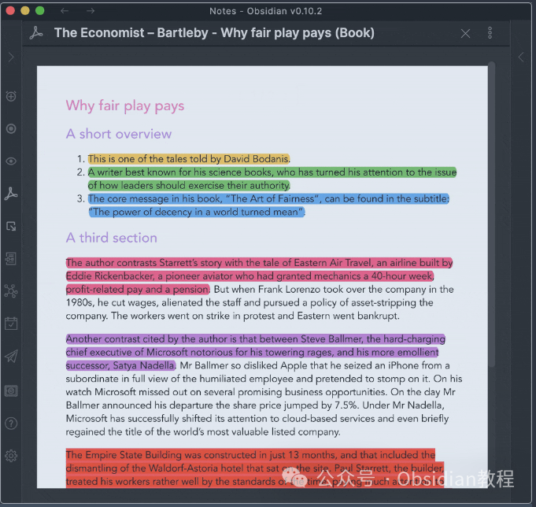
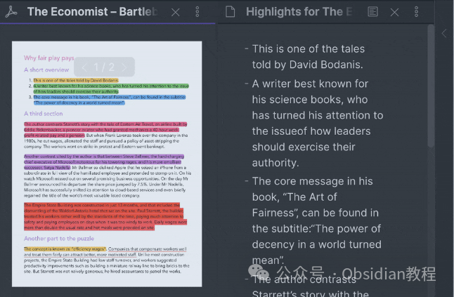
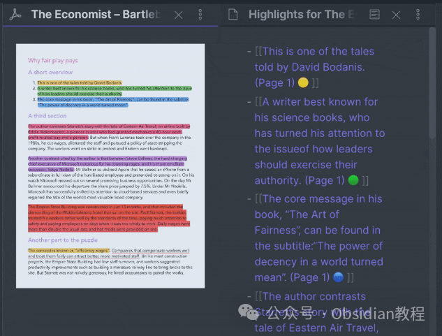
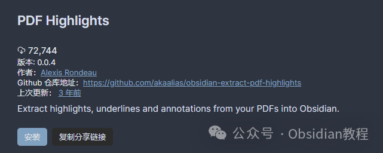

# Obsidian插件：PDF Highlights从PDF文件中提取高亮和下划线的文本

Obsidian的《PDF Highlights》插件是一个非常实用的工具，它可以从PDF文件中提取高亮和下划线的文本，并将其转化为Markdown格式保存在您的Obsidian库中。  

这个插件特别适合于那些经常需要从PDF文档中提取关键信息的用户，例如学者、研究人员或学生。

### 

1功能特点

  * 提取高亮文本：从PDF中提取您标记的高亮部分。
  * 提取下划线文本：从PDF中提取您标记的下划线部分。
  * Markdown格式转换：将提取的文本转换为Markdown格式，方便在Obsidian中使用。
  * 包含页码：可以选择是否在提取的文本中包含原PDF的页码。
  * 包含高亮颜色：可以选择是否标注出原PDF中不同颜色的高亮。
  * 创建链接：可以选择是否为提取的文本创建回链到原PDF。

### 

  

2使用场景

例如，您正在阅读一篇学术论文，并在PDF上做了大量的高亮和下划线标记。《PDF Highlights》插件可以帮助您快速将这些标记提取出来，并保存在Obsidian中，以便于后续的复习和引用。  

### 3如何使用《PDF Highlights》插件

  * 导入PDF文件：首先，您需要将包含高亮文本的PDF文件拖拽到Obsidian库中。
  * 打开PDF文件：在Obsidian中打开您刚才导入的PDF文件。
  * 提取高亮内容：点击左侧边栏的“PDF”图标，插件会自动提取PDF中的高亮和下划线文本。

### 

4自定义设置

《PDF Highlights》插件提供了一些可选设置，让您可以根据需要进行调整：  

  * 包含页码：默认关闭，您可以选择开启，以便在提取的文本中包含原PDF的页码。
  * 包含高亮颜色：默认关闭，开启后可以在提取的文本中标记出原PDF中不同颜色的高亮。
  * 创建链接：默认关闭，开启后可以为提取的文本创建回链到原PDF。

### 

5安装与激活

现在让我们来看看如何在Obsidian中安装并激活《PDF Highlights》插件。

### 

### **1.在线安装**（需要科学上网） ：****

### ****  
****

### 点击“社区插件”下的“浏览”按钮，在左上角的搜索框中搜索“ Quick Explorer”，然后点击“安装”按钮。

###   
启用插件：安装成功后，点击“启用”以启用插件。  

**  
****2.离线安装：****  
****因为网络原因很多同学无法直接在线安装obsidian插件，这里我已经把obsidian所有热门插件下载好了**  
只需要关注下方公众号，后台回复：**插件** 即可获取  

激活插件：安装完成后，返回“插件”列表，找到“PDF Highlights”并切换开启。

### 

6总结

《PDF Highlights》插件为Obsidian用户提供了一个强大且高效的工具，用于从PDF文档中提取重要信息。无论您是正在进行学术研究，还是只是想要更好地管理您的文档和笔记，《PDF Highlights》都能大大提高您的工作效率。  
随着该插件的不断发展和完善，它将为Obsidian用户带来更多便利和功能。  
  
  
1******扫码购买****《 Obsidian实战教程》****从入门到精通， 链接您的每一个思维瞬间。**  

