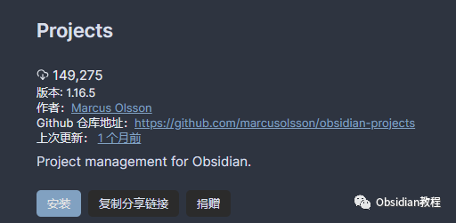
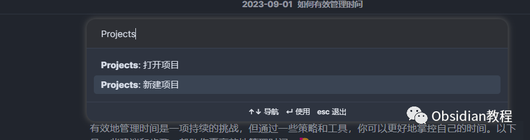
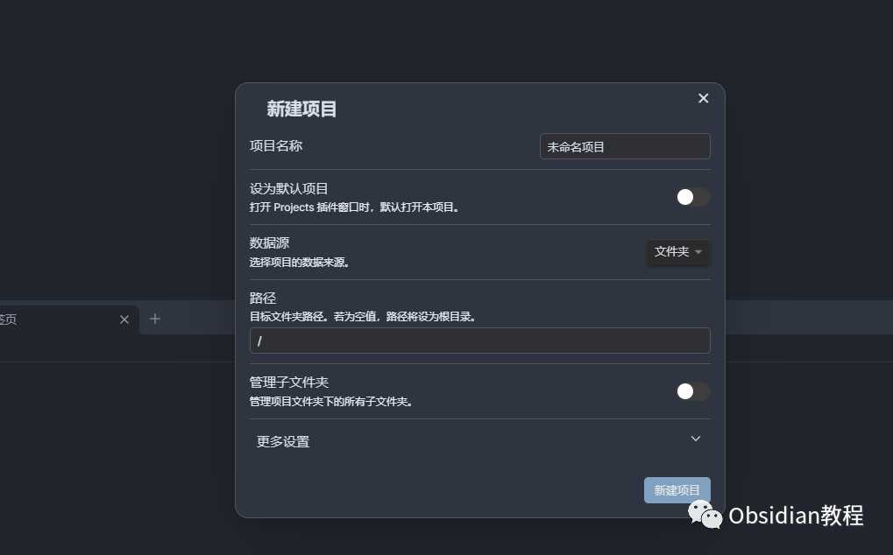
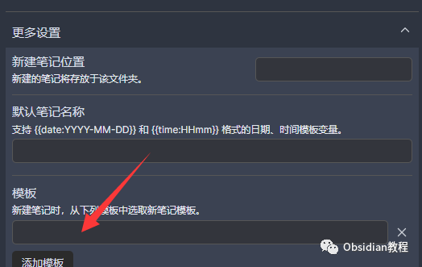
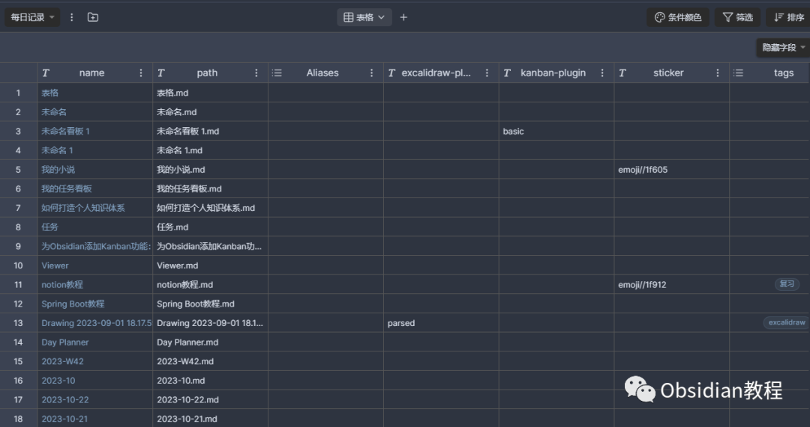
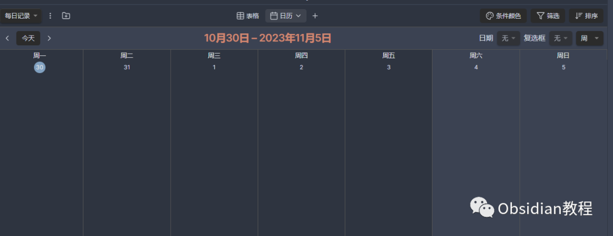
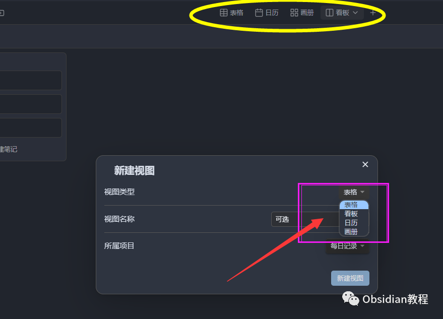
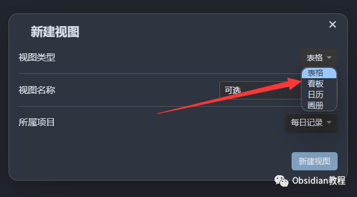

# Obsidian插件：Projects插件，打造高效项目管理体验

点击下方公众号，回复关键字：**Obsidian** ，获取Obsidian资料合集。

  
Obsidian 作为一款高效的知识管理工具，其默认的文件浏览器将所有在快节奏的工作环境中，一个高效、直观的项目管理工具是必不可少的。  
Obsidian的Projects插件正为你提供了一个完美的解决方案。它不仅帮你整理和管理项目，还能可视化地展现项目进度和任务状态。  
现在我们就一起来探索如何充分利用这个强大插件，将你的项目管理提升到新的高度。

##  1**步骤一：安装与设置**   
要使用这个插件，我们首先需要在Obsidian中安装它。安装过程非常简单直接：

### **  
**

### **1.在线安装**（需要科学上网） ：****

  
1.在Obsidian的设置中，找到“第三方插件”选项，点击“社区插件”2.在搜索框中输入“Projects”，找到并安装它。3.安装完成后，激活该插件，在成功安装插件后，我们需要对其进行简单的配置，以符合我们的需求。  
  
**2.离线安装：****  
****因为网络原因很多同学无法直接在线安装obsidian插件，这里我已经把obsidian所有热门插件下载好了**  
只需要关注下方公众号，后台回复：**插件** 即可获取**  
****基本设置 :****  
**

  * 确保关闭 Restricted mode以启用Projects插件。
  * ## 按Ctrl+P（或Mac上的Cmd+P）打开命令面板，选择Projects: Show projects以进入插件界面。

  
2**步骤二：创建与配置项目****  
****创建项目:**

  * 你可以直接从现有文件夹或通过Dataview查询来创建项目。  

**  
****配置模板:**  
为每个项目配置特定的笔记模板，这样当你创建新的任务或笔记时，它们会自动应用这些模板，使得内容组织更为统一和高效。  
  

## 3**步骤三：探索多视图****功能**   

**表格视图:**  
提供一目了然的项目概览，你可以在这里查看所有笔记和任务的状态、优先级和截止日期。  
**  
****看板视图:**  
将你的任务可视化为一个个卡片，通过拖拽卡片来更新任务的状态，让项目管理更直观、更有趣。**  
****日历视图:****  
**

  * 通过日历视图，你可以方便地查看和安排任务的时间线，确保你的项目按计划进行。

**  
****画廊视图:****  
**

  * 提供一种图形化的方式来展现你的项目，让你的内容看起来更生动、更吸引眼球。

  
  

##  4**步骤四：自定义和优化**   

**自定义视图:**  

  * 根据你的需求自定义视图的布局和显示内容，让它完全符合你的项目管理需求。

**  
****优化工作流:**  

  * 利用插件提供的各种选项，例如：固定重要文件、定义文件排除规则等，优化你的项目管理流程，使其更为高效和顺畅  

  
随着你对Projects插件功能的探索和使用，你将发现它能为你的项目管理工作带来前所未有的便利和效率。现在就开始你的项目管理之旅，让Projects插件成为你高效工作的得力助手！  
  
  
1**扫码购买****《 Obsidian实战教程》****从入门到精通， 链接您的每一个思维瞬间。****  
**  
往 期精彩1.[Obsidian插件：Zotero Integration，让文献管理得心应手](http://mp.weixin.qq.com/s?__biz=MzkyMDUyMDM2Mg==&mid=2247484439&idx=1&sn=c5161930a16de70029fca1263ebb6250&chksm=c190d7d2f6e75ec49094d9800a91e8c6a2fde9f39e62d8c18795068a19b4b8e2a3c8f876efbc&scene=21#wechat_redirect)  
[2.Obsidian插件：轻松实现思维导图和PDF注释的Obsidian MarkMind插件](http://mp.weixin.qq.com/s?__biz=MzkyMDUyMDM2Mg==&mid=2247484438&idx=1&sn=895f3041fa9688b8276cf2731b23c353&chksm=c190d7d3f6e75ec507ff918eb7cad18f78fa3dff799b9e9737b734f66e5c06e091653598cfb4&scene=21#wechat_redirect)  
[3.Obsidian 插件:Make.md赋能创作者的终极体验](http://mp.weixin.qq.com/s?__biz=MzkyMDUyMDM2Mg==&mid=2247484437&idx=1&sn=56d072590a221e82421f806bd14f9d01&chksm=c190d7d0f6e75ec6a112fc672ce1daca289b70893334e5c5bbd4d406836c641ef294bbdeace2&scene=21#wechat_redirect)  

点分享

点点赞

点在看
