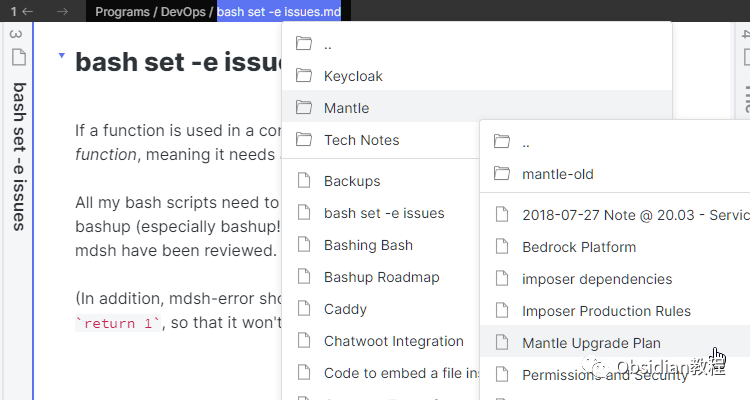
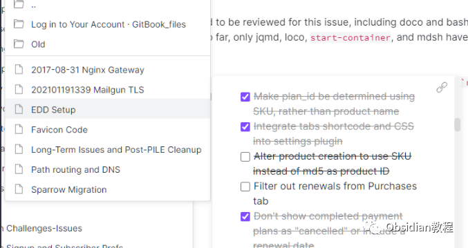
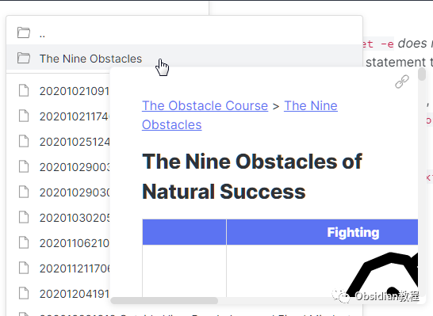
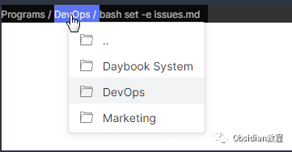
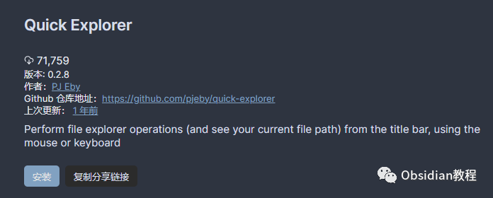

# Obsidian插件：Quick Explorer一个提高文件浏览和笔记预览效率的工具

Obsidian的Quick Explorer插件是一个旨在提高文件浏览和笔记预览效率的工具，特别适用于那些希望通过键盘而非鼠标操作来快速导航Obsidian保险库的用户。  
在本文中，我将详细介绍Quick Explorer的特点、功能、使用方法以及一些当前的限制。

### 

1Quick Explorer的特点

**键盘友好的导航：** Quick Explorer提供了一个基于菜单的、键盘友好的界面，可以轻松地从保险库根目录或当前文件夹进行导航，而无需通过繁琐的文件夹展开和折叠操作。  
  
**快速预览模式：** 通过PgDn键可以快速浏览文件夹中每个笔记的内容，如同翻阅笔记本页面或滚动查看一个巨大文档一样流畅。  

**文件夹笔记支持：** 预览文件夹时会显示文件夹笔记，而在导航进入文件夹时，如果存在文件夹笔记，则会自动选中。  

**面包屑导航条：** 在每个窗口的标题栏（或状态栏，如果Obsidian标题栏被禁用）中显示当前笔记文件的路径，作为“面包屑导航条”。每个面包屑点击后会显示同一目录下的文件和文件夹列表。  

### 2功能和操作

  * 预览文件：使用Ctrl/Cmd + 悬停来预览文件（如果启用了内置的页面预览插件）。
  * 打开文件：点击打开文件（使用ctrl或cmd在新面板中打开）。
  * 全功能上下文菜单：右键点击任何文件、文件夹或面包屑可获取完整的上下文菜单。
  * 拖拽支持：可以拖拽任何文件、文件夹或面包屑，并放置到支持放置的任何位置（例如：到星标、文本编辑器中创建链接、面板头部打开面板、文件浏览器中的文件夹移动文件、看板列等）。

###   

### **键盘操作**

**  
**

  * 文本搜索：输入正常文本在文件夹（或上下文菜单）内搜索条目名称，选择下一个匹配项。
  * 导航键：使用上、下、Home和End键在文件夹或上下文菜单内移动。
  * 箭头键选择：左右箭头键选择父文件夹或子文件夹。
  * 快速预览切换：Tab键切换快速预览模式；活动时，悬停或箭头键到条目上会自动显示悬停预览

### 

3 安装方法

### 

### **1.在线安装**（需要科学上网） ：****

### ****  
****

### 点击“社区插件”下的“浏览”按钮，在左上角的搜索框中搜索“ Quick Explorer”，然后点击“安装”按钮。

###   
启用插件：安装成功后，点击“启用”以启用插件。  

  
**2.离线安装：****  
****因为网络原因很多同学无法直接在线安装obsidian插件，这里我已经把obsidian所有热门插件下载好了**  
只需要关注下方公众号，后台回复：**插件** 即可获取

  

4主题和插件兼容性Quick Explorer可能会重新格式化标题栏，以便为Quick Explorer本身留出空间。  
此外，它还使用了与Obsidian相同的颜色变量来突出显示选中的模式按钮，以提供大多数主题在深色和浅色模式下足够的对比度。  

### **当前限制**

  

  * 文件总是按升序排列。
  * 可以从下拉菜单中拖出东西，但不能放入任何东西。
  * 无法配置文件的排序或分组。
  * 仅支持“同一位置内”的文件夹笔记。

###   

### **更新和热键命令**

  
Quick Explorer最近的更新（0.2.0版本）中加入了对Obsidian 0.16.3版本的支持，可以使用标签标题栏。插件还包括六个可热键化命令，如浏览保险库根目录、浏览当前文件夹、在文件夹中前往下一个/上一个/第一个/最后一个文件等。  
综上所述，Quick Explorer插件显著提升了在Obsidian中浏览和预览文件的效率，尤其是对于那些倾向于使用键盘而非鼠标进行操作的用户。  
通过本文的介绍，您应该能够有效地利用Quick Explorer插件，更加快捷地管理和浏览您的Obsidian笔记。  
  
  
1******扫码购买****《 Obsidian实战教程》****从入门到精通， 链接您的每一个思维瞬间。**  

