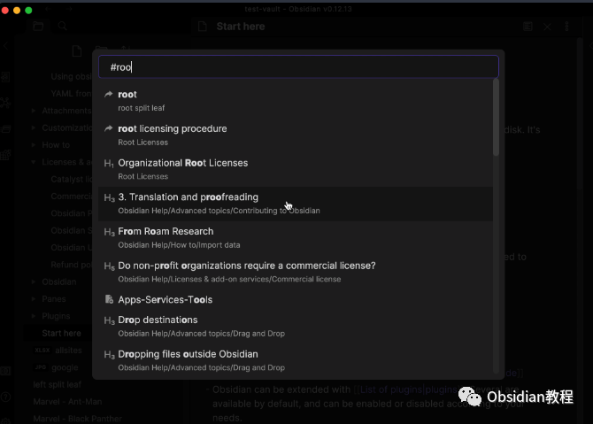
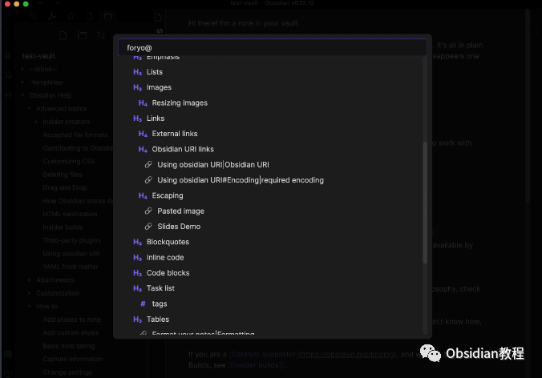
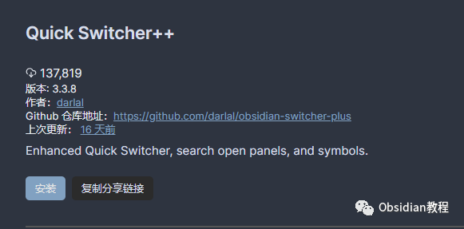
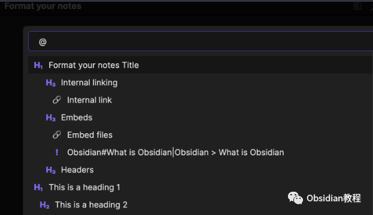
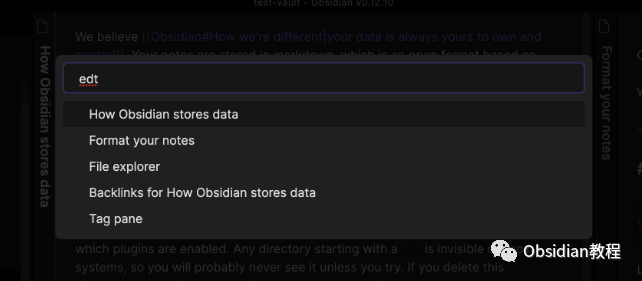
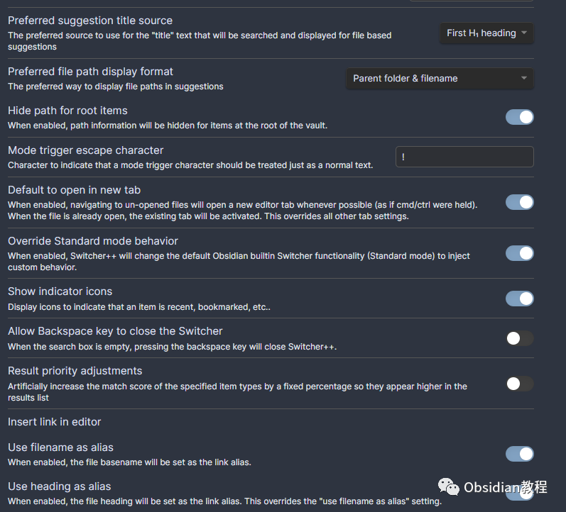

# Obsidian插件：Quick Switcher++ 你的笔记导航专家

点击下方公众号，回复关键字：**Obsidian** ，获取Obsidian资料合集。  
Obsidian 用户们，准备好让你们的笔记跳跃起来了吗？Quick Switcher++ 插件是你们的新超能力，它将内置的“快速切换器”提升到了一个新的水平。  
让我们一起探索如何使用这个强大的工具，以更快的速度找到你需要的内容。  

## 1快速切换器++：你的笔记导航专家

想象一下，你的笔记就像一个庞大的迷宫，而Quick Switcher++就是那个能够帮你找到任何一个角落的向导。  
不仅可以通过文件名快速定位文件，还可以通过标题、符号、甚至Obsidian书签来导航。这不仅仅是一个搜索工具，它是你的知识库的GPS。  

## 2特色功能一览

  * 通过标题查找文件：不再局限于文件名，直接搜索内容中的标题。
  * 符号导航：轻松跳转到笔记中的画布节点、标题、标签、链接和嵌入内容。
  * 编辑器间切换：在打开的编辑器和侧边栏之间自如切换。
  * 工作空间快速切换：配置好的工作空间之间可以迅速跳转。
  * 搜索Obsidian书签：快速访问你的书签。
  * 执行Obsidian命令：直接从切换器运行命令。
  * 导航到相关文件：找到与当前文件相关联的其他文件。
  * 快速过滤器：缩小搜索结果范围，快速找到目标。

## 

## 

1安装与启动

要使用这个插件，我们首先需要在Obsidian中安装它。安装过程非常简单直接：

### **  
**

### **1.在线安装**（需要科学上网） ：****

  
1.在Obsidian的设置中，找到“第三方插件”选项，点击“社区插件”2.在搜索框中输入“Quick Switcher++”，找到并安装它。3.安装完成后，激活该插件，在成功安装插件后，我们需要对其进行简单的配置，以符合我们的需求。  

**2.离线安装：****  
****因为网络原因很多同学无法直接在线安装obsidian插件，这里我已经把obsidian所有热门插件下载好了**  
只需要关注下方公众号，后台回复：**插件** 即可获取

## 

2如何使用

### **通过标题查找**

**  
**

  * 使用快捷键启动 Switcher++。
  * 输入 # 触发标题模式，然后输入搜索文本。
  * 你会看到不同级别的标题匹配结果，包括别名、未解决的链接和常规文件名匹配。

### **  
**

### **符号导航**

  

  * 使用快捷键启动 Switcher++。

  * 输入 @ 触发符号命令，直接打开文件并跳转到指定的符号位置。

### **编辑器间切换**

  

  * 使用快捷键直接进入编辑器模式。
  * 输入 edt 过滤当前打开的编辑器，选择你想要激活的编辑器。

### 

### **工作空间切换**

  

  * 输入 + 快速切换到配置好的工作空间。

###   

### **搜索书签**

  

  * 输入 ' 快速访问Obsidian书签。

###   

### **执行命令**

  

  * 输入 > 查找并运行Obsidian命令。

###   

### **导航到相关文件**

  

  * 输入 ~ 查找与当前文件相关的文件。

## 

3配置与自定义

## Quick Switcher++ 提供了丰富的配置选项，你可以在插件的设置中自定义触发字符、搜索行为和结果显示方式。

##   

## 例如，你可以设置是否在搜索结果中包含标签、链接、嵌入内容等。

## **快速过滤器**

  
使用快速过滤器可以在不更改查询的情况下快速缩小搜索结果的类型。每种结果类型都有一个热键分配，可以用来切换显示或隐藏结果类型。  

## **全局命令与热键**

  
Quick Switcher++ 注册了一系列全局命令，你可以为这些命令设置全局热键，以便快速访问不同的搜索模式。  

## 4结语

Quick Switcher++ 插件是Obsidian用户的新宠儿，它让笔记之间的跳转变得前所未有的快捷和直观。无论你是在整理思路、寻找灵感还是简单地想要更高效地管理你的知识库，这个插件都将成为你不可或缺的助手。  
  
  
1**扫码购买****《 Obsidian实战教程》****从入门到精通， 链接您的每一个思维瞬间。****  
**  
往 期精彩[1.](http://mp.weixin.qq.com/s?__biz=MzkyMDUyMDM2Mg==&mid=2247484437&idx=1&sn=56d072590a221e82421f806bd14f9d01&chksm=c190d7d0f6e75ec6a112fc672ce1daca289b70893334e5c5bbd4d406836c641ef294bbdeace2&scene=21#wechat_redirect)[Obsidian插件：Hover Editor将 Obsidian 的“页面预览”功能提升到一个全新的层次](http://mp.weixin.qq.com/s?__biz=MzkyMDUyMDM2Mg==&mid=2247484530&idx=1&sn=2e5eb91aedf095be338604660c04e678&chksm=c190d7b7f6e75ea119a474a11cbf90c3263a72ba692ed3964730e5a4de8a18e7199807236a63&scene=21#wechat_redirect)[2.Obsidian插件：File Tree Alternative Plugin，高效文件树管理体验](http://mp.weixin.qq.com/s?__biz=MzkyMDUyMDM2Mg==&mid=2247484529&idx=1&sn=9203300a6e1251614ec526a11c1d5433&chksm=c190d7b4f6e75ea2eaa28c8bf93ab22bdffac196d5fa69584233cdabe0a76634095ccd1d2cb3&scene=21#wechat_redirect)  
[3.Obsidian插件：Text Generator，你的 AI 助手](http://mp.weixin.qq.com/s?__biz=MzkyMDUyMDM2Mg==&mid=2247484528&idx=1&sn=a10ef8a8522fa6e670b95ac2ccb97100&chksm=c190d7b5f6e75ea3b9cfb7cd95be9961bb4779b8ce779821fff3432de278ee8e5f841e9f5715&scene=21#wechat_redirect)  

点分享

点点赞

点在看
