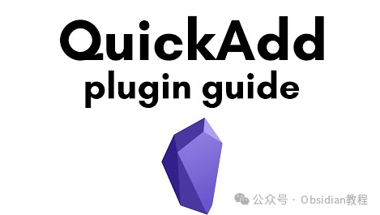
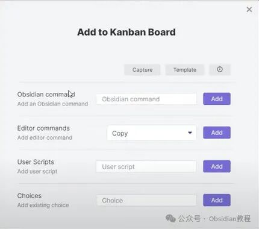
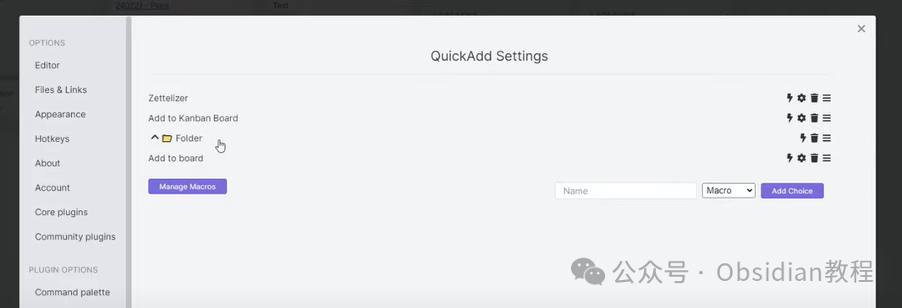
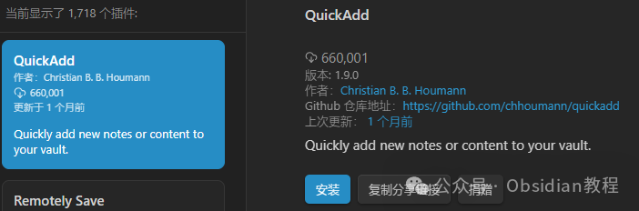
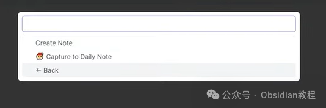
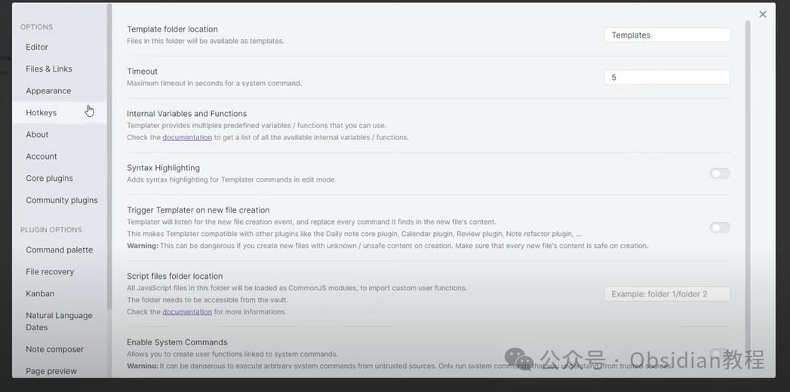

# Obsidian插件：QuickAdd 创建模板，告别重复劳动，提升笔记效率

嗨，我是鬼哥，10年+老程序员一枚。

你有没有过这样的困惑？在Obsidian里，有时候需要重复创建一些模板笔记，比如每周的工作计划、会议记录或者读书笔记，每次都手动创建实在是麻烦。

老实说，看到这些重复的操作，我的内心OS是：救救孩子吧，这简直是在消耗我的生命！

好消息来了！今天我要给大家介绍一个Obsidian插件——QuickAdd，让你轻松快速创建各种模板笔记，不再为重复劳动烦恼。

**介绍**

QuickAdd 是 Obsidian 中一个非常强大的插件，它可以帮助我们快速添加模板笔记，自动化执行一些重复性的任务。

通过QuickAdd，我们可以定义自己的模板，并通过快捷键或者命令面板快速调用。这不仅大大提高了效率，还能确保笔记的一致性和规范性。

简直就像给我们的笔记插上了飞速的翅膀，从此告别手动创建的苦逼日子。

#### **模板（Templates）**

模板就是用来创建新笔记的预设格式。想象一下，每天早上打开Obsidian，只需要按一个快捷键，今天的工作日志就自动生成了，内容、格式都按照你预先设置好的模板，简直不要太省事。

#### **捕捉（Captures）**

捕捉功能可以让你快速添加内容到预定义的文件里。比如，你可以设置一个快捷操作，把当前打开文件的链接添加到你的日记笔记里。只需一点，灵感、重要信息就能秒速记录下来。

#### **宏（Macros）**

宏功能是把模板和捕捉组合起来，形成更强大的自动化工作流。比如，你可以设定一个宏，按下快捷键，就能新建一篇棋局记录笔记，用特定模板记录比赛情况，同时在你的“比赛列表”和日记笔记里添加引用。这种效率提升，简直让人爱不释手。

#### **多选（Multis）**

多选其实就是一个组织工具。你可以把各种选择放在不同的文件夹里，整理得井井有条。比如，把所有与工作相关的操作放在一个文件夹里，与个人生活相关的操作放在另一个文件夹里。

**下载和安装**

在Obsidian中安装QuickAdd非常简单：

### **1.在线安装：**

  * 打开Obsidian，点击左下角的“设置”图标。
  * 在设置菜单中，选择“第三方插件”选项。
  * 点击“浏览”按钮，搜索“QuickAdd”。
  * 找到插件后，点击“安装”。
  * 安装完成后，切换插件的“启用”开关。

### **2.离线安装：****  
****因为网络原因很多同学无法直接在线安装obsidian插件，这里我已经把obsidian所有热门插件下载好了**  
只需要关注下方公众号，后台回复：**插件** 即可获取

  

#### 

安装完成后，我们需要进行一些简单的配置：

  1. 打开设置菜单，找到“QuickAdd”插件，点击进入配置界面。

  2. 在配置界面中，你可以看到“Macro”、“Choice”、“Template”等选项。这里我们主要使用的是“Choice”和“Template”。

#### 3\. 创建模板

QuickAdd支持多种类型的模板，包括普通模板、脚本模板等。下面以创建一个“每日日志”模板为例：

  1. 在Obsidian中创建一个新的笔记文件，命名为“daily-log-template.md”。

  2. 在模板文件中输入你需要的内容，例如：

  *   *   *   *   *   *   *   *   *   * 

    
    
    # 日志 - {{DATE}}  
    ## 今日任务- [ ]   
    ## 完成情况-   
    ## 备注- 

3.保存模板文件。

#### 4\. 配置Choice

我们需要在QuickAdd中配置一个Choice来调用这个模板：

  1. 在QuickAdd配置界面中，点击“New Choice”。

  2. 在弹出的窗口中，选择“Template Choice”。

  3. 为这个Choice命名，例如“每日日志”。

  4. 选择我们刚刚创建的模板文件“daily-log-template.md”。

  5. 配置完成后，点击“保存”。

#### 5\. 使用QuickAdd

现在，你可以通过命令面板或者快捷键快速调用这个模板了：

  1. 按下Ctrl+P（或Cmd+P）打开命令面板，输入“QuickAdd”。

  2. 选择“每日日志”。

  3. QuickAdd会自动根据模板创建一个新的笔记，并替换模板中的变量（如{{DATE}}）为当前日期。

### **QuickAdd的优势**

  * **效率提升** ：快速创建模板笔记，减少重复劳动。每次按下快捷键，就感觉自己像是瞬移到下一个任务一样，效率高到飞起！

  * **规范性** ：确保笔记内容一致，符合预设的格式。再也不用担心笔记乱七八糟，老婆看了都夸我有条理。

  * **灵活性** ：支持多种类型的模板和脚本，满足不同需求。想怎么定制就怎么定制，简直就是笔记界的“万金油”。

  * **易用性** ：界面友好，配置简单，适合各种用户。你不会用？不存在的！你会用微信，那你就会用QuickAdd。

### **应用场景**

QuickAdd不仅适用于创建每日日志，还可以用于以下场景：

  * **项目管理** ：快速生成项目模板，跟踪项目进展。再也不用每次都从零开始写项目计划，老板看到都会感动得痛哭流涕。

  * **会议记录** ：创建标准化的会议记录模板，方便记录和查阅。再也不用担心会议记录找不到，老板夸你有条理。

  * **读书笔记** ：根据模板快速生成读书笔记，记录读书心得。每本书读完都有详细的记录，再也不怕忘记重要的观点。

  * **学习笔记** ：创建学习笔记模板，系统化记录学习内容。学习效率大大提升，再也不用怕考试复习找不到重点。

### **鬼哥的使用感受**

我使用QuickAdd已经有一段时间了，它确实大大提升了我的工作效率。以前每次写会议记录都要手动创建新的笔记，现在只需按一个快捷键，模板自动生成，内容一致，规范统一。此外，QuickAdd的灵活性也让我可以根据不同需求创建各种模板，使用起来非常方便。如果你也有类似的需求，不妨试试QuickAdd，相信它会给你的Obsidian使用体验带来新的提升。再也不用为那些繁琐的重复操作头疼了，快来试试吧！  
  
  
1******扫码购买****《 Obsidian实战教程》****从入门到精通， 链接您的每一个思维瞬间。**  

