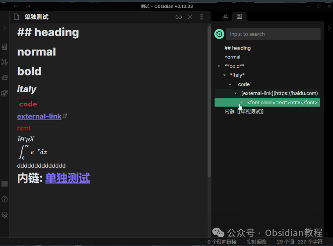
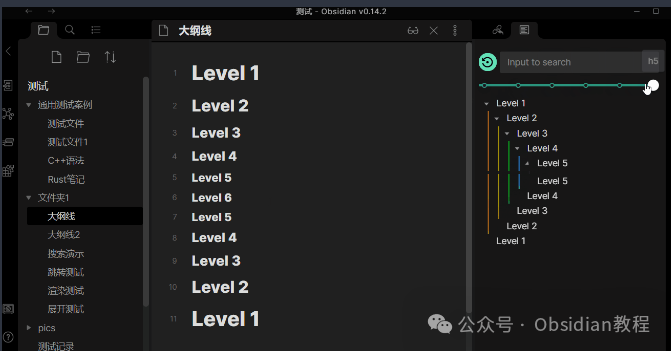
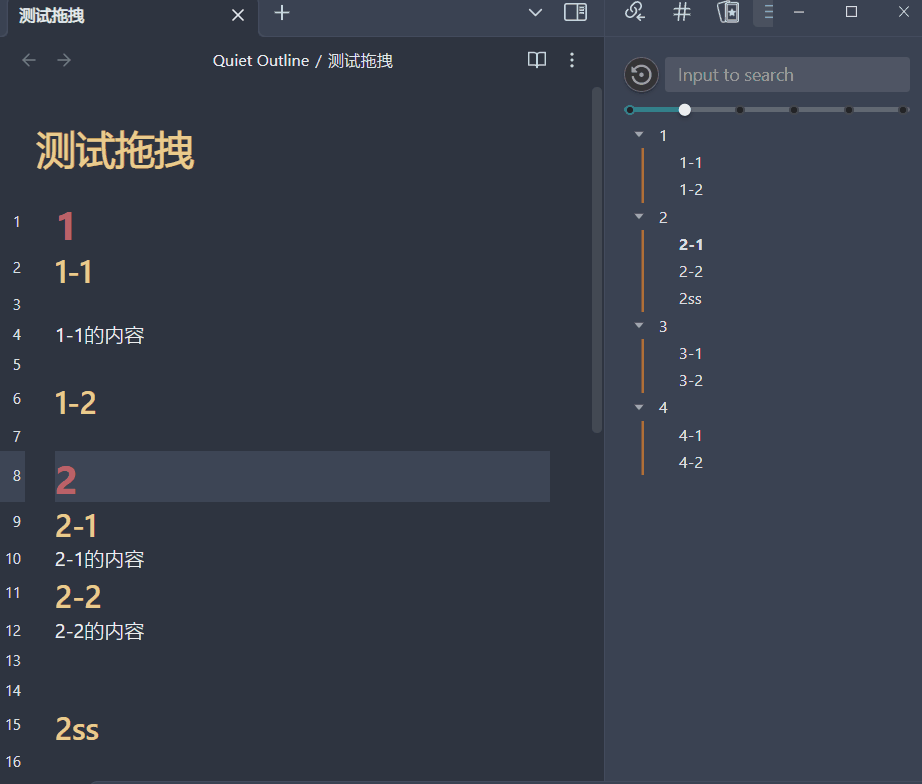
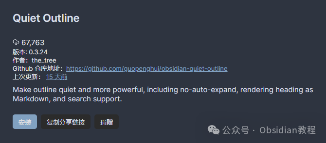
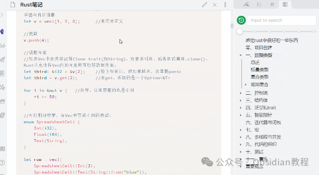

# Obsidian插件：Quiet Outline为用户提供更加清晰、易用的大纲视图

Obsidian 是一个强大的知识管理和笔记软件，支持大量插件扩展其功能，其中 Quiet Outline 插件为用户提供了一个更加清晰、易用的大纲视图，使得管理和浏览大型文档变得更加轻松。  
本文将详细介绍如何安装和使用 Quiet Outline 插件，以及它的主要特性和一些使用限制。

##  **1****主要特性**   

### **默认大纲与安静大纲**

**  
**

  * 默认大纲：Obsidian 自带的大纲视图，展示了文档中所有的标题。

  

### **

**

### **  
**

  * 安静大纲：Quiet Outline 插件提供的大纲视图，特点是更加简洁和易于阅读。

  
  

### **特性概览**

**  
******

  * 无自动展开编辑：在编辑时，大纲视图不会自动展开，帮助你保持焦点。
  * 支持搜索：可以通过关键词搜索大纲中的内容，支持隐藏不相关结果和使用正则表达式搜索。
  * Markdown 渲染支持：大纲中的 Markdown 内容可以被渲染，使得视图更加丰富和直观。

  

  * 自动展开/折叠：根据文档结构自动展开或折叠大纲中的内容。
  * 级别切换条：可以快速切换展示大纲的级别，例如仅显示一级标题或二级标题等。

  

  * 拖拽修改：支持通过拖拽的方式调整笔记中的内容结构。

### 

  

###   

### **使用限制**

**  
**

  * 懒渲染策略：由于 Obsidian 编辑器的懒渲染策略，快速滚动时可能会出现渲染延迟。如果在编辑模式下点击大纲跳转没有立即到达目标位置，可以尝试再次点击。

  

  * 不支持跨级：大纲必须按顺序使用标题等级，例如 h1->h2->h3，而不能跳跃使用，如 h1->h3->h4。

  

  * 无法将标题拖拽为子标题：不能将一个标题拖拽成为另一个标题的子标题。  

  * 部分扩展语法不支持：一些 Obsidian 的扩展 Markdown 语法可能默认不被支持，但可以通过扩展 Markdown 解析器来解决。

  

## 3**安装 Obsidian Quiet Outline 插件**   
****

### 

####  通过社区插件浏览器：  

###   

### **1.在线安装**（需要科学上网） ：****

### ****  
****

### 点击“社区插件”下的“浏览”按钮，在左上角的搜索框中搜索“ diagram”，然后点击“安装”按钮。

###   
启用插件：安装成功后，点击“启用”以启用插件。  
  
**2.离线安装：****  
****因为网络原因很多同学无法直接在线安装obsidian插件，这里我已经把obsidian所有热门插件下载好了**  
只需要关注下方公众号，后台回复：**插件** 即可获取  

  * 下载最新发布的ZIP文件。
  * 解压至Obsidian的插件文件夹

##  4**使用方法**   

### **开启 Quiet Outline**

**  
**

### ****

  * 打开 Obsidian 的命令面板（通常通过快捷键 Ctrl+P 或 Cmd+P）。
  * 输入 Quiet Outline 并按 Enter 键，即可启用插件的大纲视图。

### 

### **  
**

### **配置 Markdown 渲染**

  

  * 如果需要在大纲中渲染 Markdown 格式，可以在设置面板中开启 Markdown Render 选项。

##   

## **实用技巧**

**  
**

  * 利用搜索功能：当你的文档非常长时，使用搜索功能可以快速定位到你感兴趣的部分。正则表达式搜索特别有用于查找特定格式的内容。
  * 调整大纲级别：使用级别切换条可以帮助你快速浏览文档的结构，特别是在复杂文档中，这可以大大提高你的效率。
  * 优化笔记结构：通过拖拽修改功能，你可以轻松地重组你的笔记结构，这对于组织你的思路和信息非常有帮助。

  
通过上述教程，你应该对如何安装和使用 Obsidian 的 Quiet Outline 插件有了深入的了解。  
这个插件通过提供一个更加清晰和易于操作的大纲视图，能够帮助你更有效地管理和浏览你的笔记，是提高 Obsidian 使用效率的重要工具。  
  
  
1******扫码购买****《 Obsidian实战教程》****从入门到精通， 链接您的每一个思维瞬间。**  
  

