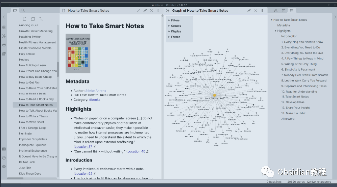
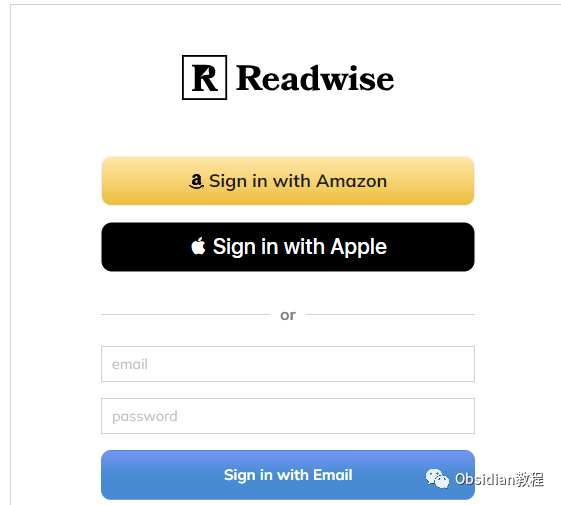
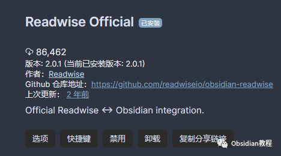
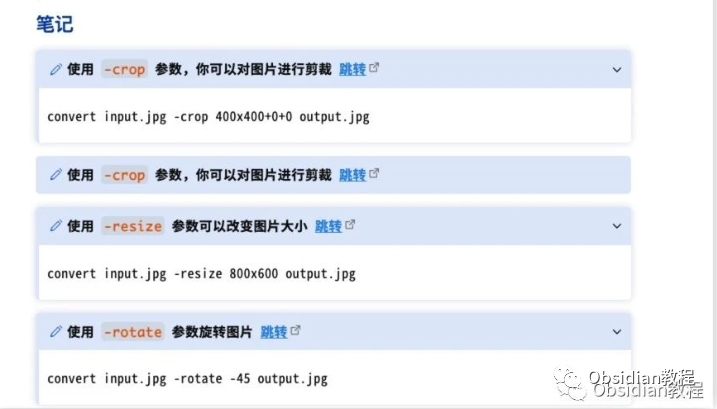
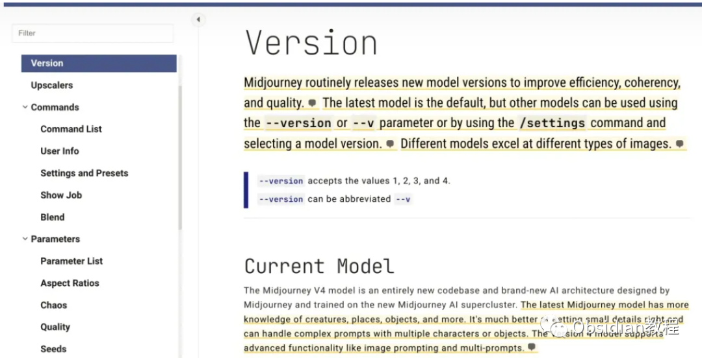

# Obsidian插件：Readwise Official将高亮内容整合到Obsidian中，便于管理和回顾

Obsidian作为一款功能丰富的笔记软件，通过插件可扩展其用途，其中Readwise Official插件便是一个非常实用的工具。  
这款官方维护的插件主要用于将你在不同平台上的阅读高亮内容自动导出到Obsidian中。  
下面，我将详细介绍Readwise Official插件的功能、使用方法及其实际应用场景。  

## 1Readwise Official插件简介

Readwise Official插件能够自动同步你在各种平台上的阅读高亮，如Amazon Kindle、Apple Books、Google Play Books、Instapaper、Pocket、Medium、Twitter以及PDF等。它的主要功能是将这些高亮内容整合到Obsidian中，便于管理和回顾。  
需要注意的是，使用这个插件需要订阅Readwise服务，这是一个付费服务，旨在帮助用户将所有阅读数据汇总到一个地方，并便于复习。  

## **  
**

## **插件功能特点**

  

  * 连续自动同步：无论何时何地做的阅读标注，都可以自动同步到Obsidian。
  * 灵活的模板定制：使用Jinja2模板语言自定义导出格式，满足个性化需求。
  * 丰富的元数据：高亮导出内容不仅包括文本，还有封面图片、原始URL、作者名称、章节标题、阅读时添加的标签等。
  * 优质的客户支持：作为付费产品，用户可以获得快速响应的咨询服务，并根据反馈不断升级插件。

## 

2使用方法

### **1.在线安装**（需要科学上网） ：****

### ****  
****

### 点击“社区插件”下的“浏览”按钮，在左上角的搜索框中搜索“ Readwise Official”，然后点击“安装”按钮。

###   
启用插件：安装成功后，点击“启用”以启用插件。  

  
**2.离线安装：****  
****因为网络原因很多同学无法直接在线安装obsidian插件，这里我已经把obsidian所有热门插件下载好了**  
只需要关注下方公众号，后台回复：**插件** 即可获取

  * 启用插件：在插件列表中找到「Readwise Official」并启用。
  * 连接Readwise账户：在插件设置中连接你的Readwise账户。
  * 自定义导出设置：根据需要定制导出格式和设置。
  * 启动首次同步：完成设置后，进行首次同步。
  * 配置自动或手动同步：根据个人喜好设置同步频率。

## 

3实际应用案例

**阅读笔记整理：**  

  * 当你在Kindle上阅读书籍并做了一些高亮标记后，通过Readwise Official插件，这些标记可以自动同步到Obsidian中，方便你后续的学习和复习。
  * 你可以为每本书创建一个单独的笔记文件夹，在Obsidian中形成有序的阅读笔记体系。

  
研究资料汇总：

  1. 

  2.   

     * 对于研究人员来说，可以将在不同平台和文献上的重要标记和笔记汇总到Obsidian中，便于整理和分析。
     * 利用Obsidian的链接和标签功能，可以将这些标记与其他相关笔记连接起来，形成一个互联的知识网络。
  3.   

  4. **日常学习跟踪：**
  5.   

     * 对于学生和终身学习者，通过这个插件，可以跟踪和管理在各个平台上的学习进度和重要内容。
     * 可以利用Obsidian的强大搜索和过滤功能，快速找到特定主题或关键词的相关标记。

##   

## **小贴士**

**  
**

  * 定期检查同步状态：确保你的阅读高亮内容能够顺利同步到Obsidian。
  * 充分利用模板功能：根据你的笔记习惯定制导出模板，以获得最佳的使用体验。
  * 结合其他Obsidian插件使用：例如与Graph View、Dataview等插件结合，可以更有效地管理和展示同步的内容。

## 

4结语

Readwise Official插件是一个极为实用的工具，尤其适合那些希望将阅读高亮内容整合到Obsidian中的用户。  
无论是用于学习、研究还是个人知识管理，这个插件都能大大提高你的工作效率和学习体验。记得充分利用其提供的强大功能，让你的阅读和笔记更加高效有序。  
  
  
1******扫码购买****《 Obsidian实战教程》****从入门到精通， 链接您的每一个思维瞬间。**  

