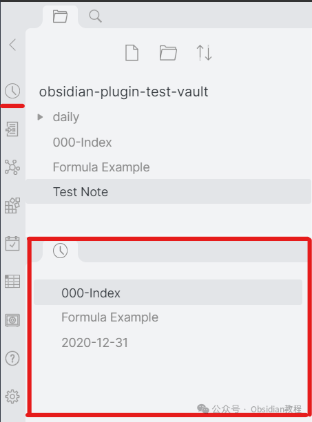
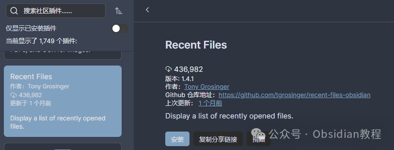

# Obsidian插件：Recent Files快速找到最近编辑过的文件

嗨，我是鬼哥，10年+老程序员一枚。  
今天咱们来聊聊一个相当实用的Obsidian插件——Recent Files。  
大家都知道，Obsidian的强大之处在于它的扩展性，各种插件让我们的笔记管理如虎添翼。  
Recent Files这个插件就属于那种小而美的工具，解决了我们在使用Obsidian时的一个小烦恼：**如何快速找到最近编辑过的文件** 。  
这个插件的功能非常简单直接，但却非常实用。下面鬼哥就带大家深入了解一下这个插件的使用方法和它带来的好处。  

### **介绍**

  
Recent Files插件的主要功能是展示最近打开的文件列表在侧边栏中。想象一下，你在Obsidian里有成百上千个笔记文件，要找到最近编辑的那些文件可不是件轻松的事。而这个插件就能帮你解决这个问题，让你不用再在庞大的文件夹结构中苦苦搜索。  

### **下载与安装**

**  
****在线安装：****  
**

  1. 打开Obsidian：首先，确保你已经安装并打开了Obsidian软件。
  2. 访问社区插件：在Obsidian的设置中，找到“社区插件”选项，然后点击“浏览”。
  3. 搜索Recent Files：在插件市场的搜索栏中输入“Recent Files”，找到这个插件。
  4. 安装插件：点击安装按钮，然后启用这个插件。

### 

  

******  
****离线安装：****  
****很多同学无法直接在线安装obsidian插件，这里我已经把obsidian所有热门插件下载好了**  
只需要关注下方公众号，后台回复：**插件** 即可获取

### 

###   

### **使用方法**

  
Recent Files插件的使用非常简单。安装并启用插件后，你会在Obsidian的侧边栏中看到一个新的面板，列出了最近打开的文件。你可以通过以下几种方式与这些文件进行交互：  

  1. 单击打开：点击列表中的文件名，可以直接打开文件。
  2. Ctrl+单击新窗格中打开：按住Ctrl键点击文件名，可以在新的窗格中打开文件。
  3. 右键菜单：右键点击文件名，会弹出一个菜单，提供更多操作选项。
  4. 拖动文件：你可以将文件拖到编辑器中，以创建链接，或拖到侧边栏中的文件夹，以移动文件。

  
此外，如果你启用了“页面预览”设置中的“Recent Files”选项，还可以通过鼠标悬停或按住Ctrl键悬停在文件名上来预览文件内容。  

### **插件的好处**

**  
**

  1. 提高工作效率：无需在文件夹中反复查找最近编辑的文件，节省了大量时间。
  2. 方便快捷：所有最近打开的文件都集中在一处，使用起来非常方便。
  3. 增强用户体验：通过预览功能，可以快速浏览文件内容，决定是否需要打开编辑。

###   

### **使用感受**

  
鬼哥用了这个插件一段时间，感觉真的是提升了不少效率。尤其是在需要频繁切换不同笔记的时候，这个插件可以说是神器了。不用再花时间去记忆或者查找文件路径，所有操作都变得更加顺畅。

  

### **适用场景**

**  
**

  1. 多项目管理：如果你同时管理多个项目，各项目的笔记文件分布在不同的文件夹中，这个插件能帮你快速找到最近编辑的笔记。
  2. 快速参考：写作或者研究过程中，常常需要参考最近的一些资料，通过Recent Files插件，你可以快速找到并打开这些文件。

###   

### **总结**

  
Recent Files插件虽然功能简单，但却极大地提高了Obsidian的使用效率。对于那些笔记量大、文件夹结构复杂的用户来说，这个插件无疑是一个福音。  
希望这篇文章能帮助大家更好地理解和使用Recent Files插件，让Obsidian成为你工作和学习中的好帮手。  
  
鬼哥会继续为大家带来更多有趣又实用的Obsidian插件介绍，敬请期待！  
  
  
1******扫码购买****《 Obsidian实战教程》****从入门到精通， 链接您的每一个思维瞬间。**  

