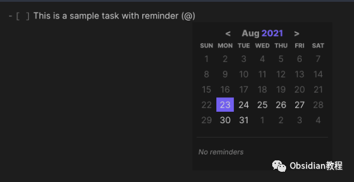
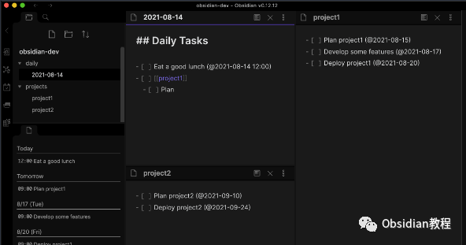
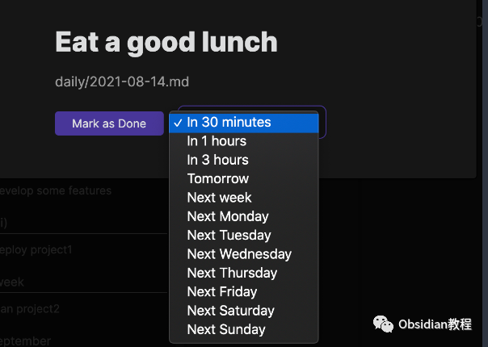
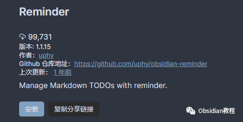

# Obsidian插件：Reminder 为 Obsidian 用户提供便捷的提醒功能

Obsidian Reminder 插件为 Obsidian 用户提供了便捷的提醒功能，尤其适合那些希望将任务管理和笔记结合使用的用户。  
通过这个插件，用户可以在 Obsidian 中设置提醒，管理待办事项，并与其他插件协同工作。  

本教程将详细介绍该插件的安装、功能和实际应用方法。  

## 1基本功能介绍

### **1\. 设置提醒**

  
用户可以为待办事项（TODOs）设置提醒。提醒的格式如下：  

  * [ ] 表示一个未完成的任务。
  * 在任务描述后加上 (@YYYY-MM-DD) 或 (@YYYY-MM-DD HH:MM) 来设置提醒日期和时间。
  * 已完成的任务（即 [x] 格式）不会触发提醒。

  
例如：  

  * [ ] 项目报告 (@2023-08-14)

  * [ ] 会议准备 (@2023-08-14 09:37)

### 

###   

### **2\. 查看提醒列表**

  
插件允许用户查看所有文件中包含的提醒列表。在列表中点击某个提醒项，Obsidian 会打开包含该提醒的 Markdown 文件。  

### **3\. 提醒通知**

  
当提醒时间到达时，Obsidian 会显示通知。用户可以直接在通知中将任务标记为完成，或者选择稍后提醒。

## 2高级功能和使用技巧

### **1\. 插件间互操作性**

  
Obsidian Reminder 插件支持其他插件的格式，如：  

  * Obsidian Tasks 格式（例如：📅 2021-05-02）。
  * Kanban 插件格式（例如：@{YYYY-MM-DD}）。

  
这意味着用户可以在使用这些插件的同时，无缝集成 Reminder 插件的功能。  

### **2\. 整合日程管理**

  
用户可以将 Reminder 插件与日程或日历插件结合使用，以实现更全面的时间和任务管理。  

### **3\. 自定义通知方式**

  
虽然插件默认提供基本的提醒通知，但用户可以通过 Obsidian 的其他插件或自定义脚本进一步定制提醒方式，例如集成桌面通知或声音提醒。

## 

3实际应用场景

  * 个人任务管理：设置日常工作、学习或生活中的任务提醒，确保重要事项不被遗忘。
  * 项目协作：在团队协作项目中使用，提醒团队成员完成指定任务或达到项目里程碑。
  * 学术研究：为文献审阅、实验计划或会议准备设置提醒，确保按时完成学术活动。

## 

4插件安装

### **1.在线安装**（需要科学上网） ：****

### ****  
****

### 点击“社区插件”下的“浏览”按钮，在左上角的搜索框中搜索“ Reminder”，然后点击“安装”按钮。

###   
启用插件：安装成功后，点击“启用”以启用插件。  

  
**2.离线安装：****  
****因为网络原因很多同学无法直接在线安装obsidian插件，这里我已经把obsidian所有热门插件下载好了**  
只需要关注下方公众号，后台回复：**插件** 即可获取  

**常见问题解决  
**

  * 提醒不显示：检查 Obsidian 是否运行在前台，以及提醒格式是否正确。
  * 时间格式错误：确保遵循正确的时间格式（@YYYY-MM-DD HH:MM）。
  * 插件冲突：如果使用多个插件，确保它们之间不会相互干扰。

## 

5结语

Obsidian Reminder 插件为 Obsidian 用户提供了一个简单而强大的提醒功能，使得任务管理和时间规划变得更加便捷。  
通过合理利用这个插件，用户可以更有效地组织自己的工作和学习，确保重要事项得到妥善处理。  
  
  
1**扫码购买****《 Obsidian实战教程》****从入门到精通， 链接您的每一个思维瞬间。****  
**

