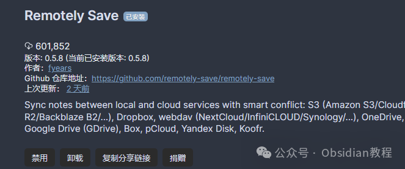
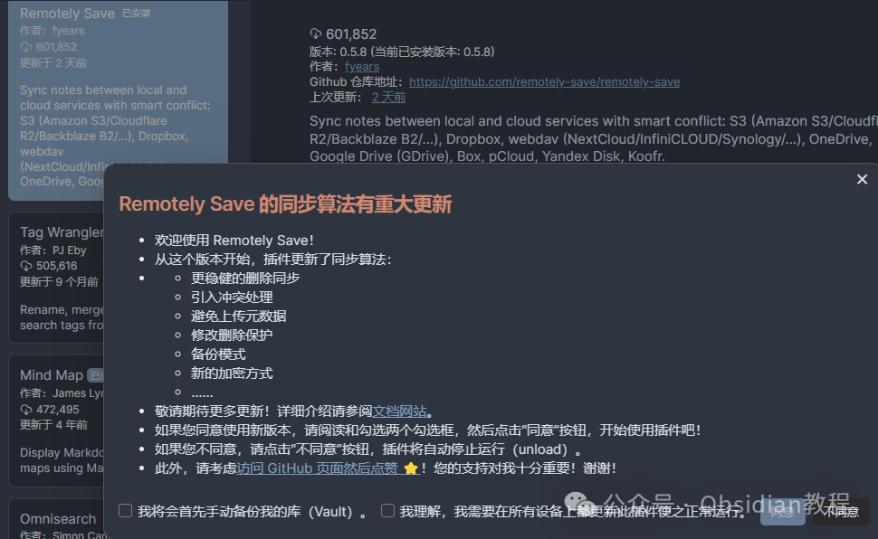

# Obsidian插件：Remotely Save支持各种主流的云服务来同步Obsidian笔记

嗨，我是鬼哥，10年+老程序员一枚。  
今天咱们聊聊一个名叫“Remotely Save”的插件，它为Obsidian提供了一种非官方的同步服务。  
如果你对Obsidian不陌生，那么你一定知道它的官方同步服务还是蛮不错的，但是有时候我们需要一些更灵活、更便宜甚至是更私有的解决方案，这就是Remotely Save闪亮登场的地方。  

Remotely Save插件支持各种主流的云服务，像是Amazon S3、Dropbox、OneDrive、Google Drive等等，甚至连Webdav都支持！  
这意味着你可以使用你最喜欢的云服务来同步Obsidian的笔记，不仅限于官方提供的同步方案。  
这个插件还支持端到端加密，确保你的数据在传输过程中是安全的，这点对隐私控来说简直是福音。  

## **Remotely Save 的下载与安装**

###   

在Obsidian中安装Remotely Save非常简单：

### **1.在线安装：**

  * 打开Obsidian，点击左下角的“设置”图标。
  * 在设置菜单中，选择“第三方插件”选项。
  * 点击“浏览”按钮，搜索“Remotely Save”。
  * 找到插件后，点击“安装”。
  * 安装完成后，切换插件的“启用”开关。

### **2.离线安装：****  
****因为网络原因很多同学无法直接在线安装obsidian插件，这里我已经把obsidian所有热门插件下载好了**  
只需要关注下方公众号，后台回复：**插件** 即可获取

  

**插件的功能与使用方法**

Remotely Save提供了丰富的功能，下面咱们逐一介绍这些功能以及如何使用它们：  

### **支持的云服务**

  
Remotely Save支持以下云服务：  

  * Amazon S3 或 S3-compatible（Cloudflare R2 / BackBlaze B2 / MinIO 等等）
  * Dropbox
  * OneDrive
  * Webdav（NextCloud / InfiniCloud / Synology webdav server 等等）
  * Webdis
  * Google Drive（PRO功能）
  * Box（PRO功能）
  * pCloud（PRO功能）
  * Yandex Disk（PRO功能）
  * Koofr（PRO功能）

  
如果你使用的是免费版，可以选择Amazon S3、Dropbox、OneDrive或者Webdav进行同步；而如果你升级到PRO版，则可以使用更多的高级功能和云服务。**  
**

### **支持移动设备同步**

  
Remotely Save不仅支持桌面设备，还支持Obsidian Mobile。你可以在手机和桌面设备之间无缝同步笔记，非常适合需要随时随地访问笔记的用户。  

### **端到端加密**

  
为了保护你的数据安全，Remotely Save支持端到端加密。你只需在插件设置中指定一个密码，插件就会在文件发送到云端之前使用openssl格式进行加密。

###   

### **自动同步**

  
你可以设置定时自动同步，让插件定期将你的笔记备份到云端。当然，你也可以手动触发同步，方法包括在侧边栏点击按钮、使用命令面板中的命令，甚至可以绑定快捷键，随时按下快捷键组合进行同步。  

### **文件和路径的跳过**

  
有时候，你可能不希望同步某些大文件或者特定路径下的文件。这时候，你可以通过自定义正则表达式来设置跳过条件，插件会自动忽略这些文件，节省你的云端存储空间和同步时间。  

### **冲突检测和处理**

  
Remotely Save具备基本的冲突检测和处理功能。对于免费版用户，这些基本功能已经足够应付大部分情况；而PRO版用户则可以享受更加智能的冲突处理机制。  

## **使用体验与总结**

  
总的来说，Remotely Save插件给Obsidian用户提供了一种灵活、安全且高效的同步解决方案。无论你是需要更多的云服务支持，还是对数据安全有更高的要求，这款插件都能满足你的需求。  
对于我个人而言，最大的亮点在于它的端到端加密和丰富的云服务支持，这让我的笔记不仅安全，而且可以在多设备之间无缝同步。  
对于像鬼哥这样经常在不同设备上工作的人来说，这无疑是极大的便利。  
所以，如果你也在寻找一款功能强大的Obsidian同步插件，不妨试试Remotely Save吧！记得备份好你的数据，开始愉快的笔记之旅吧！  
  
  
1******扫码购买****《 Obsidian实战教程》****从入门到精通， 链接您的每一个思维瞬间。**  

