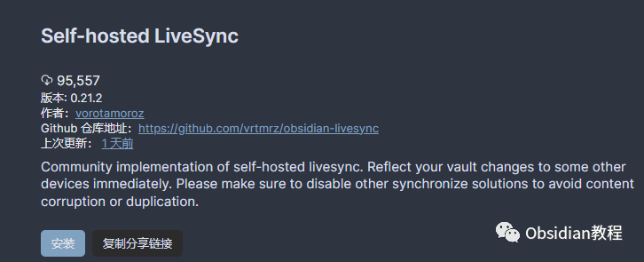

# Obsidian插件：Self-hosted LiveSync确保笔记的完全私密

Self-hosted LiveSync插件是一个由社区实现的Obsidian同步插件。  
与官方的"Obsidian Sync"不兼容，它使用自托管或购买的CouchDB作为中间服务器，支持所有兼容Obsidian的平台。  
此插件特别适合需要出于安全原因全面自托管笔记的研究人员、工程师和开发人员，或者只是想要确保笔记完全私密的任何人。  

下面是关于Self-hosted LiveSync插件的详细教程：

### 

1特点和注意事项

**特点：****  
**

  * 包含可视化冲突解决器。
  * 设备之间几乎实时的双向同步。
  * 支持使用CouchDB或兼容CouchDB的服务，如Cloudant。
  * 支持端到端加密。
  * 插件同步（测试版）。
  * 从obsidian-livesync-webclip接收WebClip（不适用端到端加密）。

  
**重要提示：****  
**

  * 不要同时启用此插件与其他同步解决方案（包括iCloud和Obsidian
  * Sync）。
  * 启用此插件前，请禁用所有其他同步方法，以避免内容损坏或重复。
  * 不要将您的保险库放在云同步文件夹内（如iCloud文件夹或Dropbox文件夹）。这是一个同步插件，而非备份解决方案。
  * 如设备存储空间不足，可能会导致数据库损坏。
  * 隐藏文件或任何其他不可见文件不会保存在数据库中，因此不会同步（可能还会被删除）。

### 

2使用方法

**准备数据库：**  

  * 设置fly.io。
  * 设置IBM Cloudant。
  * 设置您的CouchDB。
  * 使用fly.io进行测试，或者使用您自己的服务器搭建CouchDB。

  
可以参考以下教程：  
**配置插件：**  
参考快速设置指南进行配置。  
**处理损坏问题：****  
**

  * 如果本地数据库损坏（即使独立使用Obsidian时出现问题），选择“否”来回 答“保留本地数据库？”
  * 如果远程数据库损坏（即在复制过程中发生问题），选择“否”来回答“保留远程数据库？”
  * 如果两者都回答“否”，则您的数据库将通过您设备上的内容重建。然后远程数据库将锁定其他设备。您需要再次同步所有设备。

  
**状态栏信息：****  
**

  * 同步状态会显示在状态栏。
  * 状态包括：已停止、LiveSync已启用并等待更改、同步进行中、发生错误、上传/下载的数据块和元数据、待处理的进程数量、等待其数据块的文件数量。
  * 如果删除或重命名了文件，请等待⏳图标消失。

  
**提示：**  

  * 如果文件夹在复制后变空，默认会被删除。但这个行为可以在设置中切换。LiveSync模式在移动设备上会更耗电。建议定期同步并设置一些自动同步。
  * 移动版Obsidian无法连接到非安全（HTTP）或本地签名的服务器，即使设备上安装了根证书。
  * 没有像"exclude_folders"这样的配置。
  * 同步时，文件会根据修改时间进行比较，较旧的文件会被较新的覆盖。然后插件检查冲突，如有需要，会打开对话框进行合并。
  * 数据库中的文件可能偶尔会损坏。当文件看起来损坏时，插件不会写入本地存储。如果您的设备上有该文件的本地版本，可以通过编辑本地文件并同步来修复损坏。但如果该文件不存在于您的任何设备上，则无法恢复。在这种情况下，您可以从设置对话框中删除这些项目。

  
**故障排除**  
如果遇到插件工作不正常的问题，请参考故障排除指南。  

### 3安装插件：  

### **1.在线安装**（需要科学上网） ：****

### ****  
****

### 点击“社区插件”下的“浏览”按钮，在左上角的搜索框中搜索“ Self-hosted LiveSync”，然后点击“安装”按钮。

###   
启用插件：安装成功后，点击“启用”以启用插件。  

  
**2.离线安装：****  
****因为网络原因很多同学无法直接在线安装obsidian插件，这里我已经把obsidian所有热门插件下载好了**  
只需要关注下方公众号，后台回复：**插件** 即可获取

通过上述指南，您可以更好地了解并使用Self-hosted LiveSync插件，实现高效、安全的Obsidian笔记同步。

  
  
  
1**扫码购买****《 Obsidian实战教程》****从入门到精通， 链接您的每一个思维瞬间。****  
**

