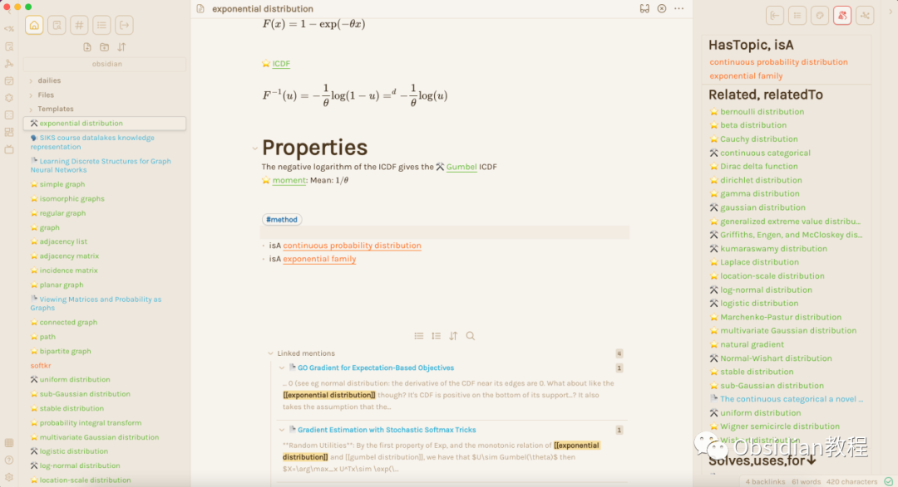
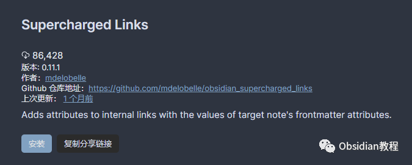
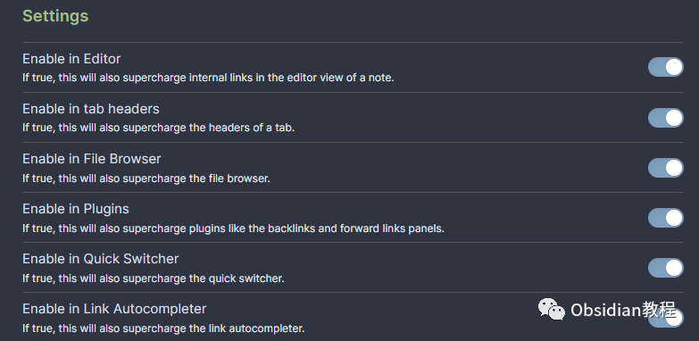
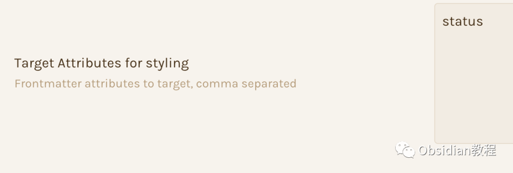
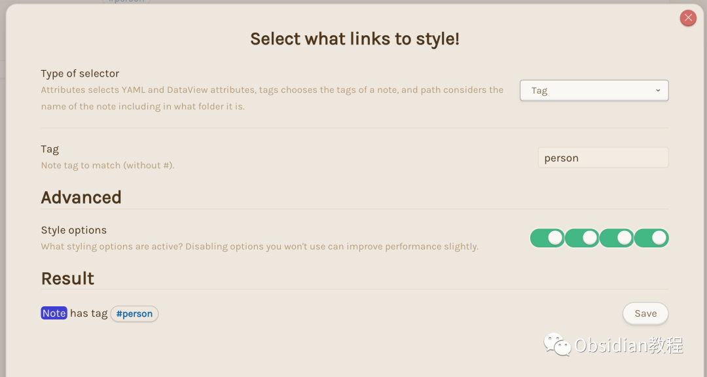
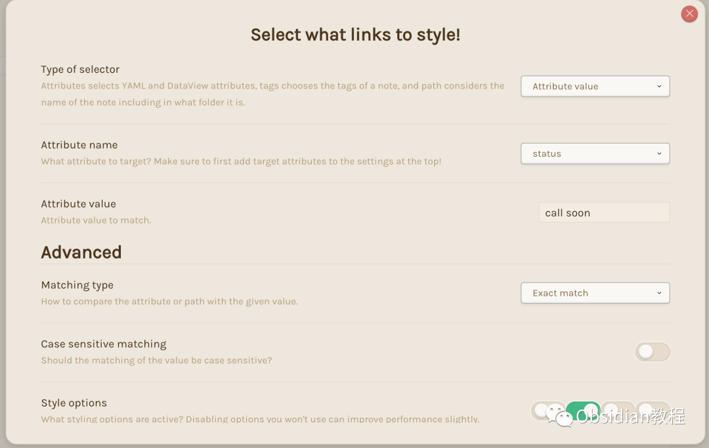
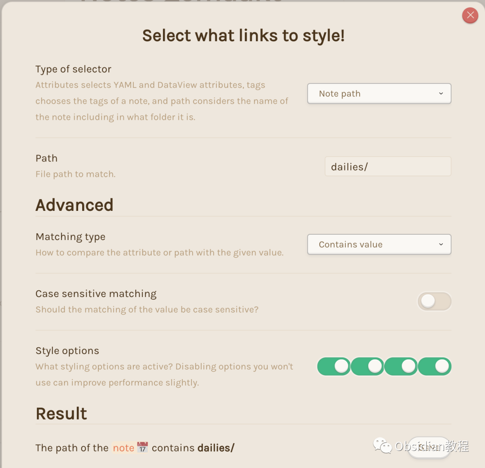
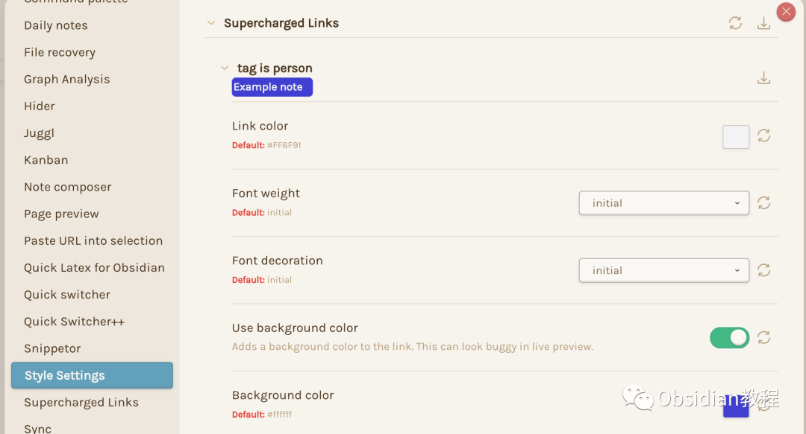

# Obsidian插件：Supercharged Links根据笔记的元数据来设置链接的样式

Supercharged Links 是一款Obsidian笔记软件的插件，能让你根据笔记的元数据（如标签或YAML前端属性）来设置链接的样式。

  

你可以自动地为链接添加颜色、表情符号或其他风格，使它们更具视觉吸引力，便于导航。  

  

### 1安装插件

### **1.在线安装**（需要科学上网） ：****

### ****  
****

### 点击“社区插件”下的“浏览”按钮，在左上角的搜索框中搜索“ Supercharged Links”，然后点击“安装”按钮。

###   
启用插件：安装成功后，点击“启用”以启用插件。  

  
**2.离线安装：****  
****因为网络原因很多同学无法直接在线安装obsidian插件，这里我已经把obsidian所有热门插件下载好了**  
只需要关注下方公众号，后台回复：**插件** 即可获取

  

这里我们需要安装Supercharged Links插件和Style Settings插件。

并确保两个插件都被激活。

### 

2初步使用

Supercharged Links的使用流程大致如下：

  

  * 在Supercharged Links设置中，创建你想要设置样式的新选择器。

  * 选择选择器的类型（标签、属性或路径）并输入你想匹配的值。

  * 在Style Settings插件设置中，为选定的属性设置样式，例如更改文本颜色、背景颜色或添加表情符号。

### 

###   

### **例子**

  

假设你有一篇关于Jim的笔记，名为“Jim.md”，其中包含标签#person和一些YAML前端元数据。
      
      *   *   *   *   *   *   *   * 
    
    
    
    ---status: call soonage: 42---  
    Jim is one of my colleagues  
    #person

  

你想改变指向Jim笔记的链接的样式，特别是想让指向人物的链接有蓝色背景，并在需要联系的人物前添加电话表情符号☎️。

### 

3设置插件

#### **第一步：配置目标属性**

  
在插件设置中，首先定义你的样式目标属性。在“目标属性用于样式设置”选项中添加status。

#### **第二步：设置选择器**

  
然后，告诉插件寻找带有#person标签的笔记。在设置中的“样式”标题下，创建一个新的选择器。选择器类型选择“标签”，并在下方添加person。  

你也可以设置当笔记的status属性为call soon时添加表情符号。这将会寻找名为status的内联字段。  

#### **第三步：样式选项**

  
重要的设置是仅启用“在链接前添加内容”选项，因为否则这种样式会覆盖来自#person标签的样式。  

#### **第四步：基于路径的样式**

####   

#### 除了基于属性或标签的样式外，我们还可以基于笔记的“路径”（包括其名称、文件夹和扩展名）来设置样式。例如，我们可以为“dailies”文件夹中的所有笔记设置样式。这里要确保选择“包含值”而非“精确匹配”。

4实际样式设置确保Style Settings插件已安装并启用。然后，在设置中导航至Style Settings的设置。现在我们准备好为链接设置样式了！  

#### **设置#person标签的样式**

  
我们将使用白色文字颜色，启用背景，并使用漂亮的蓝色背景。  

#### 为带有call soon状态的笔记添加表情符号

这里只需将☎️表情符号复制到“前置文本”文本区域。  

### 5总结

### Supercharged Links插件为Obsidian用户提供了一个强大的工具，通过自定义链接样式，增强笔记的视觉效果和导航体验。无论是基于标签、属性还是路径的样式设置，或是进阶的CSS自定义，这款插件都能帮助你使笔记系统更加个性化、直观。 

###   

### 这种视觉上的反馈不仅增加了笔记之间的关联性，也使得寻找和回顾信息变得更加轻松。通过灵活运用Supercharged Links，你的Obsidian笔记本将变得更加生动、有趣，同时提高你的工作和学习效率。

  
  
  
1******扫码购买****《 Obsidian实战教程》****从入门到精通， 链接您的每一个思维瞬间。**  

