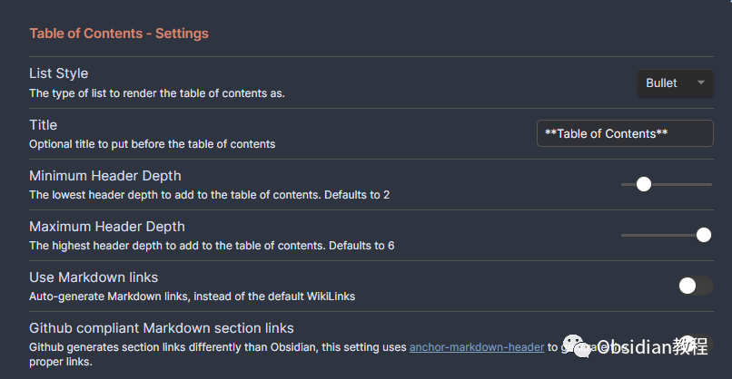
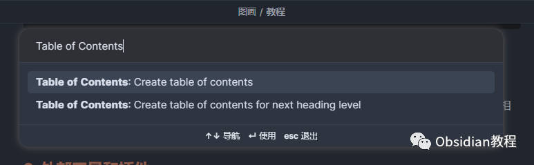

# Obsidian插件：Table of Contents在笔记中创建和管理目录

Obsidian是一款功能强大的笔记应用，它通过各种插件提供了额外的功能。其中，“目录（Table of Contents）”插件是一个实用的工具，用于在笔记中创建和管理目录。  
这篇文章将详细介绍这个插件的特点、安装方法、使用方式和一些自定义设置。  

### 1插件特点

“目录”插件提供了以下命令：  

  * 创建完整目录（默认无快捷键）
  * 为下一级标题创建目录（默认无快捷键）

  
此外，它还提供了以下设置选项：  

  * 列表样式：'bullet'（项目符号）或 'number'（数字编号）
  * 标题：字符串类型，默认为未定义
  * 最小标题深度：数字，默认为2
  * 最大标题深度：数字，默认为6

  

该插件能够为当前标题级别的子标题创建目录。  
例如，如果在二级标题下运行“目录”命令，生成的目录将只包含该二级标题的子标题。

2安装步骤

### 

### **1.在线安装**（需要科学上网） ：****

### ****  
****

### 点击“社区插件”下的“浏览”按钮，在左上角的搜索框中搜索“ Table of Contents”，然后点击“安装”按钮。

###   
启用插件：安装成功后，点击“启用”以启用插件。  

  
**2.离线安装：****  
****因为网络原因很多同学无法直接在线安装obsidian插件，这里我已经把obsidian所有热门插件下载好了**  
只需要关注下方公众号，后台回复：**插件** 即可获取

安装插件后，需要确保“目录”插件的开关已打开。  
设置好之后，可以在命令面板（CMD + P）中看到此插件的命令。你可以为这些命令分配快捷键以便快速使用。例如：  

  * 创建完整目录 => CMD + SHIFT + T
  * 为下一级标题创建目录 => CMD + T

###   

### **使用方法**

**  
**

  * 在Obsidian中打开一个笔记。
  * 将光标定位到你想创建目录的位置。
  * 使用命令面板（CMD + P）或设置的快捷键执行“创建完整目录”或“为下一级标题创建目录”命令。
  * 插件会在光标位置生成目录。

###   

### **自定义设置**

####   

####  详细嵌套的有序列表

  
如果你希望目录使用嵌套列表编号（例如：1.1, 1.2），可以添加以下CSS代码片段到Obsidian中。这将影响你笔记中的所有有序列表：
      
      *   *   *   *   *   *   *   *   *   *   *   *   * 
    
    
    
    ol {  counter-reset: item;}  
    ol li {  display: block;}  
    ol li:before {  content: counters(item, ".") ". ";  counter-increment: item;  padding-right: 5px;}

注意：确保在Obsidian的选项中启用这个代码片段。

### 

3使用技巧和最佳实践

  * **标题层次清晰：** 为了使目录清晰易读，保持你的笔记标题层次分明和一致。
  * **定期更新目录：** 当你的笔记内容有较大变更时，记得更新目录以反映最新结构。
  * **利用快捷键：** 通过为“创建完整目录”和“为下一级标题创建目录”命令设置快捷键，可以大大提高效率。

### 

4结语

Obsidian的“目录”插件是管理大型笔记和复杂结构文档的有效工具。  
通过上述教程，你可以轻松地在你的笔记中创建、管理和自定义目录，使你的笔记更加有序和易于导航。掌握这个插件的使用，将有助于提升你的笔记整理和文档管理能力。  
  
  
1******扫码购买****《 Obsidian实战教程》****从入门到精通， 链接您的每一个思维瞬间。**  

