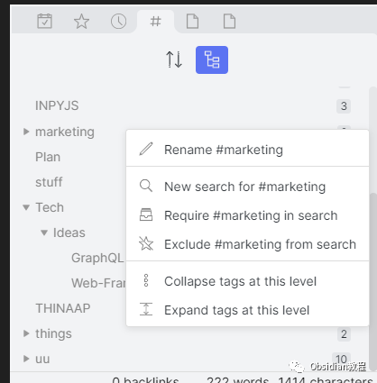
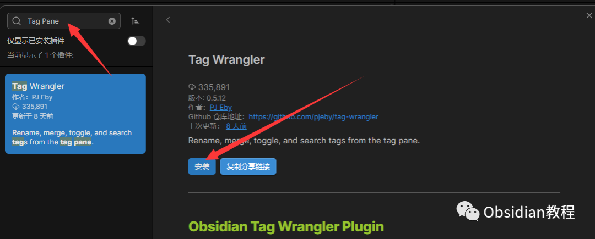
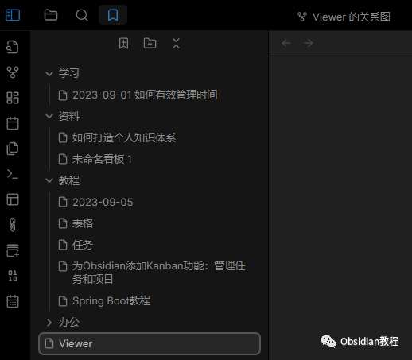

# Obsidian插件：Tag Wrangler - 为标签提供更专业的面板

### 点击下方公众号，回复关键字：**Obsidian** ，获取Obsidian资料合集。

  

## 1**插件介绍**   

Obsidian 的 Tag Wrangler 插件提供了一个专门的面板，使用户可以方便地查看和管理笔记中的标签。这个面板不仅列出了所有的标签，还显示了每个标签下的笔记数量，为用户提供了一个视觉上的概览。  

## 2功能

标签列表：查看所有在笔记中使用的标签。笔记数量：每个标签旁边都显示了使用该标签的笔记数量。快速导航：点击某个标签会显示所有使用该标签的笔记。标签层级：支持多层级的标签结构。

## 

3安装

  * 打开 Obsidian。
  * 在左侧边栏点击设置图标。
  * 在设置面板中，选择“第三方插件”。
  * 在上方搜索栏中输入“Tag Wrangler”。

  * 找到 Tag Pane 插件并点击“安装”。
  * 安装完毕后，你需要点击“启用”以启动插件功能。

## 

4使用

**查看标签面板：**

  * 在 Obsidian 的左侧边栏中，你应该能看到一个标签图标。点击它，你就可以看到 Tag Wrangler 插件提供的标签面板。

  

**导航标签：**

  * 在标签面板中，点击任何一个标签，Obsidian 将显示所有使用该标签的笔记。

  
**创建多级标签：**

  * 在笔记中，使用斜杠 (/) 来创建多级标签，例如：#project/ideas。
  * 在标签面板中，你可以看到“project”下有一个子标签“ideas”。

  
**重命名和删除标签：**

  * 直接在笔记中编辑标签名称来重命名标签。记住，你需要在所有使用该标签的笔记中都进行更改。
  * 删除标签只需在所有笔记中删除它。标签面板将自动更新。

  
**搜索特定标签：**

  * 在 Obsidian 的搜索框中，输入“tag:#YourTagName”（不包括引号），这样可以快速找到所有使用该标签的笔记。

## 

5结束

Tag Wrangler 插件为 Obsidian 的标签管理带来了巨大的便利。无论你是新手还是经验丰富的用户，都可以轻松地整理、搜索和创建关于标签的内容。安装并开始使用它，提升你的标签管理效率吧！  
  
  
1**扫码购买****《 Obsidian实战教程》****从入门到精通， 链接您的每一个思维瞬间。****  
**  
往 期精彩[Obsidian插件:Templater在笔记中使用预定义模板](http://mp.weixin.qq.com/s?__biz=MzkyMDUyMDM2Mg==&mid=2247483877&idx=1&sn=1e5653a67b47ad8395a472b0c9ea311b&chksm=c190d220f6e75b364e4b28e5ac67d0b79ad21d6949eb142c512fb22ac6eb4f8e7651ad896b96&scene=21#wechat_redirect)  
[Obsidian插件-Dataview：强大的数据查询和展示工具](http://mp.weixin.qq.com/s?__biz=MzkyMDUyMDM2Mg==&mid=2247483865&idx=1&sn=03bddfa0b503811ae8caac10282caf1f&chksm=c190d21cf6e75b0a8977ddf76b2c0a07687190ac19126e6a5042afa570d9fea8257d1163b5a5&scene=21#wechat_redirect)  
[Obsidian Git 插件：自动备份笔记到Git并提供版本控制](http://mp.weixin.qq.com/s?__biz=MzkyMDUyMDM2Mg==&mid=2247483859&idx=1&sn=3e36b3f0e1e924ec90cf523b63829b36&chksm=c190d216f6e75b0054a019ff60803e7a0611c4ea27a37244c1568fe7e8d02c5f02776da95037&scene=21#wechat_redirect)

点分享

点点赞

点在看
