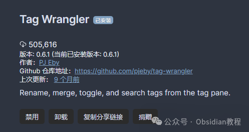

# Obsidian插件：Tag Wrangler专为整理和管理标签而生

嗨，我是鬼哥，10年+老程序员一枚。今天要跟大家聊聊Obsidian里的一个非常实用的插件——Tag Wrangler。  
这个插件简直就是鬼哥的笔记管理神器，尤其是对于那些像我一样笔记中标签成堆的人。  
你是否也遇到过在一堆标签中找不到北的情况？别急，今天鬼哥带你了解Tag Wrangler这个强大工具，教你如何让你的标签井井有条。  

### **一、Tag Wrangler简介**

  
Tag Wrangler插件是Obsidian社区的一款神器，专为整理和管理标签而生。  
它的功能之强大，让人一试成主顾。它不仅能为标签添加右键菜单，还能通过拖放、重命名等操作，让你的标签管理更加方便。对于那些追求效率和条理的人来说，这绝对是一款不可或缺的工具。  

### **二、安装与启用**

  
在Obsidian中安装Tag Wrangler非常简单。你只需要在社区插件界面搜索“Tag Wrangler”，然后点击安装并启用。  
此外，还需要确保在核心插件中启用了“Tags View”，因为Tag Wrangler会在这个视图中添加功能。  

  

### **2.离线安装：****  
****因为网络原因很多同学无法直接在线安装obsidian插件，这里我已经把obsidian所有热门插件下载好了**  
只需要关注下方公众号，后台回复：**插件** 即可获取

  

### **三、使用Tag Wrangler**

####   

#### **1\. 创建和打开标签页面**

  
在使用Tag Wrangler时，你可以通过Alt/Option点击任何标签来打开或创建一个标签页面。这对于将标签与具体内容关联起来非常有帮助。例如，你可以为#项目管理创建一个专门的页面，集中记录与项目管理相关的笔记和链接。  
**操作步骤** ：  

  1. 在标签视图或任意笔记中，按住Alt/Option键并点击标签。
  2. 如果标签页面不存在，系统会提示你是否创建它。
  3. 创建后，你可以像编辑普通笔记一样编辑这个标签页面。

#### 2\. 标签右键菜单

  
Tag Wrangler为标签添加了丰富的右键菜单功能，你可以通过右键点击标签来进行一系列操作，例如重命名标签、开始新搜索、添加标签搜索条件等。  
主要功能包括：

  * 打开或创建标签页面
  * 重命名标签及其子标签
  * 开始新的标签搜索
  * 添加标签为当前搜索的条件或排除项
  * 随机打开包含该标签的笔记（需要安装并启用Smart Random Note插件）
  * 折叠或展开标签层级

####   

#### **3\. 拖放操作**

  
通过拖放操作，你可以轻松地重命名或重组标签。你可以在标签视图或笔记预览中将标签拖动到编辑器窗格中，插入标签文本。这样的操作大大提升了标签管理的便捷性。  

### **四、手动创建和管理标签页面**

  
你不必总是使用“创建标签页面”菜单命令来创建标签页面。任何页面都可以作为标签页面，只要它有一个有效的Obsidian别名。例如，你可以为某个项目创建一个看板页面，并将其与标签关联。  
**验证方法：****  
**

  1. 打开Obsidian快速切换器（默认快捷键：Ctrl/Cmd-O），输入#加标签名，页面应显示该标签作为别名。
  2. 将笔记切换到预览模式，检查元数据框顶部是否有形状包含标签。

  
如果页面没有显示标签别名，可能是元数据语法不正确。确保别名字段格式正确，例如：
      
      *   *   *   *   *   *   *   *   *   *   *   * 
    
    
    
    ---Alias: "#some/tag"---Aliases: [ "#some/tag", "another alias" ]---alias:  - some alias  - "#some/tag"  - another alias---aliases: "some alias, #some/tag, another alias"---

  

### **五、重命名标签**

  
重命名标签是Tag Wrangler的一大亮点，它能在所有包含标签的文件中进行替换。为了确保只重命名实际的标签，Tag Wrangler使用Obsidian的解析数据来识别标签位置。如果你正在重命名的标签会与现有标签合并，插件会提前检查并警告你，防止不可逆的操作。  
**操作步骤：****  
**

  1. 右键点击要重命名的标签。
  2. 选择“重命名标签”。
  3. 输入新的标签名并确认。
  4. 系统会提示确认信息，确保没有冲突后开始重命名。

### **  
**

### **六、子标签的处理**

  
Obsidian允许使用层级标签，例如#x/y/z。当你重命名父标签（如#x/y）时，其子标签也会相应重命名。例如，将#x/y重命名为#a/b，则#x/y/z会变为#a/b/z。你可以通过这种方式对标签层次结构进行重构。例如：  

  * 将#x/y重命名为#x，#x/y/z会变为#x/z。
  * 将#x/y重命名为#letters/x/y，#x/y/z会变为#letters/x/y/z。

###   

### **七、元数据/前置事项**

  
Obsidian允许通过YAML前置事项在笔记的元数据中指定标签。Tag Wrangler会尝试重命名这些标签，以及笔记正文中的标签。  
**注意事项：****  
**

  1. 使用YAML块标量( < 或 |)指定标签时，重命名可能会影响缩进、间距或换行。
  2. 使用YAML别名(*)指定标签时，重命名会在原位展开别名，而不会更改定义它的锚点。

### **  
**

### **八、区分大小写**

  
Tag Wrangler与Obsidian一样，在匹配和检查标签时不区分大小写。例如，如果你将#foo重命名为#Bar/baz，可能会导致原来的#bar/bell显示为#Bar/bell。这是因为Obsidian在生成标签视图时使用第一个遇到的字符串作为显示名。

###   

### **九、画布支持**

  
目前，Tag Wrangler尚不支持对Obsidian Canvas文件中的标签进行重命名。这是因为Obsidian本身还不完全支持这些标签。一旦未来版本的Obsidian解决了这个问题，Tag Wrangler可能会移除这个限制。  

### **十、开发者笔记**

  
Tag Wrangler触发了以下事件，可能对其他插件的集成有用：  

  * tag-wrangler
  * tag-page
  * tag-page

  
这些事件允许其他插件向Tag Wrangler的上下文菜单添加项目，或接管标签页面的创建。  

### **总结**

  
Tag Wrangler是一款强大的标签管理工具，通过它，你可以轻松创建、管理和重命名标签页面，提升笔记管理的效率和条理性。无论你是Obsidian的新手还是资深用户，这款插件都能为你带来极大的便利。  
赶紧试试吧，鬼哥强烈推荐！  
  
  
1******扫码购买****《 Obsidian实战教程》****从入门到精通， 链接您的每一个思维瞬间。**  

