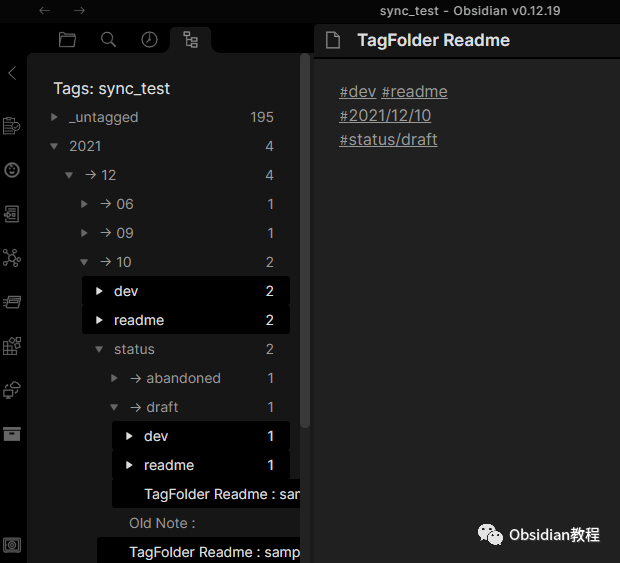
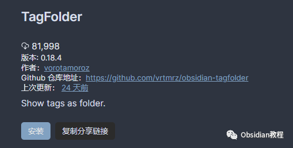
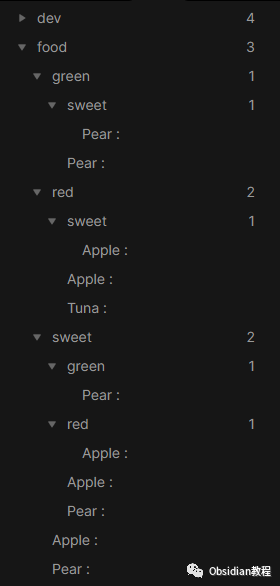
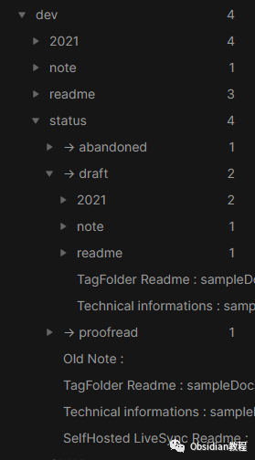
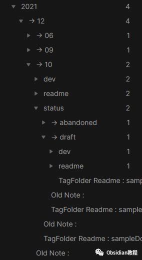
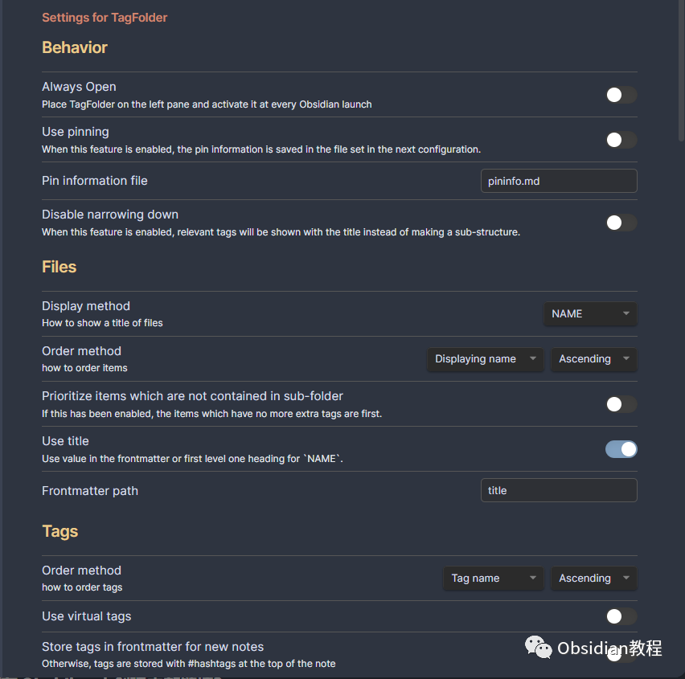

# Obsidian插件：TagFolder允许用户像处理文件夹一样管理和组织标签。

  
TagFolder 插件是一个用于 Obsidian 笔记应用的强大工具，它允许用户像处理文件夹一样管理和组织标签。  
这个插件通过创建基于标签组合的树状结构，使得对笔记的搜索和访问更加直观和高效。以下是对 TagFolder 插件的详细介绍和使用指南。  

### 1安装和启动

### **1.在线安装**（需要科学上网） ：****

### ****  
****

### 点击“社区插件”下的“浏览”按钮，在左上角的搜索框中搜索“ TagFolder”，然后点击“安装”按钮。

###   
启用插件：安装成功后，点击“启用”以启用插件。  

  
**2.离线安装：****  
****因为网络原因很多同学无法直接在线安装obsidian插件，这里我已经把obsidian所有热门插件下载好了**  
只需要关注下方公众号，后台回复：**插件** 即可获取

  

### 2插件功能

**标签树状结构:** TagFolder 插件会根据标签的排列组合创建一个树状结构。例如，如果你有几篇文档分别标记了 #food, #red, #sweet 等标签，TagFolder 将会按照这些标签组合创建树状结构。  

**嵌套标签的支持:** 插件支持嵌套标签，并能正确地生成嵌套标签的专属层级结构。嵌套的子标签不会超出其父级标签。  

**标签搜索:** 插件允许你搜索特定的标签组合。  
例如，通过输入 “sweet -red | food -sweet”，插件将只显示标签为 #sweet 但不是 #red 的笔记，以及标签为 #food 但不是 #sweet 的笔记。

### 

4设置选项

  * 始终打开: 可以设置 TagFolder 在每次启动 Obsidian 时自动打开，并放置在左侧面板。
  * 使用固定: 启用这个选项后，可以固定特定的标签。固定信息保存在配置中指定的文件中。
  * 标签信息文件: 可以更改保存固定信息的文件名。
  * 禁用收缩: 启用此选项后，收集到的标签组合将不再结构化显示，而是按照我们组织的方式显示。
  * 文件显示方法: 可配置条目的显示方式，如按名称、文件名、修改时间等排序。
  * 使用虚拟标签: 启用此功能后，笔记将根据其“新鲜度”自动标记。
  * 新笔记中的标签存储方式: 可以设置在新创建的笔记中标签是存储为顶部的 #hashtags 还是存储在 frontmatter 中。

### 

### **功能操作**

**  
**

  * 在 TagFolder 中搜索标签: 单击标签时，可以在 TagFolder 内部搜索标签，而不是打开默认的搜索面板。
  * 在分离的面板中列出文件: 启用后，文件将在分离的面板中显示。

###   

### **标签和文件的排列设置**

**  
**

  * 隐藏项目: 可以配置隐藏项目的选项，如隐藏所有中间的嵌套标签。
  * 合并冗余组合: 启用此功能后，如果没有中间项，a/b 和 b/a 将合并为 a/b。
  * 不简化空文件夹: 即使可以简化，也保留空文件夹。
  * 将嵌套标签视为独立级别: 启用此选项后，每个嵌套标签将分解为普通标签。
  * 减少嵌套标签中的重复父标签: 如果同一文档中有相同父级的嵌套标签，此选项将影响它们的显示。

###   

### **过滤器**

  

  * 目标文件夹: 设置此项后，插件将只针对其中的文件。
  * 忽略文件夹: 可以指定忽略特定文件夹中的文档。
  * 忽略标签: 设置忽略特定标签或具有特定标签的笔记。

### 

5实际应用场景

假设你是一个研究者，拥有大量关于不同主题的笔记，每篇笔记都有详细的标签，如 #科学, #技术, #健康 等。  
TagFolder 插件可以帮助你更有效地管理这些笔记。你可以快速找到特定标签组合的笔记，例如所有标记为 #科学 但不是 #技术 的笔记。此外，你还可以利用嵌套标签功能来创建更细致的层级结构，如将 #科学 分为 #科学/物理, #科学/化学 等子类。  
总之，TagFolder 是一个强大的工具，能够显著提高 Obsidian 用户管理和访问笔记的效率。无论是用于个人笔记整理还是复杂的项目管理，TagFolder 都能提供出色的组织能力和灵活性。  
  
  
1******扫码购买****《 Obsidian实战教程》****从入门到精通， 链接您的每一个思维瞬间。**  

