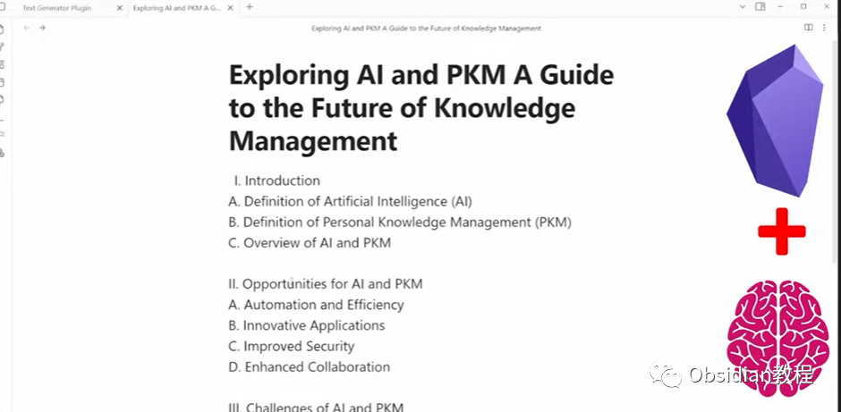
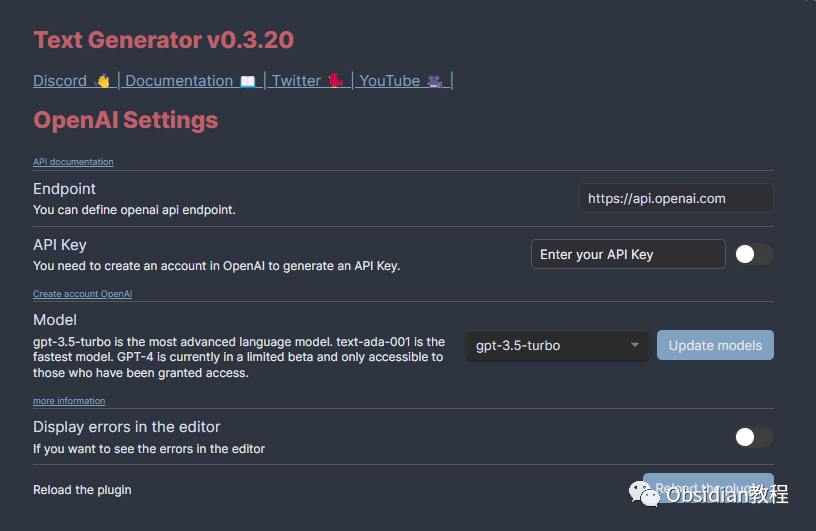
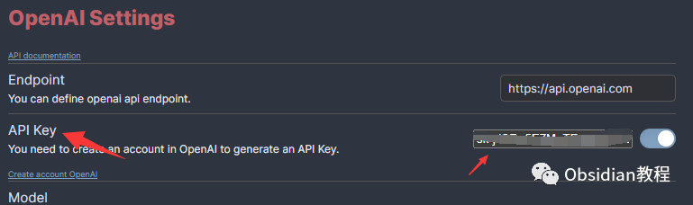
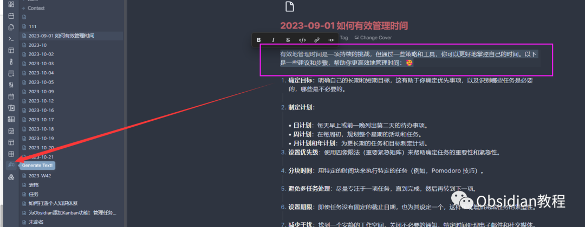
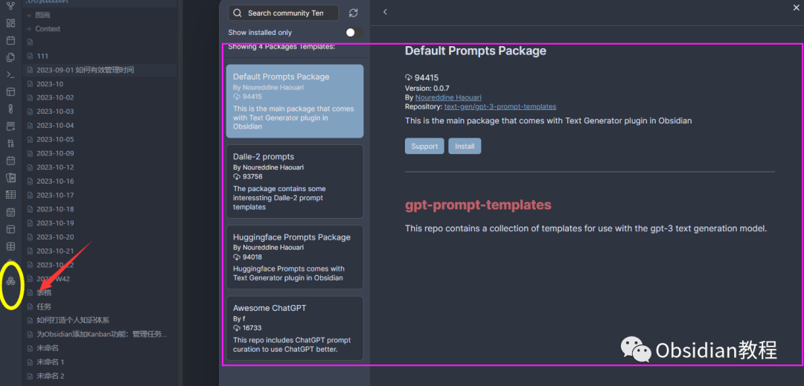

# Obsidian插件：Text Generator，你的 AI 助手

点击下方公众号，回复关键字：**Obsidian** ，获取Obsidian资料合集。‍  
Obsidian 的 Text Generator 你了解多少？如果你之前没有用到没有了解，那这篇文章你一定要收藏。  
本篇文章我们将探索如何将生成性人工智能的力量引入到 Obsidian 中，为你的知识创造和组织提供无尽的可能性。无论是生成创意、吸引人的标题、摘要、大纲，还是整段文字，Text Generator 都能为你轻松完成。  
  

## 1**Text Generator：你的 AI 助手**   

Text Generator 是一个开源的 AI 助手工具，它将生成性人工智能的魔法带入了 Obsidian。你可以想象它就像一个智能的专家，帮助你在 Obsidian 中创造和组织知识。

##  2**为什么选择 Text Generator？**   

  * 免费和开源：你可以放心使用，无需担心授权费用。
  * 与 Obsidian 完美结合：Obsidian 本身就是一个强大的个人知识管理软件，结合 Text Generator，你可以创建一个更加强大的知识管理系统。
  * 灵活的提示：使用 Considered Context，你可以轻松地为提示提供上下文，从而获得更高的灵活性。
  * 模板引擎：你可以创建模板，使重复的任务变得更加容易。
  * 社区模板：你可以发现共享模板中的新用途，并更容易地分享你的用例。
  * 高度灵活的配置：使用 Frontmatter Configuration，你可以选择使用不同的服务，如 OpenAI 和 HugginFace。

##  3**开始使用：安装和配置**   

安装 Text Generator：

### **在线安装**（需要科学上网） ：****

  
1.在Obsidian的设置中，找到“第三方插件”选项，点击“社区插件”2.在搜索框中输入“Text Generator”，找到并安装它。3.安装完成后，激活该插件，在成功安装插件后，我们需要对其进行简单的配置，以符合我们的需求。  
**  
****2.离线安装：****  
****因为网络原因很多同学无法直接在线安装obsidian插件，这里我已经把obsidian所有热门插件下载好了**  
只需要关注下方公众号，后台回复：**插件** 即可获取**配置 Text Generator：**  
在 Obsidian 的设置中，找到 Text Generator 插件，选择你想要使用的服务（如 OpenAI 或 HugginFace）并进行配置。  
这里需要配置API key，配置后才可使用AI功能  
  
**4****生成文本：让 AI 为你写作**

## 

创建一个新的笔记：在 Obsidian 中，选择新建文件。  
使用 Text Generator：在笔记中，输入你的提示，然后使用 Text Generator 插件。你会看到 AI 为你生成的文本。  
  
5**使用模板：简化重复任务** Text Generator 提供了一个模板引擎，你可以创建模板，使重复的任务变得更加容易。  
例如，如果你经常需要为你的文章生成摘要，你可以创建一个摘要模板，然后每次只需填写文章的主题和关键点，Text Generator 就会为你生成摘要。  
  

## **6****最后的建议**   

Text Generator 是一个强大而灵活的插件，但最重要的是，它是为你而设计的。不要害怕尝试新的功能，不要害怕犯错误。只有通过实践，你才能真正掌握这个插件的魔力。所以，开始你的 AI 写作之旅吧！  
总之，Text Generator 是 Obsidian 中的一颗璀璨明珠，它可以帮助你更好地创造和组织知识。无论你是一个作家、研究员还是日常生活中的知识爱好者，Text Generator 都是你的最佳选择。  
  
  
1**扫码购买****《 Obsidian实战教程》****从入门到精通， 链接您的每一个思维瞬间。****  
**  
往 期精彩[1.Obsidian 插件:Make.md赋能创作者的终极体验](http://mp.weixin.qq.com/s?__biz=MzkyMDUyMDM2Mg==&mid=2247484437&idx=1&sn=56d072590a221e82421f806bd14f9d01&chksm=c190d7d0f6e75ec6a112fc672ce1daca289b70893334e5c5bbd4d406836c641ef294bbdeace2&scene=21#wechat_redirect)[2.Obsidian插件:让链接插入更加灵活的 Paste URL into selection](http://mp.weixin.qq.com/s?__biz=MzkyMDUyMDM2Mg==&mid=2247484436&idx=1&sn=7176e8eba90c95d2ebe936d98f82e937&chksm=c190d7d1f6e75ec76c4a41782639e3f49d415b8aa40c8ad7b58106ff17ab3ddb358dfd208275&scene=21#wechat_redirect)  
[3.Obsidian插件:Note Refactor 在 Obsidian 中轻松地提取选定部分的笔记到新的笔记中。](http://mp.weixin.qq.com/s?__biz=MzkyMDUyMDM2Mg==&mid=2247484435&idx=1&sn=c4ecdb98cdcd329ab4a18c9571818096&chksm=c190d7d6f6e75ec00580be3a0b5014ab489ba49b1905a5299a9bf14c2cbdc75eb2d6d83bea57&scene=21#wechat_redirect)  

点分享

点点赞

点在看
