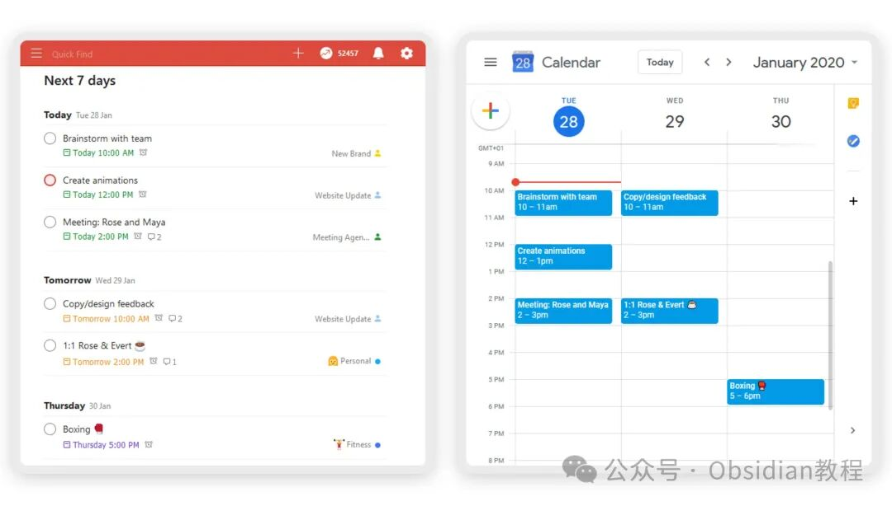
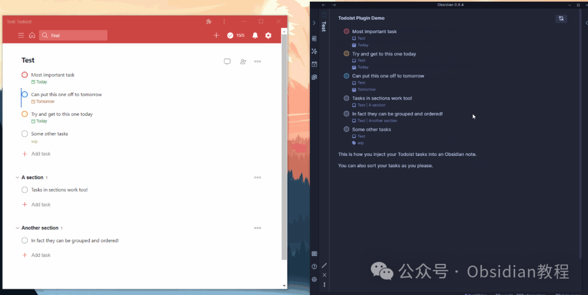
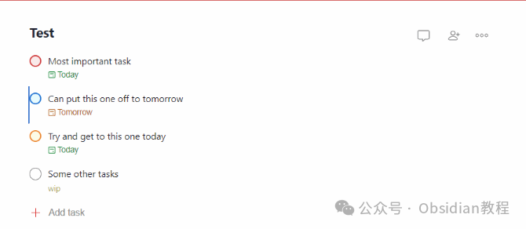
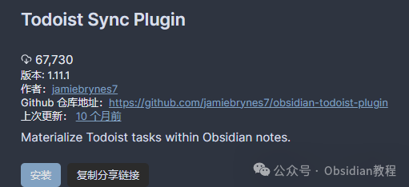

# Obsidian插件：Todoist Sync在笔记中实现Todoist任务列表展示

### Todoist Sync是一个用于在Obsidian笔记中实现Todoist任务列表展示的插件。

###   

### 它允许用户在Obsidian中直观地查看和管理Todoist中的任务，使任务管理与笔记记录紧密结合。  

### 1功能特性

**任务查询与展示：** 使用YAML代码块定义任务查询，插件会在预览模式下将其转换为实际的任务列表。  

**自动刷新：** 可以设置自动刷新间隔，自动更新任务列表。**任务排序和分组：** 支持按照优先级、日期等进行排序，以及按项目和部分进行任务分组。

#### 

2安装步骤

通过社区插件浏览器：

###   

### **1.在线安装**（需要科学上网） ：****

### ****  
****

### 点击“社区插件”下的“浏览”按钮，在左上角的搜索框中搜索“ Todoist Sync”，然后点击“安装”按钮。

###   
启用插件：安装成功后，点击“启用”以启用插件。  

  
**2.离线安装：****  
****因为网络原因很多同学无法直接在线安装obsidian插件，这里我已经把obsidian所有热门插件下载好了**  
只需要关注下方公众号，后台回复：**插件** 即可获取  

  * 下载最新发布的ZIP文件。
  * 解压至Obsidian的插件文件夹。

  

### 3使用教程

**基本使用：**  

  * 在任何笔记中放置类似以下的代码块：

  *   * 

    
    
    name: My Tasksfilter: "today | overdue"

  

  * 切换到预览模式，插件将代码块替换为过滤器的实际结果。

  
**高级应用：****  
**

  * 展示当前和过期的任务，按日期和优先级排序，按项目和部分分组：

  *   *   *   *   *   * 

    
    
     name: Highest Priority & Datefilter: "today | overdue"sorting:    - date   - prioritygroup: true

  * 仅展示收件箱中的任务：

  *   * 

    
    
    name: Inboxfilter: "#Inbox"

  
**插件命令：****  
**

  * “ 刷新元数据”：刷新Todoist任务的项目、部分和标签元数据。
  * “添加Todoist任务”：打开一个模态框来创建Todoist任务。
  * “添加当前页面的Todoist任务”：类似于上一个命令，但同时会附加当前活动页面的链接。

###   

### **自定义设置**

**  
**

  * 该插件默认适用于Obsidian的默认主题，但用户可以通过CSS进行自定义。
  * 作者还维护了一个支持该插件的Obsidian主题，用户可以参考其CSS源码进行自定义。

### 4注意事项

  * **API令牌安全：** 建议在同步笔记库时，显式忽略.obsidian/todoist-token文件，以保证安全性。
  * **数据同步：** 该插件仅提供任务列表的展示和基本操作，并不涉及复杂的数据同步功能。

  

### 5**结语**   

Todoist Sync插件为Obsidian用户提供了一个强大的工具，用于管理和同步Todoist中的任务。这不仅提高了任务管理的效率，也使得任务和笔记更加紧密地结合。无论是个人生活中的日常任务安排，还是工作中的项目管理，Todoist Sync插件都能提供极大的帮助。  
希望这篇文章能够帮助您更好地理解和使用Todoist Sync插件，使您的笔记和任务管理更加高效和有序。如果在使用过程中遇到任何问题或需要更多信息，欢迎随时咨询。  
  
  
1******扫码购买****《 Obsidian实战教程》****从入门到精通， 链接您的每一个思维瞬间。**  

