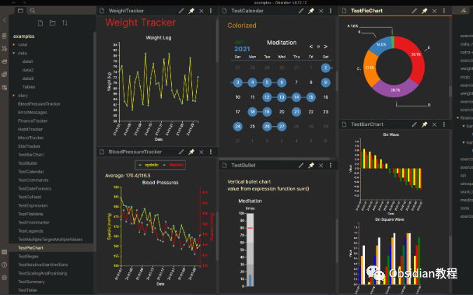
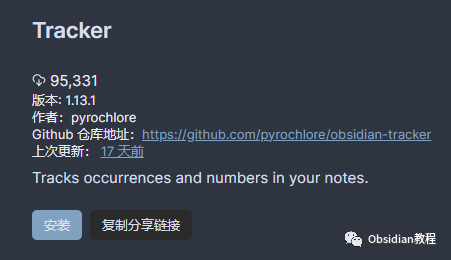
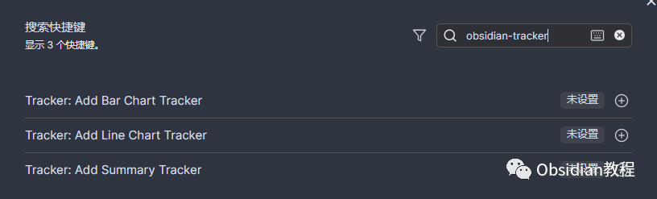
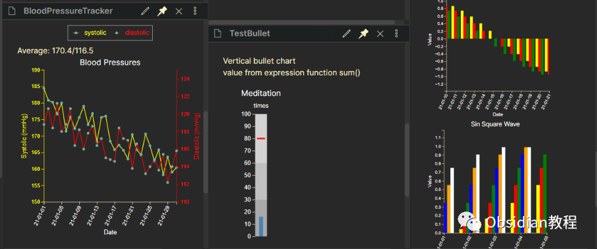

# Obsidian插件：Tracker从笔记中收集数据并全面地展示数据

Obsidian 是一款功能强大的知识管理和笔记软件，以其灵活的链接和嵌入功能而著称。  
在众多插件中，Obsidian Tracker 插件是一个非常实用的工具，用于从笔记中收集数据并全面地展示这些数据。这个插件可以帮助用户追踪和可视化各种数据，如习惯、进度、任务等。  




## 1插件概述

### **1.1 功能**

  
Obsidian Tracker 插件的核心功能是从您的笔记中提取和汇总数据，然后通过各种图表形式展示这些数据。它支持多种数据类型，包括文本、表情符号、复选框等。

## 

2安装和设置

### **1.在线安装**（需要科学上网） ：****

### ****  
****

### 点击“社区插件”下的“浏览”按钮，在左上角的搜索框中搜索“ Tracker”，然后点击“安装”按钮。

###   
启用插件：安装成功后，点击“启用”以启用插件。  




  
**2.离线安装：****  
****因为网络原因很多同学无法直接在线安装obsidian插件，这里我已经把obsidian所有热门插件下载好了**  
只需要关注下方公众号，后台回复：**插件** 即可获取

  1. 


### **2.2 配置插件**

  
安装后，您需要配置插件以适应您的特定需求。通过 Obsidian 的设置菜单访问 Tracker 的设置选项，您可以调整如图表类型、数据源、样式等多种设置。

## 



  


3使用教程

### **3.1 数据跟踪设置**

  
首先，您需要决定要跟踪哪些数据。例如，您可以在每日笔记中记录习惯、心情、工作进度等。  


### **3.2 创建跟踪笔记**

  
新建笔记: 创建一个新笔记来显示跟踪器。  
添加跟踪代码块: 可以手动添加跟踪代码块或使用命令。
      
      *   *   *   * 
    
    
    
    ```trackersearchType: tagsearchTarget: #habitfolder: Daily Notes

  


### **3.3 查看跟踪结果**

  
将文档视图模式切换到“预览”，代码块就会被渲染成图表。  




## 4实用示例

### **4.1 追踪特定习惯**

  
假设您想追踪特定的习惯（例如读书、锻炼），您可以在每日笔记中用特定的标签（如 #读书、#锻炼）来标记这些活动。  


  1. 


### **4.3 示例代码**

  
下面是一个追踪读书习惯的示例代码：
      
      *   *   *   *   * 
    
    
    
    ```trackersearchType: tagsearchTarget: #读书folder: Daily NotesoutputType: line

  


这段代码会在您的笔记中搜索带有 #读书 标签的条目，并以线形图的形式展示您的阅读习惯。  


## 6 结语

Obsidian Tracker 插件是一个强大的工具，可以帮助您更有效地管理和分析您的数据。通过这篇教程，您应该能够开始使用这个插件，并根据自己的需求进行自定义和优化。  
持续地使用和探索这个插件，您将能够更深入地了解自己的习惯、进度和生活模式  
  
  
1******扫码购买****《 Obsidian实战教程》****从入门到精通， 链接您的每一个思维瞬间。**  


