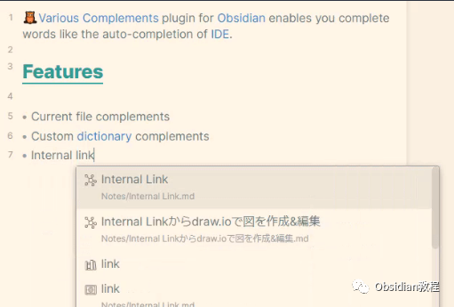
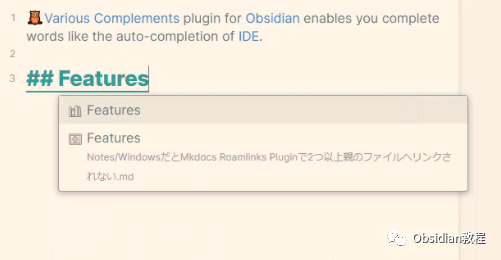
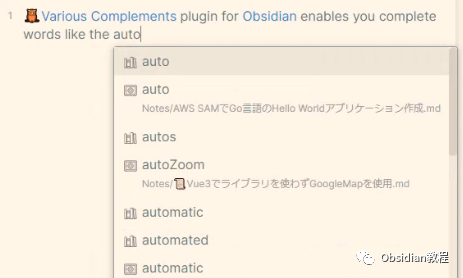

# Obsidian插件：Various Complements让你的笔记体验更加流畅

欢迎进入Obsidian插件Various Complements的世界，这是一个让你的笔记体验更加流畅的神奇工具。如果你曾经羡慕IDE（集成开发环境）中那些智能的自动补全功能，现在你可以在Obsidian中享受同样的便利了。  
Various Complements插件将自动补全的魔法带入你的笔记，让写作变得更加迅速和高效。  

## 1Various Complements：你的智能笔记伙伴

Various Complements插件就像是一个在背后默默支持你的助手，它能够预测你的输入并提供补全建议。这不仅可以节省时间，还能减少打字错误，提高笔记的整体质量。  

## 2安装插件

要使用这个插件，我们首先需要在Obsidian中安装它。安装过程非常简单直接：

### **  
**

### **1.在线安装**（需要科学上网） ：****

  
1.在Obsidian的设置中，找到“第三方插件”选项，点击“社区插件”2.在搜索框中输入“Various Complements”，找到并安装它。3.安装完成后，激活该插件，在成功安装插件后，我们需要对其进行简单的配置，以符合我们的需求。  

**2.离线安装：****  
****因为网络原因很多同学无法直接在线安装obsidian插件，这里我已经把obsidian所有热门插件下载好了**  
只需要关注下方公众号，后台回复：**插件** 即可获取

## 3插件特性

Various Complements插件提供了以下特性：  

  * 单词补全：在你输入时，插件会根据你之前的笔记内容提供单词补全建议。
  * 学习你的习惯：随着你的使用，插件会逐渐学习并适应你的写作风格，提供更加个性化的补全选项。
  * 快速高效：补全建议会在你打字时实时出现，无需等待，提高写作效率。

##   

## 

4使用方法

使用Various Complements插件非常简单：  

  * 开始输入：在任何笔记中开始输入，插件会自动开始工作。
  * 选择建议：当补全建议出现时，使用键盘上下箭头选择一个建议。
  * 确认补全：按下 Tab 或 Enter 键来选择高亮的补全建议。

## 

## **配置和自定义**

  
Various Complements允许你根据自己的需要进行配置：  

  * 你可以在插件的设置中调整补全的灵敏度。
  * 你可以选择在特定的情况下启用或禁用自动补全功能。
  * 你还可以自定义补全的触发条件，比如只在输入特定的字符后才显示建议。

## 

5结语

Various Complements插件是Obsidian生态中的一颗新星，它提供了一个简单而强大的功能，让你的写作更加流畅。无论你是在快速记录想法，还是在整理复杂的文档，这个插件都能让你的笔记体验更上一层楼。现在，就让我们开始享受更智能的笔记吧！  
  
  
1**扫码购买****《 Obsidian实战教程》****从入门到精通， 链接您的每一个思维瞬间。****  
**  
往 期精彩[1.](http://mp.weixin.qq.com/s?__biz=MzkyMDUyMDM2Mg==&mid=2247484437&idx=1&sn=56d072590a221e82421f806bd14f9d01&chksm=c190d7d0f6e75ec6a112fc672ce1daca289b70893334e5c5bbd4d406836c641ef294bbdeace2&scene=21#wechat_redirect)[Obsidian 插件：使用Hider来精简你的用户界面](http://mp.weixin.qq.com/s?__biz=MzkyMDUyMDM2Mg==&mid=2247484587&idx=1&sn=4762b4fa1ee9e878f9649c385be320e6&chksm=c190d76ef6e75e78444313ca65acda9881ae76f69b4721ccca481286fc7c94286d6e6c9a3d2a&scene=21#wechat_redirect)[2.Obsidian插件：Quick Switcher++ 你的笔记导航专家](http://mp.weixin.qq.com/s?__biz=MzkyMDUyMDM2Mg==&mid=2247484586&idx=1&sn=a5c9ebcde2fbf0e03475e0b7ca36bca4&chksm=c190d76ff6e75e791195c959219724af0611245c75ad490aa7eacd7613330a15392d3bb4b220&scene=21#wechat_redirect)  
[3.Obsidian插件：Hover Editor将 Obsidian 的“页面预览”功能提升到一个全新的层次](http://mp.weixin.qq.com/s?__biz=MzkyMDUyMDM2Mg==&mid=2247484530&idx=1&sn=2e5eb91aedf095be338604660c04e678&chksm=c190d7b7f6e75ea119a474a11cbf90c3263a72ba692ed3964730e5a4de8a18e7199807236a63&scene=21#wechat_redirect)  

点分享

点点赞

点在看
