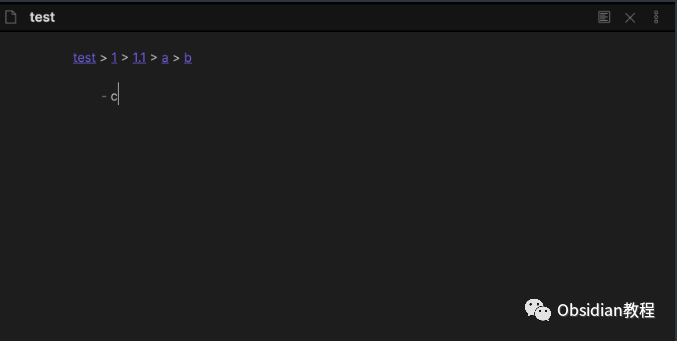
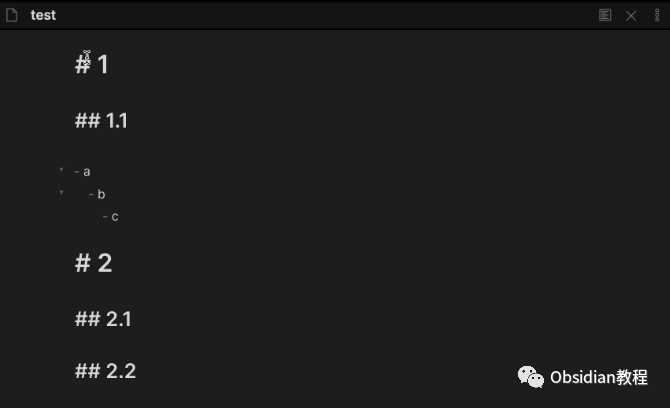
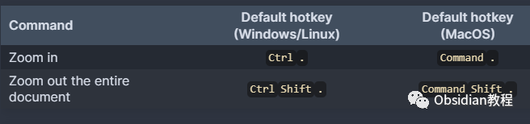

# Obsidian插件：Zoom增强Obsidian编辑体验

Obsidian的Zoom插件，这是一个增强Obsidian编辑体验的工具，特别适用于那些希望专注于文档特定部分的用户。  

在本篇教程中，我将详细介绍Zoom插件的安装过程、功能特点、使用方法以及一些常见问题的解决方案。

### 

1Zoom插件的安装

### **1.在线安装**（需要科学上网） ：****

### ****  
****

### 点击“社区插件”下的“浏览”按钮，在左上角的搜索框中搜索“ Zoom”，然后点击“安装”按钮。

###   
启用插件：安装成功后，点击“启用”以启用插件。  

  
**2.离线安装：****  
****因为网络原因很多同学无法直接在线安装obsidian插件，这里我已经把obsidian所有热门插件下载好了**  
只需要关注下方公众号，后台回复：**插件** 即可获取

  

**激活插件：** 安装完成后，关闭社区插件窗口，并在插件列表中找到Zoom插件，点击启用它。

### 

2Zoom插件的特点和功能

Zoom插件允许用户专注于Obsidian笔记中的特定列表或标题。以下是其主要功能：  

  * 缩放到特定列表或标题：插件可以隐藏当前视图中除了选中列表或标题及其内容之外的所有其他内容。

  * 快捷键支持：

     * 缩放进入：Windows/Linux下默认为Ctrl + .，MacOS为Command + .。
     * 缩放退出：Windows/Linux下为Ctrl + Shift + .，MacOS为Command + Shift + .。

### 

### **设置选项**

**  
**

  * 点击子弹时进行缩放：默认为真（true），即点击列表的子弹符号时会触发缩放功能。

###   

### **调试模式**

**  
**

  * 若要使用调试模式，可以打开DevTools（MacOS为Command + Option + I，Windows/Linux为Control + Shift + I）以复制调试日志。
  * 调试模式默认值为假（false）。

### 

3使用方法和技巧

聚焦模式：使用Zoom插件可以将注意力集中在文档的特定部分，这对于处理长文档尤其有用。  
导航和编辑：在缩放模式下，您可以更容易地对所选部分进行编辑和重新排列，而不被其他内容干扰。  
快捷键使用：熟悉并使用快捷键可以大大提高使用Zoom插件的效率。

### 

4常见问题解决方案

  * 插件不工作：确保安全模式已关闭，并检查插件是否已正确安装和激活。
  * 缩放功能不响应：检查是否有其他插件冲突，或尝试重新安装Zoom插件。
  * 调试问题：若遇到不清楚的问题，可以使用调试模式获取更多信息。

### 

### 5结语

Zoom插件是Obsidian生态中的一个实用工具，它可以帮助用户专注于文档的特定部分，从而提高工作效率和笔记管理的便捷性。  
通过本教程，您应该能够顺利安装并有效使用Zoom插件，无论您是初学者还是有经验的用户。  
最后，值得一提的是，Zoom插件是免费的额。  
  
  
1******扫码购买****《 Obsidian实战教程》****从入门到精通， 链接您的每一个思维瞬间。**  

