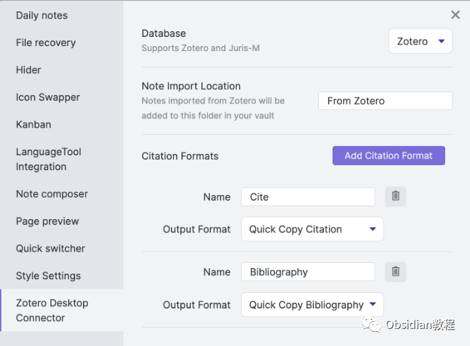
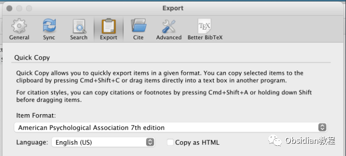
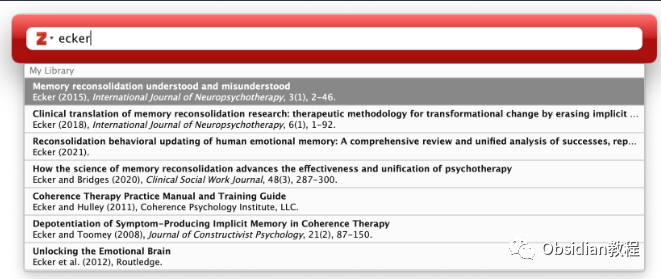
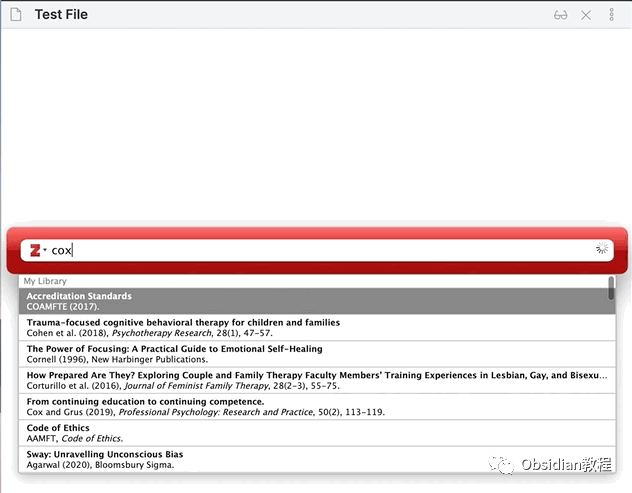

# Obsidian插件：Zotero Integration，让文献管理得心应手

点击下方公众号，回复关键字：**Obsidian** ，获取Obsidian资料合集。Obsidian 作为一款强大的个人知识管理工具，与 Zotero（一款自由的、易于使用的工具，帮助你收集、整理、引用和分享研究的资料）的结合，无疑能为研究者和写作者们带来极大的便利。  
通过 Zotero Integration 插件，我们可以轻松地将 Zotero 中的引用、文献、笔记以及 PDF 注释导入 Obsidian，构建一个高效、便捷的学术写作环境。  
下面，我们将通过几个简单的步骤来探索如何安装和使用 Zotero Integration 插件。  

## 1前期准备

在开始之前，你需要确保你的系统中已经安装了 Obsidian（至少为 v0.13.24 版本）和 Zotero。同时，你还需要在 Zotero 中安装 Better BibTeX 插件。  

## **步骤一：安装 Zotero Integration 插件**

  

### **1.在线安装**（需要科学上网） ：****

  
1.在Obsidian的设置中，找到“第三方插件”选项，点击“社区插件”2.在搜索框中输入“Zotero Integration”，找到并安装它。3.安装完成后，激活该插件，在成功安装插件后，我们需要对其进行简单的配置，以符合我们的需求。  

**2.离线安装：****  
****因为网络原因很多同学无法直接在线安装obsidian插件，这里我已经把obsidian所有热门插件下载好了**  
只需要关注下方公众号，后台回复：**插件** 即可获取

## **步骤二：配置 Zotero**

  

  * 打开 Zotero，导航至 编辑 -> 首选项 -> 导出。
  * 在 默认输出格式 下拉菜单中选择一个样式，例如 Chicago Manual of Style。
  * 在 快速复制 部分，选择一个适合你的引用样式。

## 

## **步骤三：使用 Zotero Integration 插件**

###   

###  导入引用

  * 在 Obsidian 中打开或创建一个新的笔记。
  * 切换到 Zotero，找到你想要引用的文献，选中它。

  * 切换回 Obsidian，使用快捷键 Ctrl + Shift + E（或你设定的其他快捷键），将引用插入到笔记中。

###   

### **导入文献**

  
与导入引用的步骤相似，只是在 Obsidian 中使用快捷键 Ctrl + Shift + B（或你设定的其他快捷键），将选中的文献插入到笔记中。  

### 

2导入笔记和 PDF 注释

  * 在 Zotero 中选中一个带有笔记或 PDF 注释的文献条目。
  * 切换回 Obsidian，使用快捷键 Ctrl + Shift + N（或你设定的其他快捷键），将笔记和 PDF 注释插入到笔记中。

## 

3遇到问题怎么办？

如果插件加载失败，确保你的 Obsidian 安装版本至少为 v0.13.24。如果不是，请尝试重新安装 Obsidian。  
如果在创建引用或文献时遇到错误，请确保你在 Zotero 中选择了一个快速复制样式。  
通过这些步骤，你就可以开始享受 Zotero Integration 插件为你的研究和写作带来的便利了。不断尝试和探索，你会发现它能为你的知识管理和学术写作提供强大的支持。  
  
  
1**扫码购买****《 Obsidian实战教程》****从入门到精通， 链接您的每一个思维瞬间。****  
**  
往 期精彩1.[Obsidian 插件:Make.md赋能创作者的终极体验](http://mp.weixin.qq.com/s?__biz=MzkyMDUyMDM2Mg==&mid=2247484437&idx=1&sn=56d072590a221e82421f806bd14f9d01&chksm=c190d7d0f6e75ec6a112fc672ce1daca289b70893334e5c5bbd4d406836c641ef294bbdeace2&scene=21#wechat_redirect)  
[2.Obsidian插件:让链接插入更加灵活的 Paste URL into selection](http://mp.weixin.qq.com/s?__biz=MzkyMDUyMDM2Mg==&mid=2247484436&idx=1&sn=7176e8eba90c95d2ebe936d98f82e937&chksm=c190d7d1f6e75ec76c4a41782639e3f49d415b8aa40c8ad7b58106ff17ab3ddb358dfd208275&scene=21#wechat_redirect)  
[3.Obsidian插件:Note Refactor 在 Obsidian 中轻松地提取选定部分的笔记到新的笔记中。](http://mp.weixin.qq.com/s?__biz=MzkyMDUyMDM2Mg==&mid=2247484435&idx=1&sn=c4ecdb98cdcd329ab4a18c9571818096&chksm=c190d7d6f6e75ec00580be3a0b5014ab489ba49b1905a5299a9bf14c2cbdc75eb2d6d83bea57&scene=21#wechat_redirect)  

点分享

点点赞

点在看
