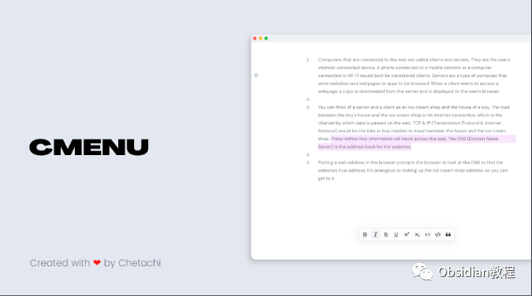
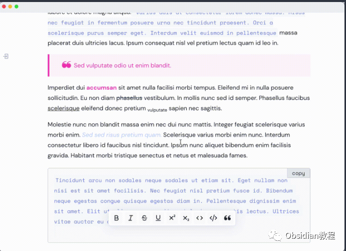
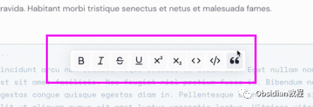
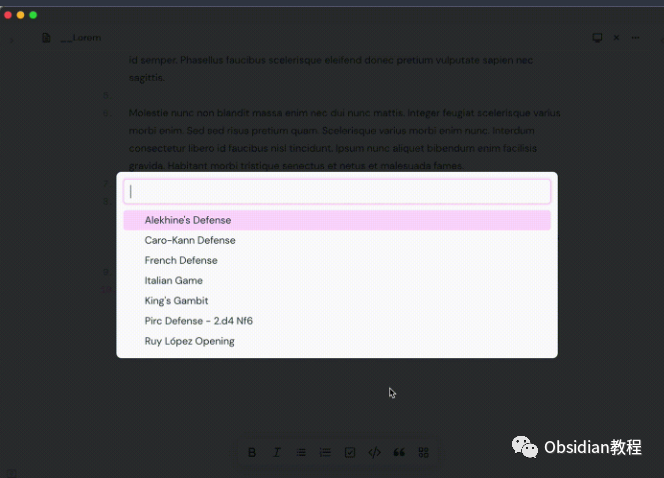
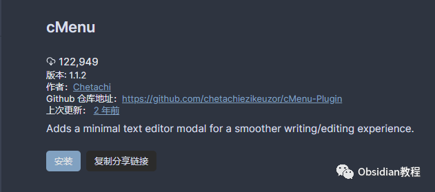

# Obsidian插件：cMenu一个简洁的文本编辑。

cMenu 插件是一款为Obsidian用户设计的文本编辑器模态插件，旨在为用户提供一个简洁且用户友好的文本编辑体验。

  

该插件特别适合那些不希望配置大量热键且需要更便捷文本编辑方式的用户。

  

  
本文将深入探讨cMenu插件的功能、工作原理、样式定制选项及安装步骤。

###  1**插件概述**

cMenu插件通过提供一个最小化的文本编辑器模态，极大地简化了文本编辑和命令执行的过程。它解决了用户需要记住众多热键或使用多个键位组合来获得所需标记的问题。使用cMenu，用户只需专注于写作即可。  

### 2**使用便利性**

  
cMenu插件专为需要简便文本编辑器以辅助笔记标记的用户设计。它通过简单直观的界面，使得文本编辑变得更加轻松。  
  

### 3**工作原理**

cMenu的最新更新允许用户将Obsidian命令库中几乎任何命令添加到菜单栏。默认情况下，菜单栏将包含以下命令：  

  * 切换粗体
  * 切换斜体
  * 切换删除线
  * 切换下划线
  * 切换上标
  * 切换下标
  * 切换代码
  * 切换代码块
  * 切换引用

  
这些命令被添加到一个命令数组中，该数组随后在cMenu模态的生成中被读取。用户可以在cMenu设置面板中添加或移除命令。

###  4**样式自定义**

cMenu还提供了一些可定制的样式改变。对于使用滑动窗格（Sliding Panes）插件的用户，可以更改cMenu的附加方法为“body”，这样cMenu就不再附加到工作区域，而是附加到应用的body部分。此外，cMenu引入了玻璃拟态设计风格，用户可以选择将cMenu设置为“玻璃”风格，从而使其具有独特的外观。

###    
5**cMenu状态栏菜单**

在1.1.0的更新中，用户可以控制cMenu的底部值，以及切换隐藏cMenu和添加/删除新命令项。删除按钮将移除最近添加的命令。

###  6**推荐插件组合使用**

强烈推荐与cMenu一起使用的插件包括Templater和Hotkeys for Templates。例如，可以将特定模板（如“阿列克辛防御”开局的象棋模板）添加到Obsidian的命令库中，然后将该命令附加到cMenu上，大大增强了cMenu的功能和实用性。

###  7**安装方法** **禁用安全模式：** 在 Obsidian 的“设置/社区插件”中，禁用“安全模式”（请注意阅读安全警告）。  
**安装插件：**  

### **1.在线安装**（需要科学上网） ：****

### ****  
****

### 点击“社区插件”下的“浏览”按钮，在左上角的搜索框中搜索“ cMenu”，然后点击“安装”按钮。

  
启用插件：安装成功后，点击“启用”以启用插件。  
  
**2.离线安装：****  
****因为网络原因很多同学无法直接在线安装obsidian插件，这里我已经把obsidian所有热门插件下载好了**  
只需要关注下方公众号，后台回复：**插件** 即可获取  

### 8结论

cMenu插件为Obsidian用户提供了一个简单、直观且功能强大的文本编辑体验。它通过简化编辑命令的执行，让用户能够更专注于内容创作。无论是对于初学者还是资深用户，cMenu都是一个值得尝试的优秀插件，它不仅提高了写作的效率，还增添了视觉上的愉悦感。  
通过与其他插件的组合使用，cMenu的功能性和灵活性进一步得到增强，成为Obsidian生态中不可或缺的一部分。  
  
  
1**扫码购买****《 Obsidian实战教程》****从入门到精通， 链接您的每一个思维瞬间。****  
**

