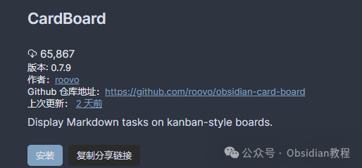
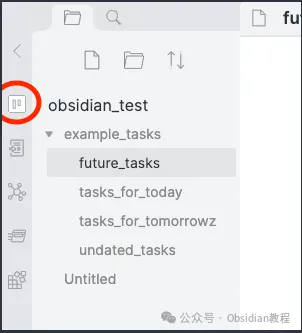
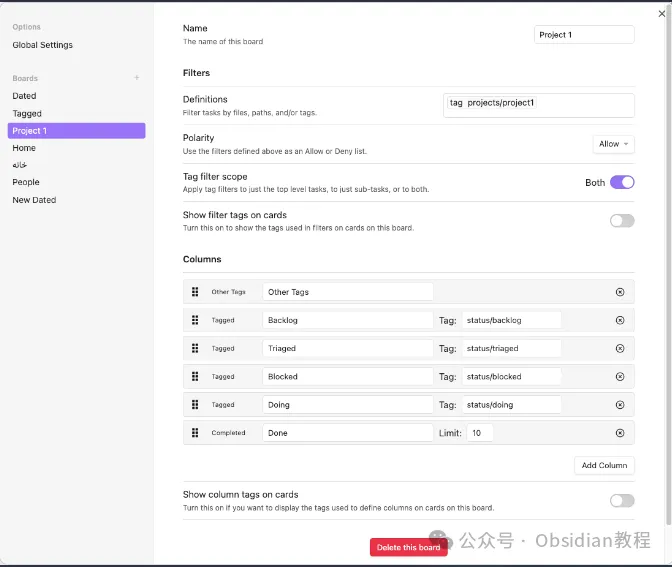
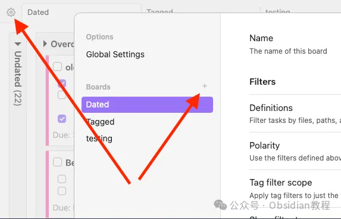
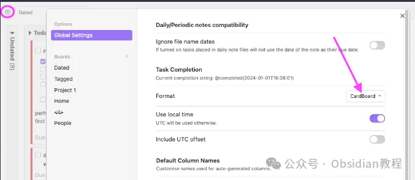

# Obsidian插件：利用CardBoard实现高效看板任务管理！

嗨，大家好。我是何老师。

  

在Obsidian中，虽然知识管理的功能非常强大，但对于任务管理的需求，可能并不是每个人都能通过原生的功能满足。

  

而CardBoard插件就是为了让任务管理更加直观高效而设计的。通过看板式的界面，你可以清晰地规划和管理你的任务，就像在实际的白板上贴满任务卡片一样直观和方便。

  

今天我就带大家详细介绍一下，如何在Obsidian中安装和使用CardBoard插件，让任务管理变得更加有条不紊。

  

**安装CardBoard插件**

  

**1.在线安装（需要科学上网）**

  

1\. 点击Obsidian左侧的“设置”按钮，然后在菜单中找到社区插件。

2\. 进入社区插件后，点击“浏览”按钮。

3\. 在左上角的搜索框中输入“CardBoard”或者“diagram”，找到CardBoard插件并点击安装。

4\. 安装完成后，点击“启用”来激活该插件。

**2.离线安装**  

### **很多同学无法直接在线安装obsidian插件，这里我已经把obsidian所有热门插件下载好了**  
只需要关注下方公众号，后台回复：**插件** 即可获取

**CardBoard插件的基本使用**

  

安装并启用CardBoard插件后，你有两种方式可以打开它的看板界面：

  

**\- 应用栏图标：** Obsidian窗口左侧的应用栏里会新增一个CardBoard的图标，点击它就可以进入看板界面。  

**\- 命令面板：** 通过快捷键`Ctrl/Cmd + P`打开Obsidian的命令面板，输入“Open CardBoard”，然后选择这个命令来打开看板。

  

初次使用时，CardBoard会提示你创建一个新的看板。你可以选择以下三种类型的看板之一：  

  

**\- 基于日期的看板：** 适用于按日期进行任务管理，比如规划每日待办事项。

**\- 基于标签的看板：** 适合通过标签来分类任务，非常适合管理复杂的任务组。

**\- 空白看板：** 完全没有预定义的列，自由度最高，你可以根据自己的需求创建和调整任务列。

  

**如何在CardBoard中管理任务**

  

CardBoard中的任务以卡片形式展示，每一列就像是你待办事项中的一类任务。要让任务在看板上显示，必须满足以下条件：

  

1.任务位于Markdown文件中，且必须是无序列表形式的任务。

  

2.任务卡片的内容还会包括缩进的子任务，标签信息，截止日期等信息。

  

缩进的内容会作为子任务或笔记显示在任务卡片上，非常直观。任务行上的标签则会显示在卡片顶部，而截止日期则在卡片底部显示。

**  
**

**看板的自定义设置**

  

CardBoard支持高度定制化，可以根据你的需求自由编辑看板和任务的显示方式。比如：

  

1.你可以根据日期和标签混合使用列，还可以自定义卡片的高亮颜色，不同任务或看板状态下的颜色区分就显得很方便。

2.如果你对CSS有点了解，还可以通过CSS片段自定义标签的样式，甚至调整卡片的高亮显示。

  

不仅如此，插件还支持通过设置菜单来添加、编辑、重新排序或删除列，完全可以按照自己的工作流来优化看板界面。

**兼容性与扩展性**

  

如果你还在使用其他插件管理任务，比如Dataview或Tasks，那好消息是CardBoard可以完美兼容它们！这些插件生成的任务格式，CardBoard都可以识别并正常显示。

  

另外，它还支持与日常笔记和周期性笔记的集成，让基于日期的任务管理变得更加轻松。比如，你可以使用它来设置周期性的待办事项，让任务自动出现在每一天的看板中。

**CardBoard的局限性与替代方案**  

  

尽管CardBoard功能强大且高度定制化，但它在处理一些大型库或非常大的Markdown文件时可能会出现性能问题。

  

如果你觉得它不能完全满足你的需求，Obsidian社区还提供了其他优秀的看板插件，如Kanban和Tasks，它们在某些场景下可能更适合你的任务管理风格。

  

**总结**

  

我个人觉得，CardBoard为Obsidian带来了极大的扩展性，特别是它的看板式任务管理功能，让我可以直观地规划和跟踪任务进度。

  

而且插件的高度自定义功能，让我可以自由调整任务卡片的展示方式，非常灵活。当然啦，如果你日常任务较多且复杂，CardBoard肯定是一个不错的选择。

  

如果你还没试过，强烈建议你安装试试看，可能会发现它正是你一直在寻找的任务管理工具！

  

# **Obsidian交流社群来了**

[**我们搞了一个专门分享Obsidian的交流社群：****玩转效率笔记****社群的主要内容包括使用技巧、模板主题和插件等，** 帮助更多人提升效率，实现自我管理的目标。](http://mp.weixin.qq.com/s?__biz=MzkyMDUyMDM2Mg==&mid=2247485997&idx=1&sn=9a528871be62e4c74a1df3807b28f2bd&chksm=c190d9e8f6e750fe9df7a333b666fdd8561fdeb928d1df1f367d2374742efa34727a3f91cbc0&scene=21#wechat_redirect)

  
如果你对Obsidian有热情，这个社群绝对不容错过！
