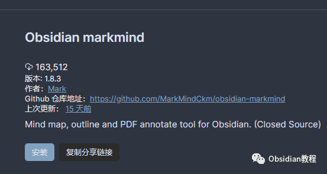
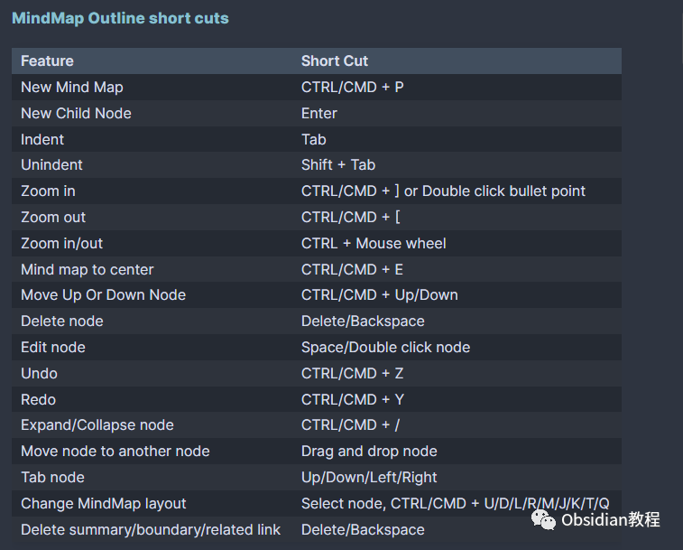
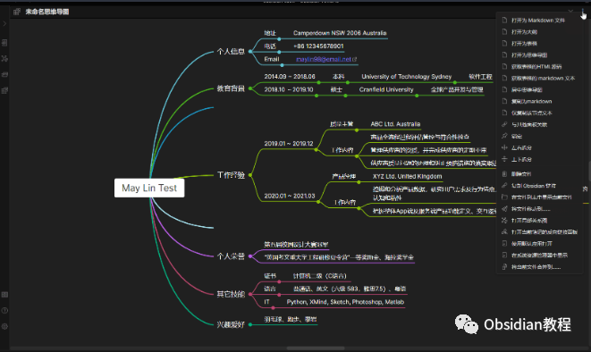
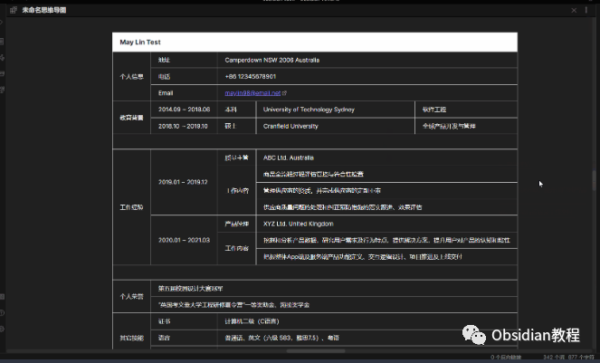
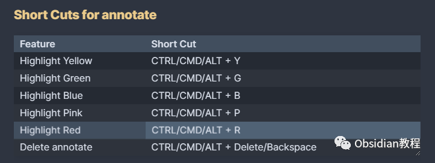
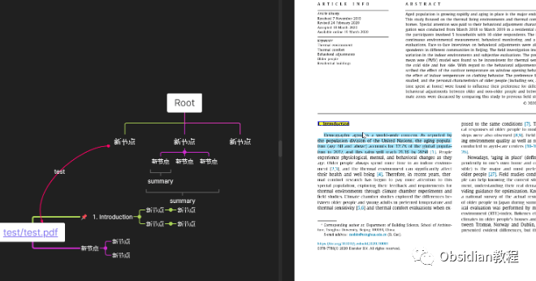

# Obsidian插件：轻松实现思维导图和PDF注释的Obsidian MarkMind插件

点击下方公众号，回复关键字：**Obsidian** ，获取Obsidian资料合集。Obsidian MarkMind 插件为你的 Obsidian 笔记应用带来了精致而功能强大的思维导图、大纲和PDF注解工具。  
它支持两种不同的模式：基本模式和丰富模式，让你可以在不同场景下自如地创建和编辑思维导图。

## 

1安装方法

  

要使用这个插件，我们首先需要在Obsidian中安装它。安装过程非常简单直接：

### **  
**

### **1.在线安装**（需要科学上网） ：****

  
1.在Obsidian的设置中，找到“第三方插件”选项，点击“社区插件”2.在搜索框中输入“Obsidian MarkMind”，找到并安装它。3.安装完成后，激活该插件，在成功安装插件后，我们需要对其进行简单的配置，以符合我们的需求。  

**2.离线安装：****  
****因为网络原因很多同学无法直接在线安装obsidian插件，这里我已经把obsidian所有热门插件下载好了**  
只需要关注下方公众号，后台回复：**插件** 即可获取

## 2创建思维导图文件

创建思维导图非常简单，你可以通过右击文件夹选择New MindMap Board创建新的思维导图板，或者手动添加以下YAML代码来创建：
      
      * 
    
    
    
    mindmap-plugin: basic (or rich)

  

## **基本模式**

  
基本模式允许你以大纲或表格模式创建和编辑思维导图。你可以通过以下方法进入大纲模式或表格模式：  

  * 点击笔记的“更多选项”，然后选择Open outline或Open as table。
  * 或者手动添加以下YAML代码：

      
      *   * 
    
    
    
    mindmap-plugin: basicdisplay-mode: outline (or table)

  

基本模式提供了一系列快捷键，例如CTRL/CMD + P新建思维导图，Enter新建子节点，Tab缩进，Shift + Tab取消缩进等，让你能更快速地操作思维导图。  

在丰富模式中，你不仅可以享受基本模式的所有功能，还能添加摘要、边界\节点相关链接和自由节点。  

启用丰富模式，只需在YAML代码中指定mindmap-plugin: rich。丰富模式提供了一些高级的Markdown格式，包括内联文本样式、多行文本、内联代码和Katex等，让你的思维导图更加丰富多彩。

## 

3PDF注解

Obsidian MarkMind 允许你对PDF文件进行高亮和区域注解，并将思维导图节点和注解关联起来。  
首先，你需要下载合适的PDFJS插件，并安装到你的设备上。  
具体的PDFJS插件安装和路径设置方法，可以在插件的使用文档中找到。  
在设置好PDFJS插件后，你可以在MindMap文档中添加以下YAML代码来指定PDF文件和注解类型：
      
      *   * 
    
    
    
    annotate-target: test/test.PDFannotate-type: pdf

  

现在，你可以在“更多选项”中找到Annotate PDF选项，开始你的PDF注解之旅。

## 4导出和分享

Obsidian MarkMind 提供了多种导出选项，包括将思维导图导出为图片、Markdown文本或PDF文件。你可以使用CTRL + P快捷键，然后选择相应的导出命令来完成操作。  
此外，你还可以将PDF的高亮注解导入到丰富模式的思维导图中，只需在“更多选项”菜单中选择Import highlight annotations from PDF即可。  

## 5总结

Obsidian MarkMind 插件将思维导图和PDF注解的强大功能带到了你的Obsidian笔记应用中。  
无论你是想快速整理思路，还是深入分析PDF文档，它都将是你不可或缺的助手。  
  
  
1**扫码购买****《 Obsidian实战教程》****从入门到精通， 链接您的每一个思维瞬间。****  
**  
往 期精彩[1.Obsidian 插件:Make.md赋能创作者的终极体验](http://mp.weixin.qq.com/s?__biz=MzkyMDUyMDM2Mg==&mid=2247484437&idx=1&sn=56d072590a221e82421f806bd14f9d01&chksm=c190d7d0f6e75ec6a112fc672ce1daca289b70893334e5c5bbd4d406836c641ef294bbdeace2&scene=21#wechat_redirect)[2.Obsidian插件:让链接插入更加灵活的 Paste URL into selection](http://mp.weixin.qq.com/s?__biz=MzkyMDUyMDM2Mg==&mid=2247484436&idx=1&sn=7176e8eba90c95d2ebe936d98f82e937&chksm=c190d7d1f6e75ec76c4a41782639e3f49d415b8aa40c8ad7b58106ff17ab3ddb358dfd208275&scene=21#wechat_redirect)  
[3.Obsidian插件:Note Refactor 在 Obsidian 中轻松地提取选定部分的笔记到新的笔记中。](http://mp.weixin.qq.com/s?__biz=MzkyMDUyMDM2Mg==&mid=2247484435&idx=1&sn=c4ecdb98cdcd329ab4a18c9571818096&chksm=c190d7d6f6e75ec00580be3a0b5014ab489ba49b1905a5299a9bf14c2cbdc75eb2d6d83bea57&scene=21#wechat_redirect)  

点分享

点点赞

点在看
