# Obsidian文本编辑与格式 保姆级教程

### 点击下方公众号，回复关键字：**Obsidian** ，获取Obsidian资料合集。

  
**O bsidian 使用 Markdown 作为其主要的笔记格式。****  
**

#   

1\. 什么是 Markdown？

  

Markdown 是一种轻量级的标记语言，允许你使用简单的文本标记来定义丰富的文本格式。  
  

2\. 标题

  
  
标题可以帮助你结构化你的内容。  
**#： 这是最大的标题，通常用于主题或文章的标题。**  

  * 

    
    
     # 这是标题1

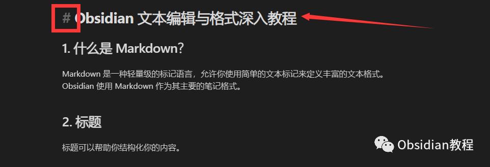**  
****##： 次级标题，比 # 小一点。 **  

  * 

    
    
     ## 这是标题2

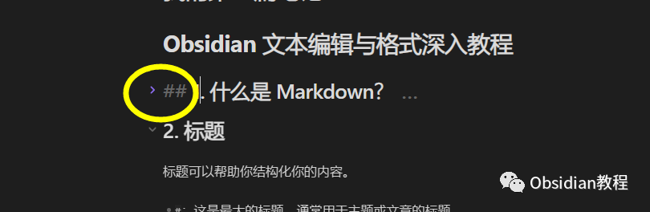  
按照这个规则，你可以创建六级标题。每多一个 #，标题就会更小一级。  
  

3\. 强调文本

  
要强调文本，你可以使其变成加粗、斜体或加粗斜体。  
**加粗：将文本包围在两个星号 ** 或两个下划线 __ 中。**

  * 

    
    
     **这是加粗的文本**

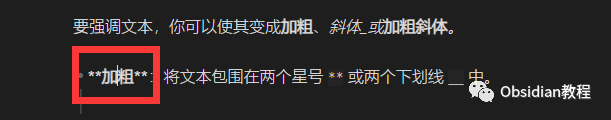 **  
****斜体：将文本包围在一个星号 * 或一个下划线 _ 中。**

  * 

    
    
    *这是斜体的文本*

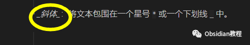 **  
****加粗斜体：组合使用三个星号 ***。**  

  * 

    
    
     ***这是加粗并斜体的文本***-

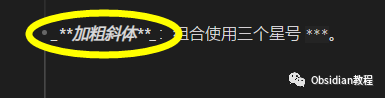  
  

4\. 列表

  
  
**列表有助于整理信息** 。  
  

  * **无序列表：** 每个项目前都有 -、+ 或 *。 如：- 项目A + 项目B * 项目C

  

  * **有序列表：** 每个项目前都有数字和 .。如：1. 第一步 2. 第二步

  
  

5\. 链接

  
  
Obsidian 的一个强大功能是链接。  

  * 内部链接：这会链接到你的另一篇笔记。

  * 

    
    
     [[我的其他笔记]]

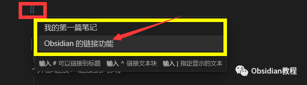  

  * 外部链接：链接到网页。 

  * 

    
    
    [点击这里访问 OpenAI](https://www.openai.com)

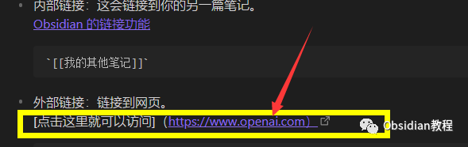   

6\. 插入图片

  
**本地图片：** 如果你的图片与你的笔记在同一个文件夹中，你可以使用相对路径。  
**网络图片：** 你可以直接链接到网络上的图片。 

  * 

    
    
     

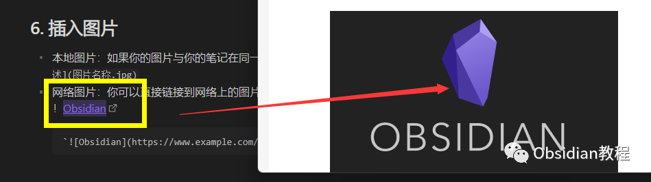  
  

7\. 引用

  
引用可以帮助你突出显示某些文本。

  * 

    
    
    > 这是一个引用文本，通常用于突出显示。

  
  

8\. 代码

  
你可以插入代码来显示特定的格式或编程相关的内容。  
**行内代码：使用反引号 ` 包围文本。****  
**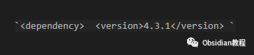  
**代码块：** 使用三个反引号 ``开始和结束，可选地后跟编程语言名称（如python、javascript` 等）。  
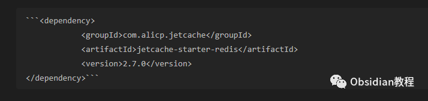   

9\. 分隔线

  
插入一个分隔线来分割内容。  
\--- 或 ***  
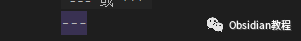  
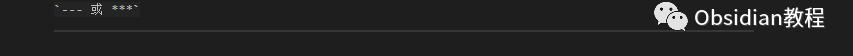   

10\. 任务列表

  
  
你可以创建可勾选的任务。  
\- [ ] 这是一个未完成的任务 - [x] 这是一个已完成的任务  
  

11\. 表格

  
利用表格整理和显示数据。  

  * 

    
    
    | 列1 | 列2 | |-----|-----| | A1 | B1 | | A2 | B2 |

  
希望这份细化的教程能够帮助你更好地理解 Obsidian 中的 Markdown 格式化功能。如果你还有其他疑问或需要进一步的指导，请告诉我！  
  
  
1点击下方公众号，回复关键字：**Obsidian** ，获取Obsidian资料合集。
