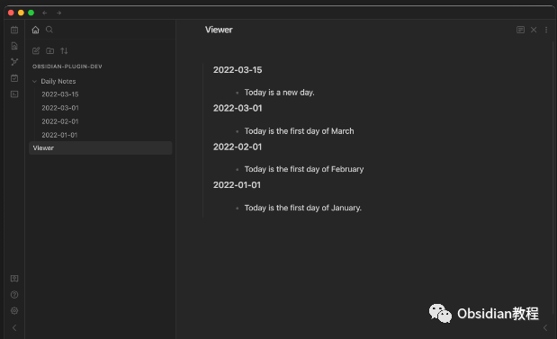
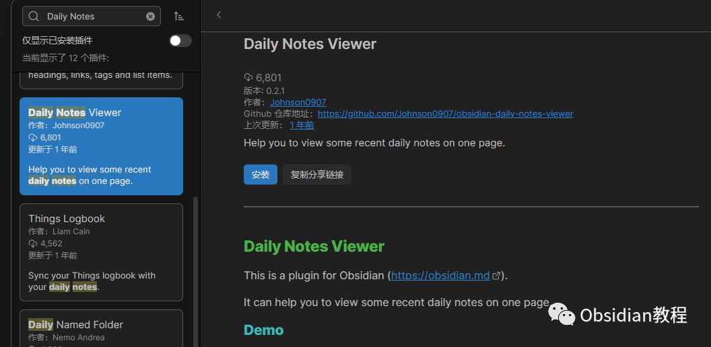
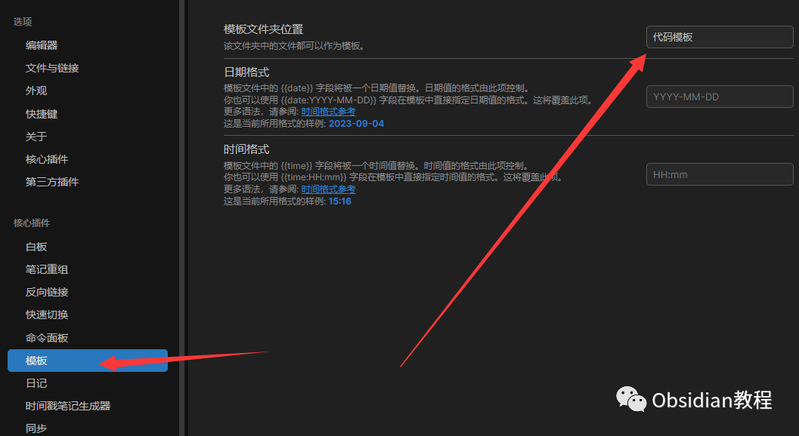
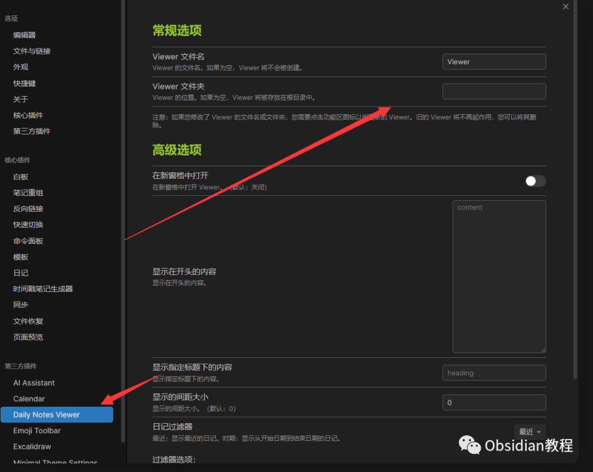
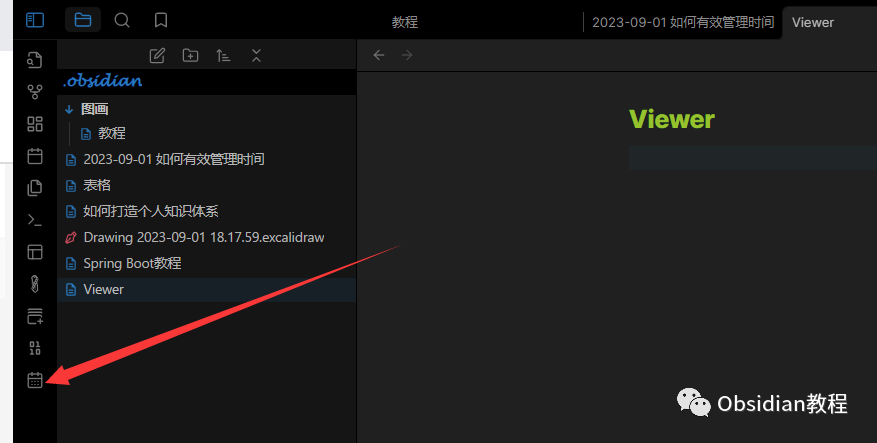

# Obsidian日常记录：Daily Notes Viewer插件

### 点击下方公众号，回复关键字：**Obsidian** ，获取Obsidian资料合集。

### 

###  1**什么是 Daily Notes Viewer 插件？**   

在知识管理和个人笔记领域，日常记录是一个非常受欢迎的习惯。许多人喜欢记录每天的所思、所学和所做，以此促进反思和学习。  

### **1\. 概述**

  
Obsidian 的 Daily Notes 插件提供了一个自动化流程，让用户轻松创建每日笔记。这种方法鼓励日常记录，帮助用户建立一个连续的思考、反思和知识积累的习惯。  

### **2\. 主要特性**

####   

####  a. 自动日期格式化

当你使用该插件创建每日笔记时，它会自动为文件命名，使用预先设置的日期格式。例如，“2023-09-04”。  

####   

#### b. 模板支持

为了确保一致性并优化笔记的结构，你可以为每日笔记设置一个默认模板。这样，每当你创建新的日记时，都会自动加载这个模板。  

####   

#### c. 自定义存储位置

你可以选择每日笔记保存的特定文件夹，这样可以帮助你更好地组织和分类笔记。

####   

#### d. 快速导航

一旦你开始使用 Daily Notes 插件，你可以通过日历图标或热键迅速访问当天的笔记。

###  2**如何启用 Daily Notes 插件？**   

  * 打开 Obsidian。
  * 点击左侧边栏的设置（齿轮图标）。
  * 在“插件”部分，查找“Daily Notes”，并启用它。

  

### 3**配置 Daily Notes**

  
在启用插件后，你需要根据自己的需求进行配置。  

  * 在设置中选择“Daily Notes”选项。
  * 你可以设置以下内容：
    * 日期格式：如何显示每天的日期，例如 YYYY-MM-DD。
    * 模板：如果你想每天的笔记都按照一定的模板来创建，可以在这里设置。

  

    * 文件夹：你希望将每日笔记存放在哪个文件夹中。

  
  

### 4**创建每日笔记**   

启用和配置完插件后，每次你想创建或打开当天的笔记时，只需：  

  * 点击左侧边栏的新建日记图标（日历图标）。
  * Obsidian 会自动为你创建或打开当天的笔记。

  

### 

5技巧与建议

**使用模板：** 为你的每日笔记设置一个模板可以帮助你更系统地记录。例如，你的模板可以包含“今日学到的东西”、“今日任务”等部分。  
**链接其他笔记：** 使用Obsidian的链接功能，可以将每日笔记与其他相关笔记连接起来，形成知识网络。  
**使用标签：** 为每日笔记添加标签，例如#会议、#阅读等，有助于后续的搜索和分类。

### 

6总结

Obsidian 的 Daily Notes 插件是一个强大的工具，它鼓励用户每天记录和反思，同时也为日常生活中的观察和学习提供了结构化的方式。  
通过正确地使用和配置这个插件，你可以更好地利用Obsidian，打造属于自己的知识网络。  
  
  
1点击下方公众号，回复关键字：**Obsidian** ，获取Obsidian资料合集。
