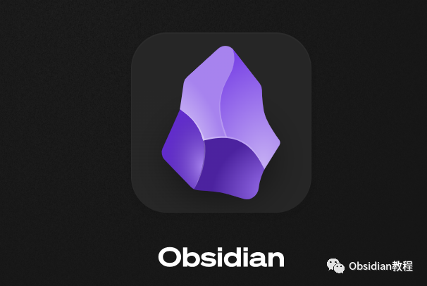
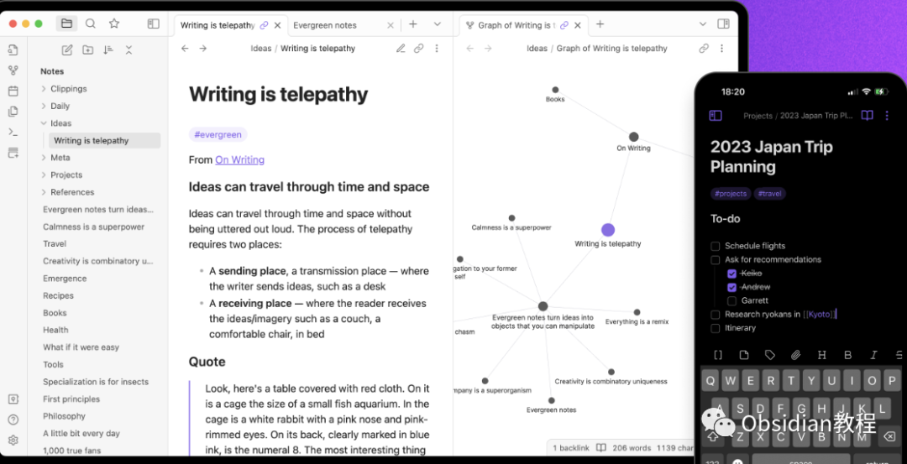
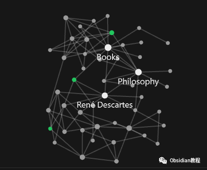
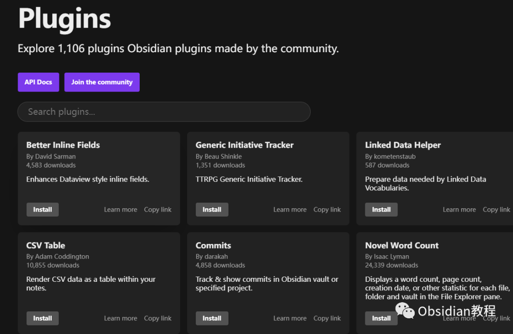
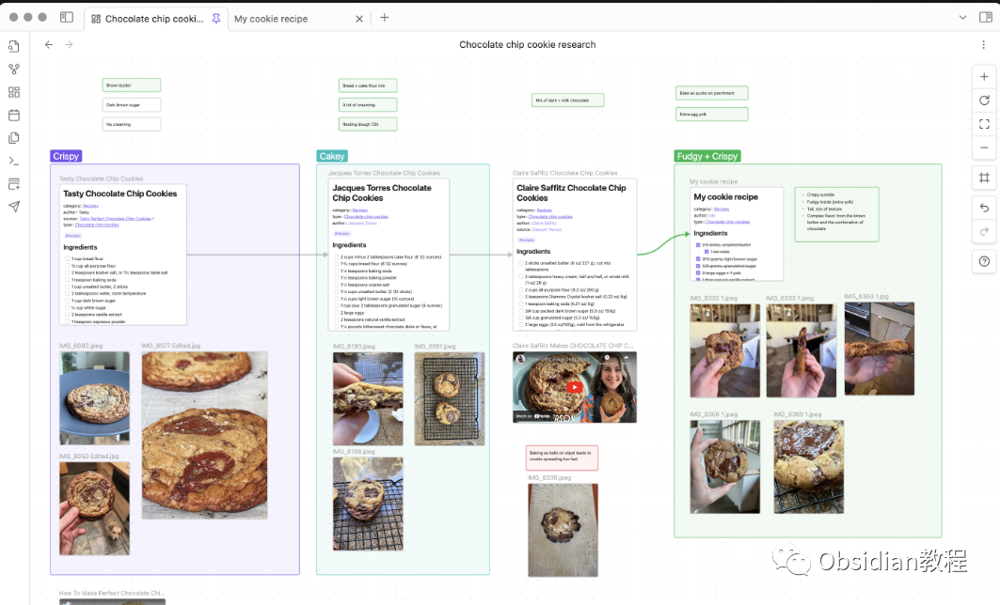
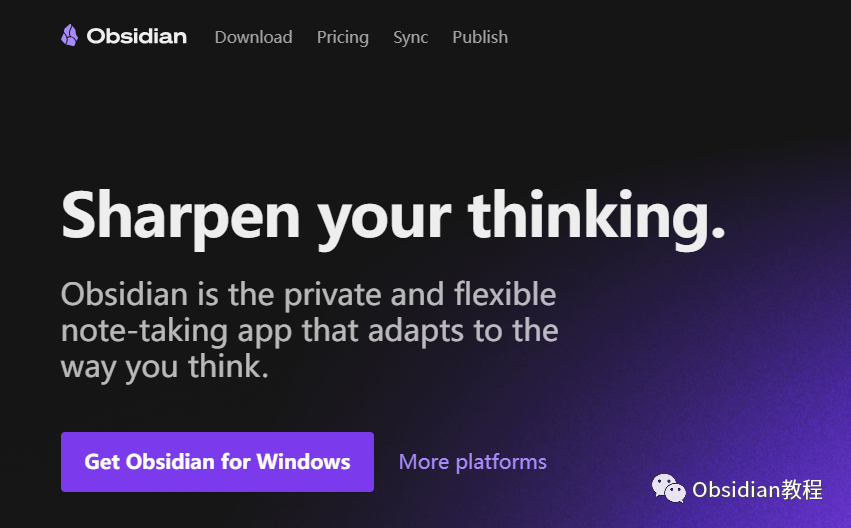

# Obsidian是什么？

点击下方公众号，回复关键字：**obsidian** ，获取Obsidian资料合集。  
  

Obsidian 是什么？

  
  
首先，Obsidian 是什么？好吧，简单来说，它是一个笔记软件。  
但别离开！它不只是一个笔记软件，更像是一个个人知识的宇宙。你可以在这个宇宙里创建星球（笔记），并建立星球之间的通道（链接），以建立你自己的星系（知识体系）。  
  

####   

为何我们需要另一个笔记工具？

  
  

首先，让我们面对现实。我们的大脑是非常强大的，但它不是为了存储大量的信息而设计的。而且，随着时间的推移，它会遗忘很多东西。这就是为什么我们都有“啊，我知道这个，但我忘了是什么”的那种时刻。  
  
Obsidian 就是为了解决这个问题而出现的。不仅仅是记录你的想法和信息，更重要的是，它帮助你组织和连接这些片段，就像你的脑中的神经网络。  
  

Obsidian 有哪些优势？

  
笔记软件那么多，Obsidian的优势在哪里呢？主要有以下几点：  
**1.链接神经网络：** 你可以非常轻松地将一个笔记与另一个笔记相连接，就像大脑中的神经元一样。这样，当你写到一个话题时，你可以马上跳到另一个相关的话题，无需反复搜索。  
  
**2.掌握数据：** 与许多其他笔记应用不同，Obsidian 保存你的所有数据在你自己的设备上。没有云，没有第三方。你的数据，你做主。  
**3.自定义大师：** Obsidian 允许你使用各种插件，你可以根据自己的需要修改和优化它。喜欢深色主题？没问题。想要更高效的提醒工具？也可以。你喜欢的，Obsidian 都可以做到。  
  
**4.知识的星图：** Obsidian 提供了一个视觉化的工具，让你可以看到你所有笔记之间的链接关系。像探索星系一样，你可以在你的知识宇宙中游走，发现新的联系。  
那么问题来了，为什么你必须使用 Obsidian 呢？  
  

为什么要使用Obsidian

  
必须使用 Obsidian的理由如下：  
**1.知识整合：** 你是否经常在想“我记得我读过这个，但是找不到在哪里了”？Obsidian 能帮你结束这种苦恼，将你的知识整合在一个地方，建立联系，快速找到你需要的东西。**  
****2.开启创造力：** 当你看到你的知识是如何相互联系的，新的思路和创意就会迸发出来。它不仅仅是存储，更是一个创意的火花池。**  
****3.成长与反思：** 写是反思的工具。通过在 Obsidian 里记录你的每一天、每一刻，你不仅是在储存记忆，更是在记录你的成长。  
  
**4.保护隐私：** 在这个数字化的时代，我们的数据是如此宝贵。Obsidian 为你提供了一个安全的空间，无需担心你的数据会泄露给第三方。  
所以，说到底，Obsidian 不仅仅是一个笔记应用。  
它是一个工具，一个帮助你更好地理解自己、发掘创意和保护数据的工具。  
如果你还没有试过，我强烈推荐你试试看。希望你也会像我一样，被它的魅力所吸引，进入这个知识的魔法世界。  
  
所以，下次当你想“啊，我知道这个，但我忘了是什么”时，你可能会想：也许我应该把它写在 Obsidian 里。  
  
  
1点击下方公众号，回复关键字：**obsidian** ，获取Obsidian资料合集。

#### 
