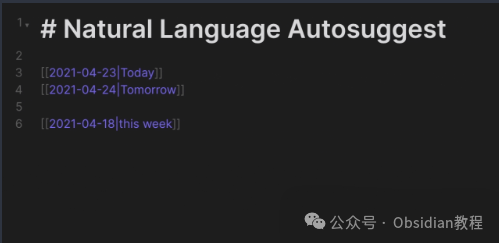
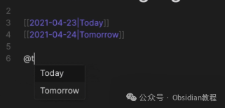
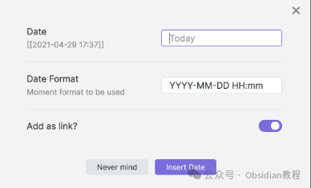
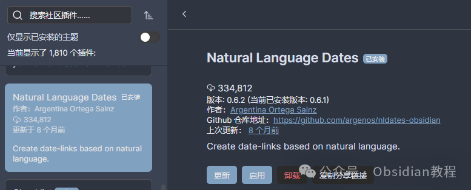

# Obsidian神级插件：Natural Language Dates ，助你高效管理笔记!

今天咱们来聊聊 Obsidian 里的 Natural Language Dates 插件。对于那些像鬼哥一样经常跟时间赛跑的朋友们，这个插件绝对是个神器！  

你有没有过想在笔记里快速插入时间戳，却得费劲脑筋去记日期格式？或者想在日记里轻松跨链接每日笔记，但总觉得操作有点繁琐？别担心，Natural Language Dates 插件来了，帮你轻松搞定这些问题！  
这款插件利用自然语言解析日期和时间，让你在 Obsidian 中操作日期和时间如同聊天一样简单。  
比如，输入“@today”然后按下回车，就会自动扩展为当前日期。如果同时按住Shift键，还能把输入文本保留为别名，生成像“[[2022-07-22|today]]”这样的链接。听起来是不是很酷？

### **插件功能一览**

####   

#### **日期自动建议**

  
在编辑器视图中，你可以用自然语言直接扩展日期。例如，输入“@today”，然后按下回车，立马变成当前日期。如果同时按住Shift键，文本会保留为别名，如“[[2022-07-22|today]]”。

####   

#### **自定义 nldates Obsidian URI**

  
你可以使用 Obsidian 的 URI 打开每日笔记，通过 obsidian://nldates?day=<date here>。别忘了适当编码空格字符。  

#### **日期选择器**

  
插件还提供了一个日期选择器菜单，方便你快速选择日期。  

#### 

#### **命令和快捷键**

  
Natural Language Dates 插件增加了一些命令，支持你用自然语言操作日期和时间。这些命令可以通过设置自定义快捷键来调用。  

### **配置和使用**

####   

#### **基础设置**

  
设置| 描述| 默认值  
---|---|---  
启用/禁用| 全局开关来启用或禁用自动建议功能| 启用  
触发短语| 打开自动建议所需的字符| @  
插入为链接？| 日期将作为 Wikilinks 插入（即 [[<date>]]）| 是  
  
####   

#### **nldates URI 操作**

  
现在你可以使用 Obsidian 的 URI 通过自然语言打开每日笔记。例如：
      
      * 
    
    
    
    obsidian://nldates?day=today

  

注意要正确编码空格字符。  

### **命令和快捷键**

  
插件提供了一些命令来解析自然语言日期和时间，你可以在设置中为它们添加自定义快捷键。默认情况下，这些快捷键是未设置的。  

#### **常用命令**

  
设置| 描述| 默认值  
---|---|---  
插入当前日期| 按照设置菜单中的格式插入当前日期| YYYY-MM-DD  
插入当前时间| 按照设置菜单中的格式插入当前时间| HH  
插入当前日期和时间| 按照设置菜单中的格式插入当前日期和时间| YYYY-MM-DD HH  
解析自然语言日期| 将选定的文本解析为自然语言日期，并替换为 Obsidian 链接| [[YYYY-MM-DD]]  
解析自然语言时间| 将选定的文本解析为自然语言时间，并替换为时间戳| HH  
解析自然语言日期（作为链接）| 将选定的文本解析为自然语言日期，并替换为标准 Markdown 链接| 选定文本  
解析自然语言日期（作为纯文本）| 将选定的文本解析为自然语言日期，并替换为纯文本| YYYY-MM-DD  
  
###   

### **使用示例**

  
解析器支持大多数日期/时间格式，包括：  

  * Today, Tomorrow, Yesterday, Last Friday 等等
  * 2024年8月17日 - 2024年8月19日
  * 这个星期五从13:00到16:00
  * 5天前
  * 2周后
  * 2014-11-30T08:15:30-05:30

####   

#### **解析日期**

  
你可以用自然语言轻松解析日期。例如：  

  * @today 会被解析为当前日期
  * in 5 days 解析为 5 天后

####   

#### **自定义解析**

  
插件也支持一些自定义解析：  

  * next week 解析为下周一
  * next month 解析为下个月的1号
  * mid month 解析为本月15号
  * end of month 解析为本月最后一天  

### **下载和安装 Natural Language Dates**

  
虽然说了这么多，还是要教大家如何下载和安装这个神器。  
**1.在线安装**  
如何安装 Obsidian 插件，通常可以通过以下步骤进行安装：

  1. 打开 Obsidian 的设置页面。
  2. 导航到“社区插件”部分。
  3. 点击“浏览”按钮，搜索“Natural Language Dates”。
  4. 找到插件后，点击“安装”按钮。
  5. 安装完成后，返回插件列表，启用该插件。

### 

******  
****2.离线安装：****  
****很多同学无法直接在线安装obsidian插件，这里我已经把obsidian所有热门插件下载好了**  
只需要关注下方公众号，后台回复：**插件** 即可获取

### 

  
安装完成后，别忘了在插件列表中启用它。这样，你就可以开始体验 Make.md 带来的强大功能了。  
总结一下，Natural Language Dates 插件让你在 Obsidian 中处理日期和时间变得前所未有的简单。通过自然语言解析和强大的日期选择器功能，你可以更高效地管理和链接你的每日笔记。  
鬼哥强烈推荐给所有 Obsidian 用户，尤其是那些希望提升笔记管理效率的小伙伴们！试试看，你一定会爱上这个插件的。  

> **对obsidian感兴趣的同学，可以链接我微信：hls404 拉你进入“obsidian交流社群”。**

  
**热门推荐**  
**  
**

  * [Obsidian插件：Make.md为你量身打造一个完美的个人系统。](http://mp.weixin.qq.com/s?__biz=MzkyMDUyMDM2Mg==&mid=2247485896&idx=1&sn=a13c9fcd01a0693dafef7a6edce5de8f&chksm=c190da0df6e7531b4890c7b581bf793c4255ea4183c567405b920a407f802ff338b1e86cbb3c&scene=21#wechat_redirect)

  * [Obsidian插件：Editing Toolbar 让笔记编辑变得更加简单和直观](http://mp.weixin.qq.com/s?__biz=MzkyMDUyMDM2Mg==&mid=2247485885&idx=1&sn=fdd0b6299765f6149bd0b6c538716552&chksm=c190da78f6e7536ef9827d3f5cff76054bb7653626368c89f711e79ee8819b6207e1f5d83210&scene=21#wechat_redirect)

  * [Obsidian插件：Better Word Count统计文档的字数、字符数、句子数等](http://mp.weixin.qq.com/s?__biz=MzkyMDUyMDM2Mg==&mid=2247485865&idx=1&sn=e34c00104214d18c4fa94789ab03124a&chksm=c190da6cf6e7537a7bbdaa5be8071e072261cba86faeeeae9f1e29afe57c27150ae5a3588fa0&scene=21#wechat_redirect)  

