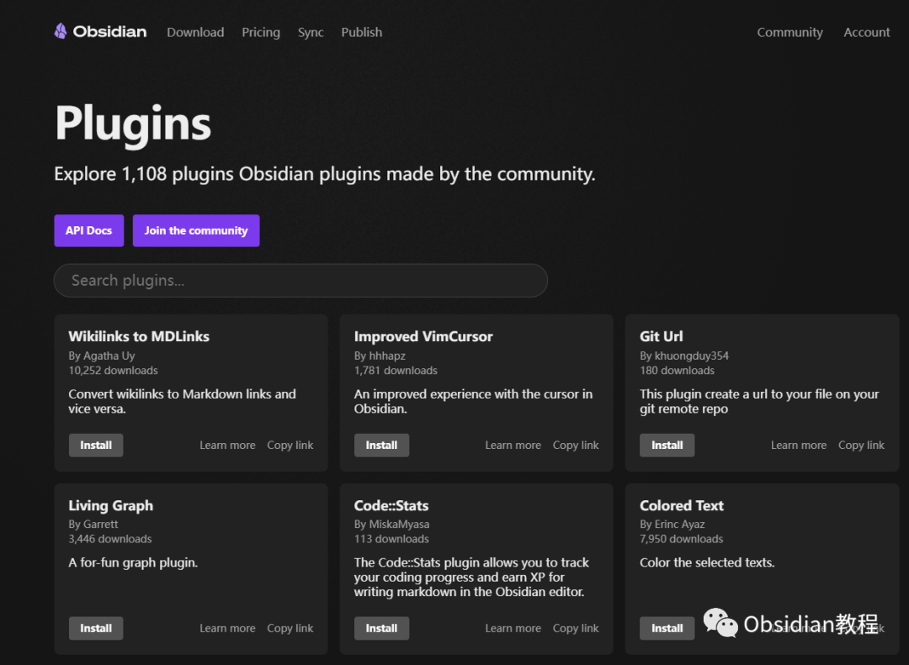
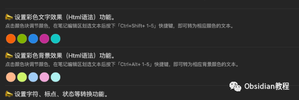
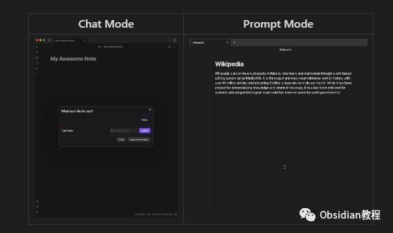

# Obsidian第三方插件详解

### 点击下方公众号，回复关键字：**Obsidian** ，获取Obsidian资料合集。

  
Obsidian 是一个高度可定制的知识管理工具，其中第三方插件为它提供了无数额外的功能。  

但是，这些插件究竟带来了哪些优势和劣势？本教程将为你详细介绍。

## 

  

第三方插件优势

  

**1.功能增强：** 第三方插件极大地扩展了 Obsidian 的功能。  
从高级数据可视化、任务管理、日历功能到代码块高亮，都能为用户提供丰富的体验。  

******高度定制化：** 插件使用户可以根据自己的具体需求来构建一个定制化的工作环境。**  
****社区创新：** 由于 Obsidian 拥有一个活跃的用户社区，新的插件和功能经常被发布，充分满足了社区的不断变化的需求。**  
****无缝集成：** 多数插件与 Obsidian 的核心功能无缝融合，提供了流畅且一致的用户体验。

##   

第三方插件劣势

  

**内容格式问题：** 许多插件在 Markdown 中使用特殊格式或标记来实现其功能。虽然在 Obsidian 内看起来无瑕，但当笔记在其他 Markdown 工具中打开时，可能会出现格式错误或其他问题。  
**对插件的依赖：** 过度依赖某些插件可能导致，如果在没有这些插件的环境中使用 Obsidian，某些功能将无法使用。  

**复杂性增加：** 虽然插件提供了许多高级功能，但它们也可能使 Obsidian 变得更加复杂，尤其是对于新手来说。  
**新手陷阱：** Obsidian 新手可能会被大量的插件选择所吸引，而忽视了最基础的内容创作和组织。过度依赖花哨的功能可能会导致他们偏离主要目标。  
**维护和稳定性问题：** 第三方插件不一定保证长期维护，可能存在稳定性问题或与未来的 Obsidian 版本不兼容。

  

总结

  
  
虽然第三方插件为 Obsidian 提供了丰富的功能和高度的定制性，但用户仍需谨慎选择。  
为了确保笔记的跨平台兼容性和长期稳定性，**建议用户首先关注内容创作，稳定工作流程，再考虑增加插件功能** 。  
  
  
1点击下方公众号，回复关键字：**Obsidian** ，获取Obsidian资料合集。
