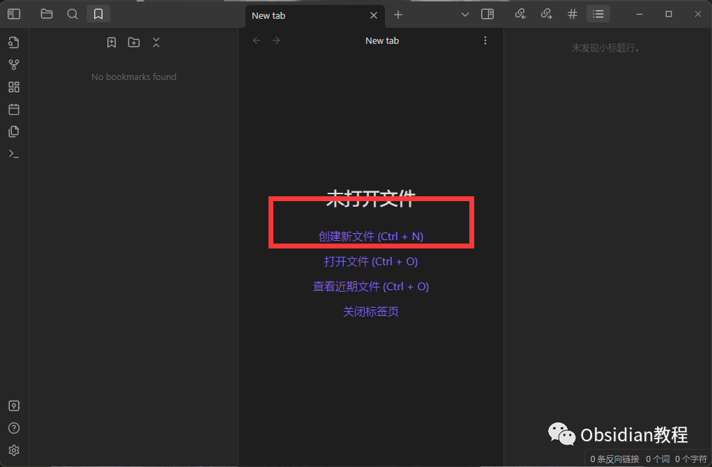
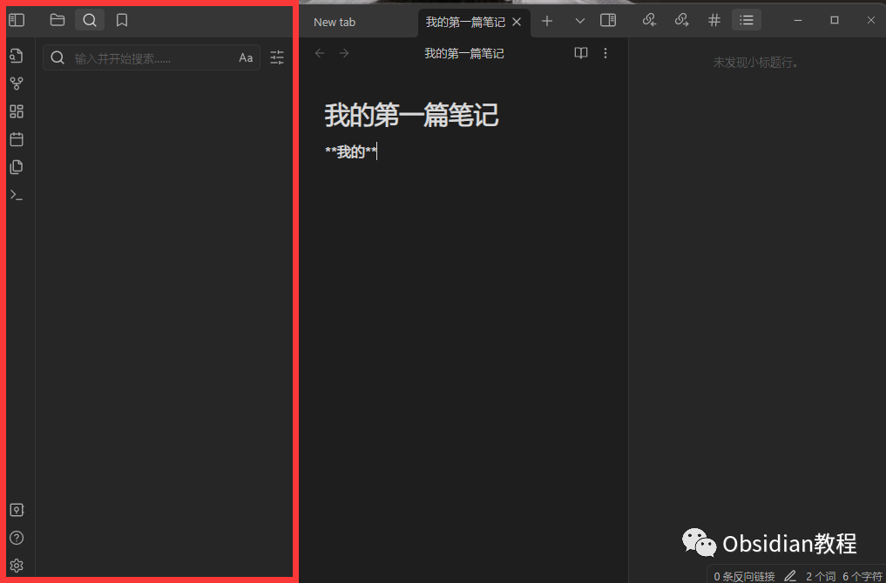
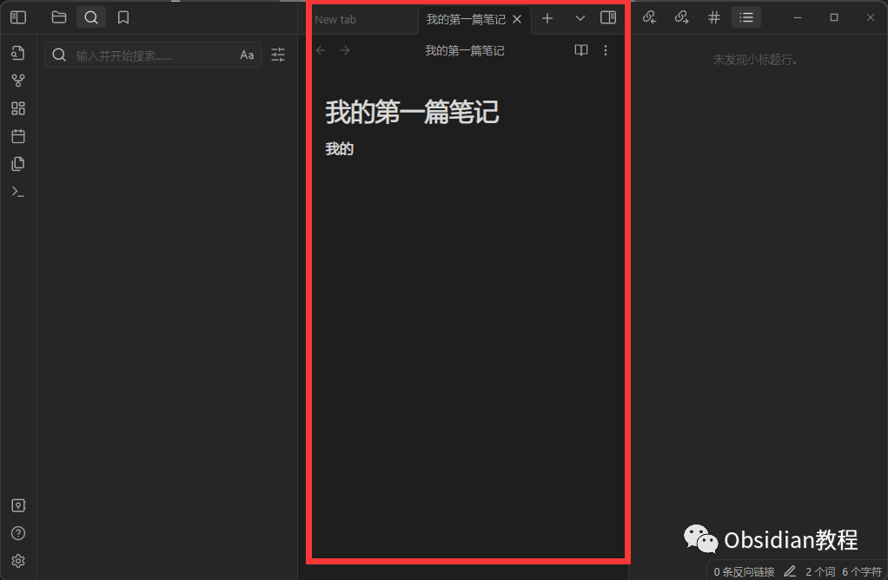
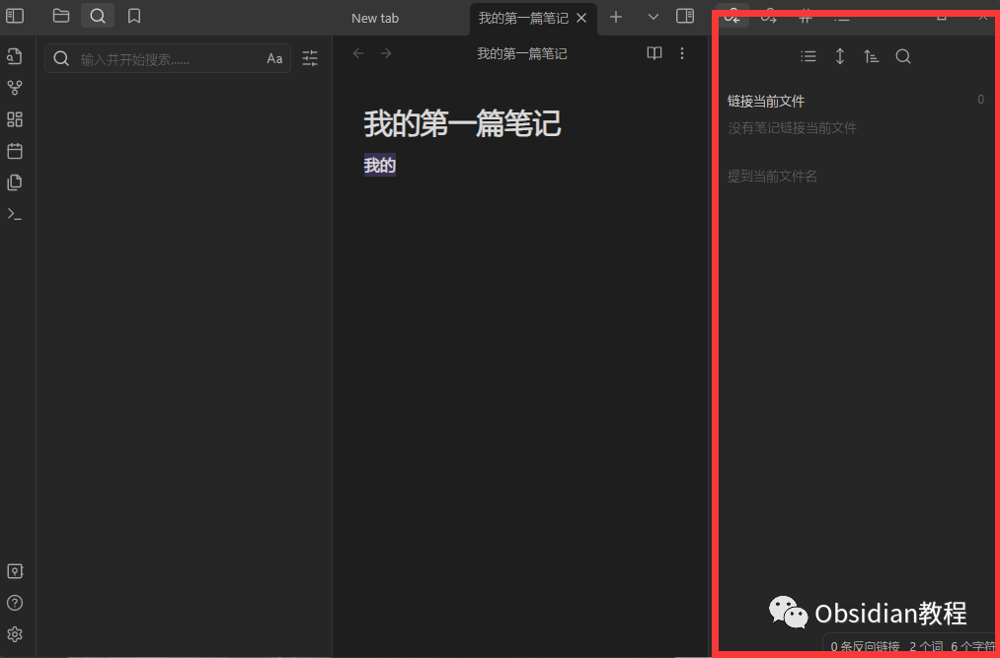
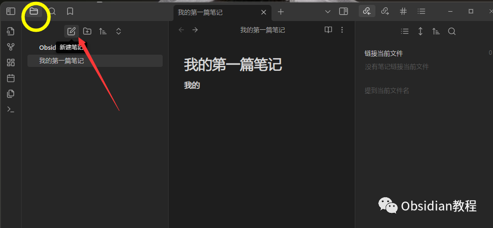
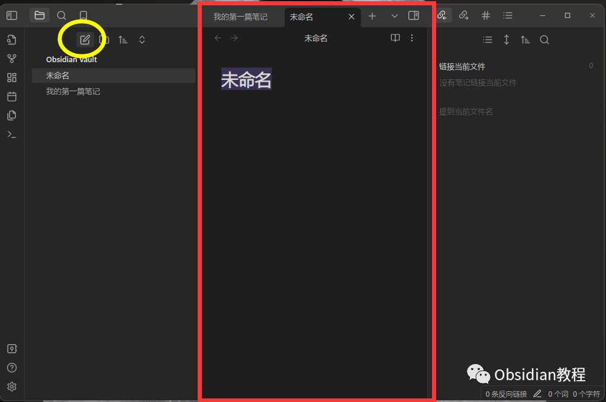
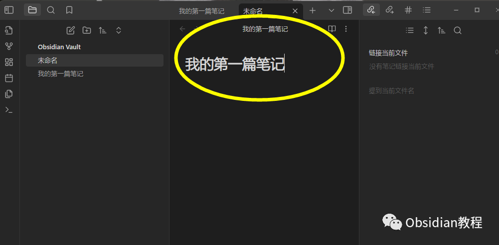
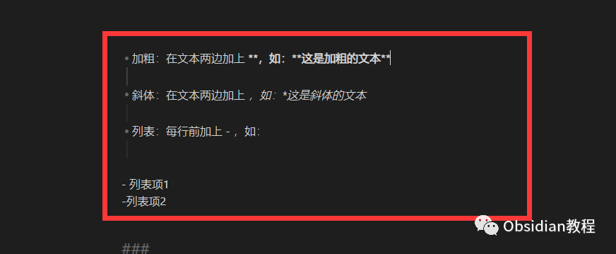
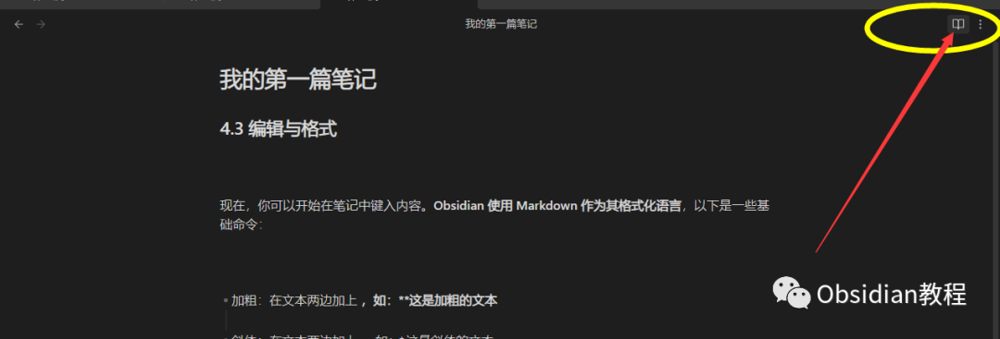

# Obsidian：创建你的第一篇笔记

### 点击下方公众号，回复关键字：**Obsidian** ，获取Obsidian资料合集。

  

  
Obsidian 是一个强大的知识管理工具，它以其灵活的链接功能和深度的扩展性脱颖而出。对于初次使用的人，仅仅开始可能就是最大的挑战。  
本教程旨在指导你创建第一篇 Obsidian 笔记，并使你对其基础功能有一个全面的了解。  

##   

1\. 安装 Obsidian

  

**1.步骤(参考：[Obsidian下载与安装保姆级教程](http://mp.weixin.qq.com/s?__biz=MzkyMDUyMDM2Mg==&mid=2247483671&idx=1&sn=7641a2d59852fa20d9faadb4264fa320&chksm=c190d2d2f6e75bc44806815b6cae8d23bf71420a7f949490d2645af862ccf8861d48a421e06c&scene=21#wechat_redirect)）****  
**

  * 访问 Obsidian 官方网站。
  * 根据你的操作系统选择合适的版本（Windows, macOS, Linux）并下载。
  * 打开下载的文件并按照提示完成安装。

##   

## **2\. 启动并设置******

  

  * 找到并打开 Obsidian 应用程序。
  * 你会被引导选择或创建一个新的文件夹作为你的笔记库。

  
  
建议：选择一个容易访问并且是专门为存储 Obsidian 笔记而设的位置，例如“我的文档”中的一个新文件夹。  

##   

2\. 界面初探

  
  

当你第一次打开 Obsidian，你会看到其简洁的用户界面，分为以下几部分：  

  * 左侧侧边栏：文件浏览器、搜索等功能。

  
  

  * 中央区域：笔记的编辑和查看区域。

  
  

  * 右侧侧边栏：显示反向链接和当前笔记的大纲。

  
  
  

##   

3\. 创建第一篇笔记

  

### **3.1 新建**

  

  * 在左侧侧边栏的顶部，点击“新建笔记”按钮。

  

  * 你会在中央编辑区看到一个新的空白笔记。

  

### **3.2 命名**

  

  * 点击笔记的顶部，默认标题是“无命名”，输入你希望的标题，例如：“我的第一篇笔记”。

  

### **3.3 编辑与格式**

  
现在，你可以开始在笔记中键入内容。**Obsidian 使用 Markdown 作为其格式化语言** ，以下是一些基础命令：  

  * 加粗：在文本两边加上 **，如：**这是加粗的文本**
  * 斜体：在文本两边加上 *，如：*这是斜体的文本*
  * 列表：每行前加上 - ，如：

    
    
    - 列表项1  
    - 列表项2  
    

###   

### **3.4 保存**

  
好消息是，你不必担心保存！Obsidian 会自动保存你的更改。

## 

  

4\. 预览你的笔记

  

在 Obsidian 中，你可以轻松地在编辑模式和预览模式之间切换。  

  * 在右上角，你会看到一个书本的图标。点击它可以切换到预览模式。

  

  * 若要返回到编辑模式，再次点击相同的图标。

  
至此，你已成功创建了第一篇 Obsidian 笔记！  
当然，Obsidian 的功能远不止这些。随着你的深入使用，你会发现更多的高级功能和插件。但对于初学者来说，掌握这些基础知识是一个很好的开始  
  
  
1点击下方公众号，回复关键字：**Obsidian** ，获取Obsidian资料合集。
