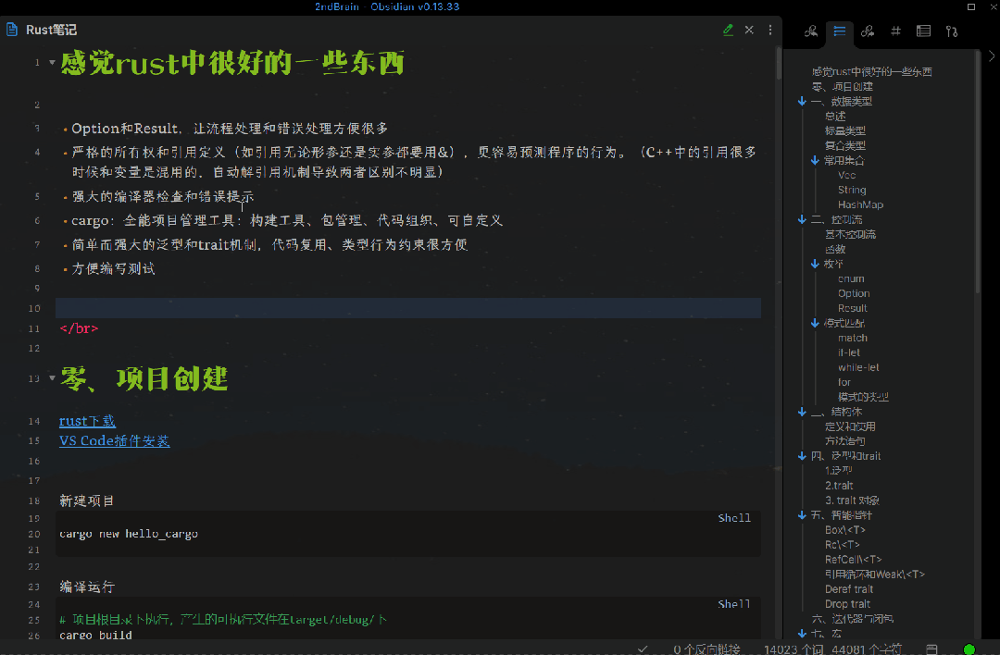
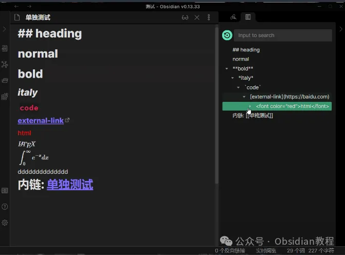
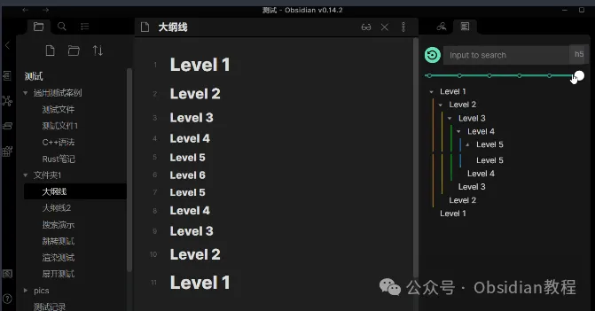
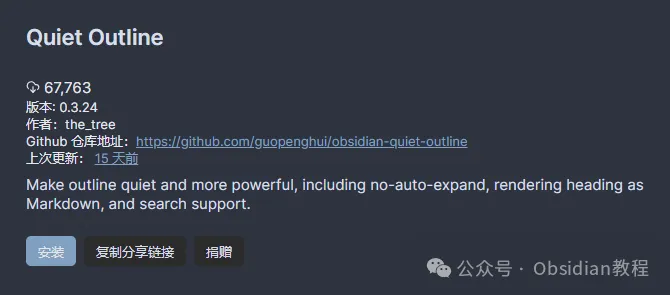
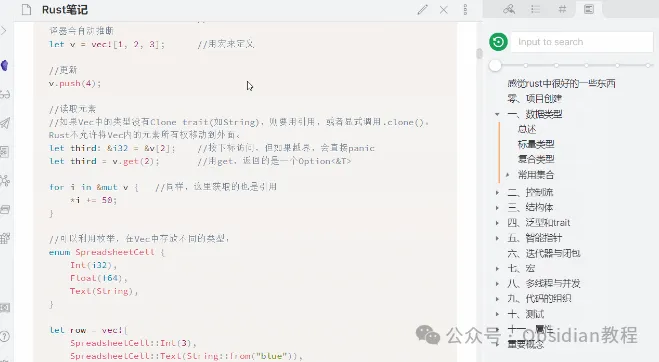

# Quiet Outline 插件：简洁大纲视图，提升笔记管理效率！

嗨，大家好。我是何老师。

  

你是不是在使用 Obsidian 管理大量笔记时，感觉到有点凌乱，尤其是长文档的情况下，找到一个特定部分可能会让你挠头？

  

没关系，今天要介绍的 Quiet Outline 插件就是为了解决这个问题而生的。这个插件为 Obsidian 提供了更加简洁的大纲视图，让你可以轻松地管理和浏览大型文档。

**  
**

**主要特性**

  

Quiet Outline 相比 Obsidian 默认的大纲视图，设计得更加简洁，易于阅读，它不仅可以帮助你清晰地查看文档的层次结构，还能通过一些实用功能来提升你的工作效率。

  

**默认大纲与安静大纲的区别**

  

**\- 默认大纲：** Obsidian 自带的功能，展示了文档中所有的标题内容，适合基本的层次查看。

**\- 安静大纲：** Quiet Outline 提供的视图更加简洁，让你只看到最重要的内容，避免信息过载。

**特性概览**

**  
**

**\- 无自动展开编辑：** 当你编辑文档时，大纲不会自动展开，帮助你保持注意力集中。

**\- 支持搜索：** 你可以使用关键词甚至正则表达式搜索大纲中的内容，非常适合快速定位到需要的部分。

**\- Markdown 渲染支持：** 可以在大纲中渲染 Markdown 格式的文本，使得内容更加直观清晰。

**\- 自动展开/折叠：** 根据文档结构，Quiet Outline 可以智能地展开或折叠不同层级的标题，方便你掌控文档的大结构。

**\- 级别切换条：** 可以快速切换显示的标题级别，比如只显示一级标题或二级标题，让你更轻松浏览复杂文档。

**\- 拖拽修改：** 允许你通过拖拽的方式，调整文档的结构，省去反复手动调整的麻烦。

**使用限制**

  

虽然 Quiet Outline 非常强大，但它在一些场景下也有使用限制：

  

**\- 懒渲染策略：** 由于 Obsidian 的懒渲染机制，快速滚动时可能会出现大纲内容延迟显示的问题。遇到这种情况，可以尝试再次点击目标位置。

**\- 不支持跨级标题：** 标题必须按顺序使用，比如 h1 -> h2 -> h3，而不能跳跃使用 h1 -> h3 -> h4 这种方式。

**\- 无法拖拽成子标题：** Quiet Outline 不支持将一个标题直接拖拽为另一个标题的子标题。

**\- 部分扩展语法不支持：** Obsidian 的部分扩展 Markdown 语法可能无法在 Quiet Outline 中直接支持，不过可以通过安装扩展 Markdown 解析器解决这个问题。

  

**安装方法**

  

**1\. 在线安装**

  

1\. 打开 Obsidian，点击左侧的“社区插件”。

2\. 在“浏览”页面中，使用搜索框搜索“Quiet Outline”。

3\. 找到插件后，点击“安装”按钮，安装完成后记得启用插件。

**2\. 离线安装**

**  
**

### **很多同学无法直接在线安装obsidian插件，这里我已经把obsidian所有热门插件下载好了**  
只需要关注下方公众号，后台回复：**插件** 即可获取1\. 找到最新发布的 Quiet Outline 插件 ZIP 文件并下载。

2\. 将文件解压到 Obsidian 的插件文件夹中。

3\. 启动 Obsidian 后，进入设置面板启用插件即可。

**  
**

**使用方法**

  

安装好插件之后，如何使用它来提升你的工作效率呢？下面是一些操作指南和技巧：

  

**1\. 开启 Quiet Outline**

  

按下快捷键 Ctrl+P 或 Cmd+P 打开 Obsidian 的命令面板，输入“Quiet Outline”并按 Enter 键，即可快速启用大纲视图。

**2\. 配置 Markdown 渲染**

  

如果你希望在大纲中渲染 Markdown 格式的内容，可以进入插件的设置面板，找到并启用“Markdown 渲染”选项，这样大纲中的 Markdown 内容就会自动渲染为更易读的格式。

  

**3\. 实用技巧**

  

**\- 利用搜索功能：** 当你的文档过长时，可以使用 Quiet Outline 的搜索功能，输入关键词，快速定位到需要的部分。你还可以使用正则表达式搜索，查找特定格式的内容。

**\- 调整大纲级别：** 文档层级复杂时，通过大纲视图的级别切换条可以快速缩小范围，比如只显示一级或二级标题，帮助你高效浏览。

**\- 优化笔记结构：** 通过大纲中的拖拽功能，你可以轻松调整笔记的层次结构，使文档更加符合你的逻辑。

  

**总结  
**

  

在我使用 Quiet Outline 插件的过程中，最让我满意的就是它的简洁设计和强大的搜索功能。

  

对于那些文档层级复杂的笔记来说，这个插件可以让我快速找到需要编辑的内容，特别是它的 Markdown 渲染功能，让大纲不仅仅是个目录，还能清楚地显示内容。

  

虽然它有一些限制，比如不支持跨级标题和懒渲染问题，但对于日常笔记管理，它依然是个不可多得的好帮手。

  

如果你也像我一样，常常被繁杂的文档搞得头疼，试试这个 Quiet Outline 吧，也许会让你的 Obsidian 笔记管理体验焕然一新。

# **Obsidian交流社群来了**

[**我们搞了一个专门分享Obsidian的交流社群：****玩转效率笔记****社群的主要内容包括使用技巧、模板主题和插件等，** 帮助更多人提升效率，实现自我管理的目标。](http://mp.weixin.qq.com/s?__biz=MzkyMDUyMDM2Mg==&mid=2247485997&idx=1&sn=9a528871be62e4c74a1df3807b28f2bd&chksm=c190d9e8f6e750fe9df7a333b666fdd8561fdeb928d1df1f367d2374742efa34727a3f91cbc0&scene=21#wechat_redirect)

  
如果你对Obsidian有热情，这个社群绝对不容错过！  

