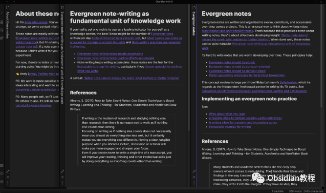
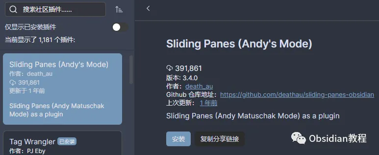

# Sliding Panes为Obsidian带来全新滑动面板体验！

嗨，大家好。我是何老师。

  

在你日常使用Obsidian的时候，是否也遇到过打开太多笔记，界面显得杂乱无章的情况？

  

相信很多笔记爱好者都会碰到这个问题。而今天要给大家介绍的插件——Sliding Panes，就是解决这个问题的好帮手！

  

它不仅能让你的Obsidian界面变得井井有条，还为你带来一场全新的笔记管理体验。

  

**Sliding Panes概述**

  

Sliding Panes这个插件的灵感其实来源于Andy Matuschak的笔记设计理念。

  

大家可以想象一下，在传统的笔记应用中，每次打开一个新笔记，旧的笔记就会被挤到边缘，导致界面变得杂乱且难以管理。

  

而Sliding Panes采用了全新的思路，将每个笔记做成了独立的滑动面板，用户可以自由滑动、调整，非常自然。

  

**功能一览**

  

**1.面板滑动：** 每个笔记变成了独立的滑动面板，滑动切换时感觉就像在书架上翻阅一本本书。笔记再多也不会杂乱。

**2.旋转标题：** 每个面板的标题被旋转90度，显示在左侧，就像书脊一样立在界面上，不仅节省空间，还方便查看和切换。

**3.自定义面板宽度：** 根据你的需求，可以自由调整面板的宽度，无论你是喜欢宽屏展示，还是习惯多任务窗口，都能找到适合自己的布局。

**4.自由切换模式：** 可以轻松打开或关闭Sliding Panes模式，根据使用场景调整界面布局，带来更灵活的创作空间。

  

**安装教程**

  

想要体验Sliding Panes带来的便利？其实它的安装非常简单，无论你是在线安装，还是离线安装，都能轻松搞定。

  

**1.在线安装**

  

如果你的网络条件允许，可以通过Obsidian的内置社区插件功能进行在线安装：

  

1\. 打开Obsidian，进入设置页面（Settings）。

2\. 在插件设置中，选择Third-party plugin（第三方插件），并确保关闭了Safe mode（安全模式）。

3\. 点击Browse community plugins（浏览社区插件），在搜索框中输入“Sliding Panes”。

4\. 找到插件后，点击Install（安装）。

5\. 安装完成后，回到第三方插件页面，找到Sliding Panes并激活它。

**2.离线安装**

**  
**

**很多同学无法直接在线安装obsidian插件，这里我已经把obsidian所有热门插件下载好了**

**  
**

只需要关注下方公众号， 后台回复：**插件** 即可获取

**  
****注意事项****\- 版本兼容：** Sliding Panes只支持Obsidian v0.9.7及以上版本，因此如果你用的是旧版本，建议先更新Obsidian。**- 安全风险：**尽管Sliding Panes是开源插件，但仍然属于第三方插件，安装时建议保持警惕。**- 性能问题：**一次性加载过多的文档可能会影响Obsidian的运行效率，建议根据自己电脑的配置合理使用。**实际体验** 安装了Sliding Panes之后，每次打开Obsidian，你都会有一种耳目一新的感觉。它的独特滑动面板设计不仅带来了更直观的笔记管理方式，还让整个Obsidian界面变得更加整洁有序。当你在多个笔记之间来回切换时，感觉每一个面板都是思想的碎片，在滑动和碰撞中慢慢形成了完整的知识框架。**结语** 在我看来，Sliding Panes确实给Obsidian的用户带来了极大的便利，尤其是对于那些日常需要处理大量笔记的用户来说，这个插件堪称神器！总之，如果你也是Obsidian的重度用户，或者刚刚踏上数字笔记的探索之旅，那么Sliding Panes绝对值得一试！安装之后，Obsidian将成为你思维整理和知识管理的更好工具。

# **Obsidian交流社群来了**

[**我们搞了一个专门分享Obsidian的交流社群：****玩转效率笔记****社群的主要内容包括使用技巧、模板主题和插件等，** 帮助更多人提升效率，实现自我管理的目标。](http://mp.weixin.qq.com/s?__biz=MzkyMDUyMDM2Mg==&mid=2247485997&idx=1&sn=9a528871be62e4c74a1df3807b28f2bd&chksm=c190d9e8f6e750fe9df7a333b666fdd8561fdeb928d1df1f367d2374742efa34727a3f91cbc0&scene=21#wechat_redirect)

  
如果你对Obsidian有热情，这个社群绝对不容错过！
