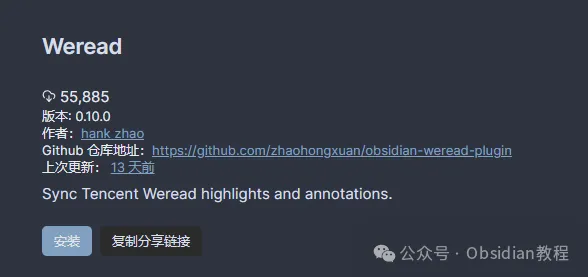

# Weread一键同步微信读书笔记至Obsidian，提升阅读管理效率！

嗨，大家好。我是何老师。

  

你是否也在微信读书里积累了大量笔记和高亮标注，却总是无法有效地管理它们？

  

特别是当你也使用Obsidian作为主要的知识管理工具时，或许你正苦恼如何将微信读书的内容同步到Obsidian中。

  

好消息是，Weread插件能够帮你解决这一问题！

**  
**

**Weread插件概览**

  

Weread插件专为Obsidian用户设计，它可以让你将微信读书中的书籍元信息（例如书籍封面、作者、出版社、ISBN等）以及各种高亮标注、读书笔记（划线笔记、章节笔记、书籍评论等）同步到Obsidian，并自动转化为Markdown格式，存储在指定的文件夹中。

  

这样一来，你就能在Obsidian中更方便地管理、检索、回顾这些内容。

  

**Weread插件的主要功能**

  

**1\. 同步书籍元数据**

这个功能允许你在Obsidian中保存微信读书中所有书籍的元信息，像是书籍封面、作者、出版社等。这样，在整理书籍时就不用再手动输入这些基本信息啦，效率会提升不少。

  

**2\. 同步高亮划线与笔记**

  

当你在微信读书中划下重点或者写下笔记时，Weread可以将这些内容完美同步到Obsidian。这意味着你能够随时回顾整理那些在阅读过程中产生的灵感和想法，并将其整合到你的知识体系中。

  

**3\. 自定义笔记生成模板**

**  
**

插件还允许你根据个人需求自定义生成笔记的模板，使你的笔记内容不仅易读，而且更符合你的使用习惯。

  

**4\. 支持多种文件命名格式**

**  
**

Weread插件提供了灵活的文件命名格式设置，方便你在Obsidian中对笔记进行更好地分类和整理。

  

**5\. 自定义FrontMatter**

  

插件支持在笔记头部的yaml区域添加自定义字段，比如标签、阅读状态等。这让你可以更好地管理和检索笔记，尤其是当你的笔记数量越来越多时。

  

**6\. 支持移动端同步**

**  
**

无论你是在手机、平板还是电脑上，Weread插件都可以帮助你同步和管理这些阅读笔记，实现跨设备的无缝体验。

  

**7\. 同步至Daily Notes**

**  
**

当你开启Daily Notes功能时，Weread插件可以自动将你当天的读书笔记同步进去，这样你每天的学习进度就能一目了然了。

  

**Weread插件的安装方法**

  

**1.在线安装**

**  
**

1\. 打开Obsidian，点击“设置”中的“社区插件”选项。

2\. 在插件浏览器的搜索框中输入“Weread”。

3\. 点击“安装”并启用插件。

**2.离线安装**

**  
**

### **很多同学无法直接在线安装obsidian插件，这里我已经把obsidian所有热门插件下载好了**  
只需要关注下方公众号，后台回复：**插件** 即可获取

**Weread插件的设置流程**

**  
**

1\. 在Obsidian的“设置”中找到“Obsidian Weread Plugin”选项。

2\. 点击登录按钮，用微信扫码登录微信读书账户。

3\. 配置笔记的保存位置、最小划线数量等设置，还可以对笔记文件夹进行分类管理。

**使用Weread插件时要注意什么？**

  

**- 同步机制：**插件采用覆盖式更新机制，如果你直接修改同步文件中的内容，下一次同步可能会覆盖你的修改。建议使用Block引用的方式来进行批注。

**\- 初次同步较慢：** 如果你积累了大量笔记，首次同步可能会需要较长时间。不过别担心，后续同步的速度会大幅提高。

**\- Cookie失效：** 长期不使用可能会导致登录失效，需要重新登录。

  

**已知问题与未来计划**

  

当前版本的Weread插件有一些小问题，比如Cookie失效以及偶尔的网络连接问题。不过，开发者已经计划在未来的版本中进行优化，包括改善同步逻辑、引入模板预览功能等。

  

**总结  
**

  

我用了这款插件一段时间，总体感觉非常方便，尤其是对于喜欢在微信读书上划线标注、做笔记的人来说，Weread大大提升了我在Obsidian中的笔记整理效率。

  

再也不用一遍遍地复制粘贴啦！当然啦，我也希望未来的版本能进一步优化，尤其是在同步效率和稳定性上，相信会变得更好。

  

如果你也是Obsidian用户，并且在微信读书上积累了大量阅读笔记，那这款插件绝对值得一试！

  

# **Obsidian交流社群来了**

[**我们搞了一个专门分享Obsidian的交流社群：****玩转效率笔记****社群的主要内容包括使用技巧、模板主题和插件等，** 帮助更多人提升效率，实现自我管理的目标。](http://mp.weixin.qq.com/s?__biz=MzkyMDUyMDM2Mg==&mid=2247485997&idx=1&sn=9a528871be62e4c74a1df3807b28f2bd&chksm=c190d9e8f6e750fe9df7a333b666fdd8561fdeb928d1df1f367d2374742efa34727a3f91cbc0&scene=21#wechat_redirect)

  
如果你对Obsidian有热情，这个社群绝对不容错过！
