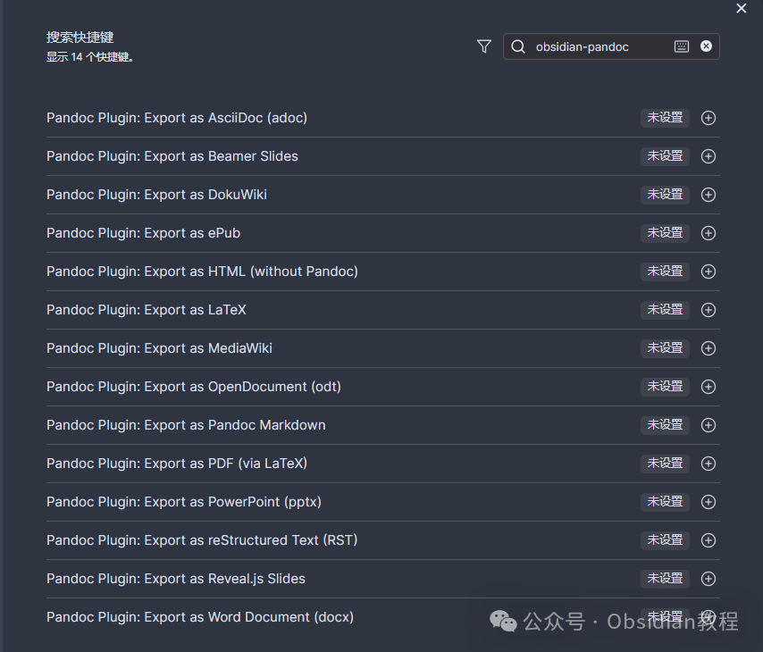
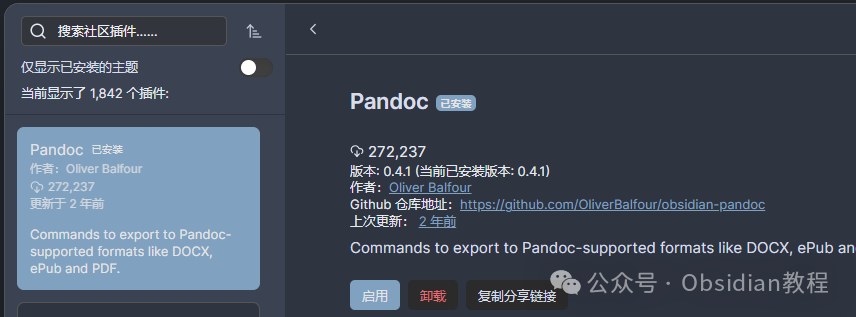
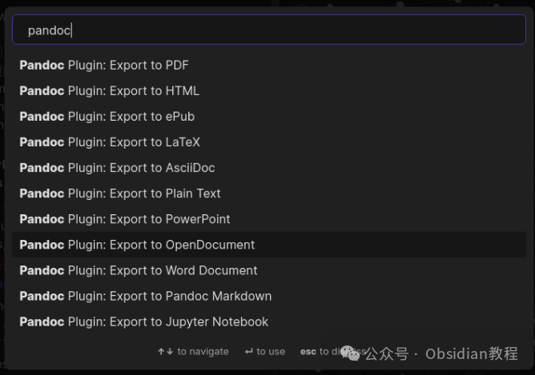

# 一键导出Word、PDF、PPT！Pandoc 提升Obsidian新高度！

今天咱们来聊聊 Obsidian 里的一个神奇插件——Pandoc Plugin。  
相信不少小伙伴都遇到过这种情况：用 Markdown 写了半天的笔记、报告或者书稿，结果最后还得费劲儿去找工具转成 Word、PDF 甚至是 PowerPoint。  

这时候，Pandoc Plugin 就能帮你把各种格式的问题一次性解决！  
首先，咱们来聊聊这个插件到底是干啥的。  
Pandoc Plugin 是 Obsidian 的一款导出插件，顾名思义，它依托于强大的 Pandoc 引擎，可以让你轻松地将 Markdown 笔记导出为各种格式，比如 Word 文档、PDF、ePub 电子书、HTML 网页、PowerPoint 幻灯片、LaTeX 文件，等等。  
你是不是已经开始脑补了各种应用场景？  
比如，你用 Markdown 写了一篇学术论文，最后直接导出成 LaTeX 文件；或者你在 Obsidian 里整理了一份书稿，想导出成 ePub 格式的电子书；再或者，你要给老板做个报告，直接用 Markdown 写好内容，然后生成一个炫酷的 PowerPoint。  
对，就是这么神奇！最关键的是，你可以全程留在 Obsidian 里，连窗口都不用切。  
不过呢，Pandoc Plugin 也不是完美的。这个插件目前还处在 Beta 阶段，也就是测试版本。  
说白了，可能在导出时会遇到一些小的格式问题，所以建议大家导出完了别急着发出去，最好先自己检查一遍，确保没有什么低级错误。毕竟，面子工程还是得做的。  

### **安装方法**

  
那么问题来了，这个插件怎么安装呢？  
其实安装过程相当简单，就算是技术小白也能轻松搞定。你可以在 Obsidian 社区插件里直接搜索并安装 Pandoc Plugin。  

### **离线安装：**  
很多同学无法直接在线安装obsidian插件，这里我已经把obsidian所有热门插件下载好了  
只需要关注下方公众号，后台回复：**插件** 即可获取

### 

### 

  

### **基本使用**

  
安装好之后，如何使用这个插件呢？  
其实也很简单。你只需要按下 Ctrl+P 或 Cmd+P 打开命令面板，然后搜索 "Pandoc"，选择你想导出的格式。  
  
假如你想把一个叫 Pandoc.md 的文件导出为 Word 文档，只需点击对应的选项，插件会提示你导出成功。  
然后你打开文件夹一看，一个叫 Pandoc.docx 的文件就躺在那里了，是不是很方便？  

### **使用场景**

  
这个插件的使用场景可谓广泛。比如：  

  * 学术研究：你可以用 Markdown 写论文，然后直接导出为 LaTeX 格式，这对于习惯用 LaTeX 的学术界朋友们来说简直是神器。
  * 写书：如果你是一个作家，Pandoc Plugin 可以让你用 Markdown 写书，然后导出成 ePub 或者 PDF 格式的电子书，再也不用担心格式问题了。
  * 制作演示文稿：写好内容后，直接生成 PowerPoint，让你的演示文稿更高效。
  * 网页制作：想用 Markdown 写网页内容？没问题，导出成 HTML 格式，轻松搞定。

###   

说到最后，Pandoc Plugin 真的是一个特别好用的工具，尤其适合那些习惯用 Markdown 记笔记、写文档的人。它的强大之处在于，你不用再为转换格式而烦恼，直接在 Obsidian 里就能完成各种导出操作，省时省力。  
虽然目前插件还在 Beta 阶段，有时可能会有些小毛病，但瑕不掩瑜，绝对值得一试。对于经常需要导出不同格式文档的小伙伴们，Pandoc Plugin 无疑是一个能大大提升效率的利器。  
就这样，推荐你试试看！  

# **Obsidian交流社群来了**

[**我们搞了一个专门分享笔记工具的社群：**](http://mp.weixin.qq.com/s?__biz=MzkyMDUyMDM2Mg==&mid=2247485997&idx=1&sn=9a528871be62e4c74a1df3807b28f2bd&chksm=c190d9e8f6e750fe9df7a333b666fdd8561fdeb928d1df1f367d2374742efa34727a3f91cbc0&scene=21#wechat_redirect)****[**玩转效率笔记**](http://mp.weixin.qq.com/s?__biz=MzkyMDUyMDM2Mg==&mid=2247485997&idx=1&sn=9a528871be62e4c74a1df3807b28f2bd&chksm=c190d9e8f6e750fe9df7a333b666fdd8561fdeb928d1df1f367d2374742efa34727a3f91cbc0&scene=21#wechat_redirect)，社群的主要内容包括**使用技巧、模板主题和插件** 等，帮助更多人提升效率，实现自我管理的目标。  
如果你对Notion、Obsidian有热情、对知识有渴望，这个社群绝对不容错过！
