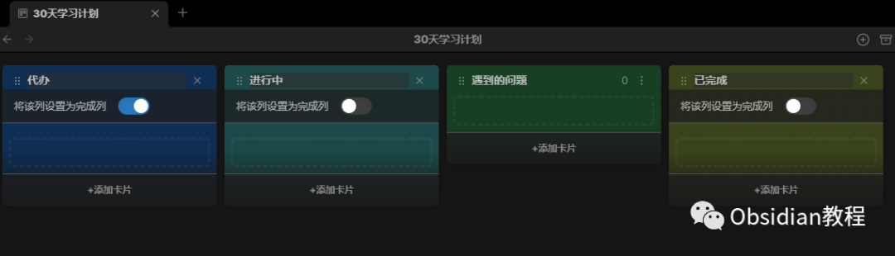
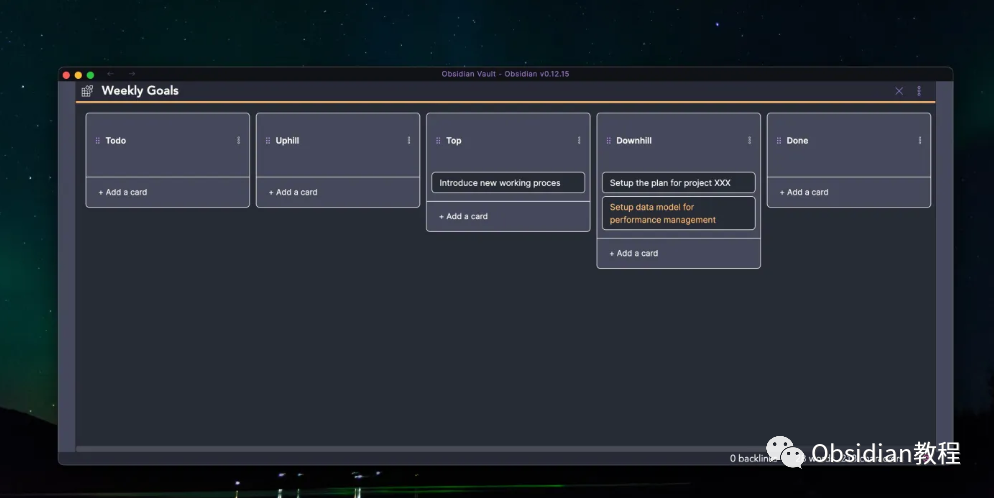

# 为Obsidian添加Kanban功能：管理任务和项目

### 点击下方公众号，回复关键字：**Obsidian** ，获取Obsidian资料合集。

Obsidian是一个非常受欢迎的知识管理和笔记工具，但原生的Obsidian并不支持Kanban板。不过，幸运的是，通过插件，我们可以轻松地为Obsidian添加Kanban功能。

1**Obsidian中的Kanban插件详细介绍** Kanban插件为Obsidian用户提供了一个简单而直观的方法来创建和管理Kanban看板。  
Kanban是一种流行的项目管理工具，可以帮助团队和个人跟踪任务和项目的进度。  
  
以下是Kanban插件的主要特点和功能：  

### **1\. 看板的创建与定制**

**  
**

  * 创建新的Kanban看板：你可以很容易地创建新的Kanban看板笔记。
  * 自定义列：默认情况下，你会得到“待办”、“进行中”和“已完成”三列，但你可以根据需要增加、删除或重命名列。

###   

### **  
**

### **2\. 任务卡片**

  

  * 添加、编辑和删除卡片：你可以在任何列添加新卡片，点击卡片编辑其内容，或删除不再需要的卡片。
  * 拖放功能：允许你轻松地在列之间移动卡片，从而改变任务的状态。
  * 标签和日期：你可以为卡片添加标签和到期日期，帮助你分类任务并跟踪即将到来的截止日期。

###   

### **3\. 其他功能**

  

  * 档案：完成的任务可以被移动到档案列，使看板保持清晰，同时保留所有已完成任务的记录。
  * 模板支持：可以为新任务设置预定义的模板，从而快速启动常见的任务格式。
  * 滤镜和排序：基于标题、内容、标签或日期对任务进行筛选或排序。
  * 任务链接：你可以在卡片内部链接到其他Obsidian笔记，使信息整合更加有组织。

###   

### **4\. 视觉定制和主题**

  

  * 插件支持Obsidian的暗黑模式和亮色模式。
  * 与Obsidian的其他主题完美集成，确保看板与你选择的界面风格相匹配。
  * 为看板、任务卡片和标签提供定制的CSS选项，以便你可以更深入地定制外观。

###   

Obsidian的Kanban插件为用户提供了一个完整的、集成的项目管理解决方案。无论你是想跟踪个人任务、写作项目还是团队合作，这个插件都能帮助你保持组织和高效。随着插件的持续更新和改进，它将继续提供更多的功能和工具来满足用户的需求。  

### 2**安装Kanban插件**   

确保你已经在你的计算机上安装了最新版本的Obsidian。  
安装Kanban插件  

  * 在同一个“插件”区域中，点击“社区插件”选项卡。
  * 在搜索框中输入“Kanban”。
  * 找到“Kanban”插件并点击“安装”。
  * 插件安装完成后，点击“启用”。

###  3**创建你的第一个Kanban板**   

  * 回到Obsidian的主界面。  

  * 在你希望的文件夹中，右键点击并选择“新建笔记”。
  * 为笔记命名，例如“我的任务看板”。

  
打开该笔记，点击右上角的三个点，并选择“将此笔记转换为Kanban板”。此时，你就可以看到一个基础的Kanban板，它默认有三个列：“待办”、“进行中”和“已完成”。  

### 4进阶功能

Kanban插件还支持许多其他功能，例如日期标记、标签、优先级等。你可以根据自己的需求，对看板进行更多的定制。  
现在，你已经成功地在Obsidian中添加了Kanban功能，并知道如何使用它来管理你的任务或项目。随着时间的推移，你会发现这个功能在提高生产力和组织任务方面是非常有用的。  
  
  
1点击下方公众号，回复关键字：**Obsidian** ，获取Obsidian资料合集。  

