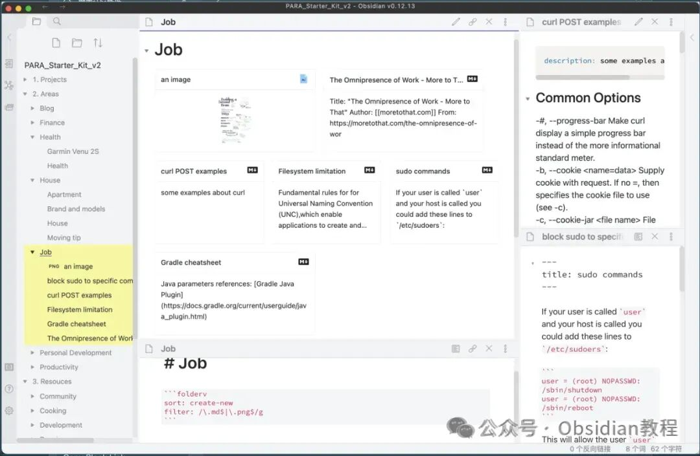
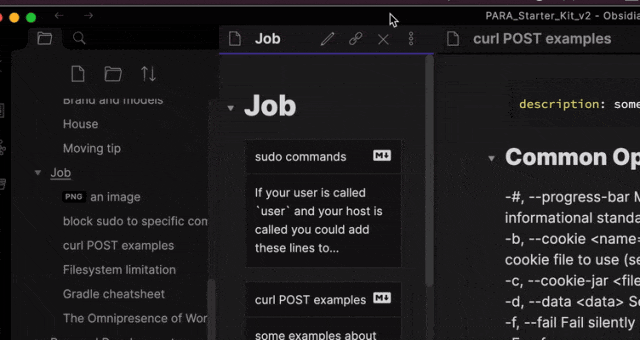
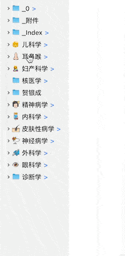
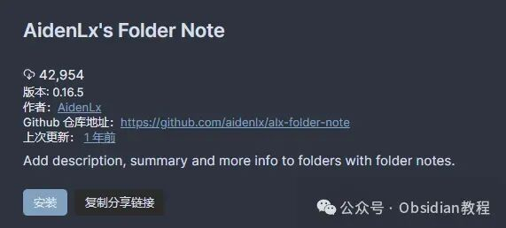

# 为文件夹增添智慧：Obsidian AidenLx插件的强大功能与应用

嗨，大家好，我是何老师。  
在日常使用 Obsidian 进行笔记管理时，大家或许都有过这样的体验：文件夹虽然能够帮助我们分门别类地整理笔记，但却无法直观呈现文件夹内的详细信息和关联内容。  
而 AidenLx 的文件夹笔记插件，正好解决了这一问题。通过为文件夹添加描述、摘要等功能，这款插件不仅提高了文件夹的实用性，还让整个笔记系统变得更加智能、高效。  
  

  

### **AidenLx 插件的核心特性**  
  

AidenLx 的文件夹笔记插件从根本上改善了文件夹与笔记的互动体验，让两者的联动变得更为紧密。插件允许用户为文件夹添加笔记、描述和摘要，这些额外的信息可以帮助我们快速回顾文件夹的用途、内容及相关背景，省去了打开多个文件查找信息的麻烦。  
更重要的是，AidenLx 插件通过增强文件资源管理器的功能，使得文件夹与笔记的操作更加一体化。  
  
插件的一大亮点就是其创建文件夹笔记的功能。用户可以轻松设置文件夹笔记，并选择多种模板来满足不同需求。  
  

  
文件夹笔记与文件夹本身之间的操作也是高度联动的，比如更改文件夹名称时，笔记会自动同步更新；移动文件夹时，文件夹笔记也会一并移动。这种无缝对接的体验让文件夹管理更加顺滑，真正实现了“文件夹即笔记”的理念。  

### **增强的文件管理体验  
  
**

不仅如此，AidenLx 插件还提供了一个可选的功能——文件夹概览。这个功能通过使用 folderv 代码块来生成文件夹的简要卡片视图，显示其中的文件信息。  
  
你可以使用前置元数据来定义文件的标题和描述，还支持按照指定的规则进行文件排序和过滤。这项功能对于那些需要时常整理和回顾项目进展的用户来说无疑是一大福音。  
  
更值得一提的是，插件引入了一个名为“文件夹焦点模式”的功能。用户只需在文件资源管理器中右键点击某个文件夹，选择“Toggle Focus”，便可以进入该文件夹的聚焦模式，屏蔽其他内容，从而更加专注于当前的文件夹操作。这对大型项目的管理或是某个特定文件夹的深度整理尤为实用。  
  
此外，AidenLx 还为文件夹图标提供了可定制的功能，用户可以根据自己的喜好或需求，在资源管理器中为每个文件夹设置不同的图标，进一步提升文件夹的识别性和管理效率。  
  

  
**安装与配置**  

### **  
**

安装 AidenLx 插件的过程并不复杂，分为在线安装和离线安装两种方式。 对于网络条件良好的用户，可以直接在 Obsidian 的设置页面中搜索并安装插件。具体步骤是：打开 Obsidian，点击左下角的设置按钮，进入“第三方插件”选项，点击“浏览”按钮后搜索“AidenLx”，然后安装并启用插件即可。  
  

  
然而，由于网络问题，一些用户可能无法通过在线方式安装插件。这时候，可以选择通过离线方式进行安装。你可以从一些平台或资源库中下载所需的插件包，然后将其手动导入 Obsidian 的插件目录中进行安装。插件的离线安装同样简单，适合那些无法访问 Obsidian 插件市场的用户。  
  
需要注意的是，AidenLx 插件的某些功能，如文件夹概览，需要额外安装依赖插件“folder-note-core”。从 v0.13.0 版本开始，文件夹概览功能成为了一个可选组件，用户可以自行选择是否安装和启用。  
  

### **很多同学无法直接在线安装obsidian插件，这里我已经把obsidian所有热门插件下载好了**  
只需要关注下方公众号，后台回复：**插件** 即可获取

### **使用场景与实际应用  
  
**

AidenLx 的文件夹笔记插件非常适合那些需要经常整理和分类大量笔记的用户。  
比如说，如果你正在进行某个长期的项目，这个插件能够帮助你为每个文件夹添加详细的描述和摘要，方便后续快速查找和回顾。  
你可以为每个文件夹设置不同的文件夹笔记，记录项目的进展、下一步计划，或者是关键的参考资料。每次打开文件夹时，相关的笔记信息都能一目了然。  
  
对于研究者或学生来说，AidenLx 插件也是一个高效的学习和资料管理工具。通过在文件夹笔记中添加课程笔记、阅读书单或研究项目的概要，你可以更加系统化地管理学习材料，提升整理和复习效率。特别是在面对大量文献或阅读资料时，这款插件能够帮助你快速整理和标记重要内容。  
如果你是 Obsidian 的资深用户，AidenLx 还能进一步优化你的笔记管理流程。它不仅在笔记的管理上提供了更多的灵活性，也极大地提升了文件夹的操作体验，让你的 Obsidian 界面更加简洁有序。  

### **总结  
  
**

总的来说，AidenLx 的文件夹笔记插件是一款能够为 Obsidian 用户带来极大便利的插件，它将文件夹与笔记紧密结合，通过增强的文件管理和信息组织能力，使得用户在使用 Obsidian 处理大量笔记时更加得心应手。不管是日常的笔记管理，还是复杂项目的整理，这个插件都能帮助你更加高效地完成任务。  
  

# **Obsidian交流社群来了**

[**我们搞了一个专门分享Obsidian的交流社群：****玩转效率笔记****社群的主要内容包括使用技巧、模板主题和插件等，** 帮助更多人提升效率，实现自我管理的目标。](http://mp.weixin.qq.com/s?__biz=MzkyMDUyMDM2Mg==&mid=2247485997&idx=1&sn=9a528871be62e4c74a1df3807b28f2bd&chksm=c190d9e8f6e750fe9df7a333b666fdd8561fdeb928d1df1f367d2374742efa34727a3f91cbc0&scene=21#wechat_redirect)

  
如果你对Obsidian有热情，这个社群绝对不容错过！
