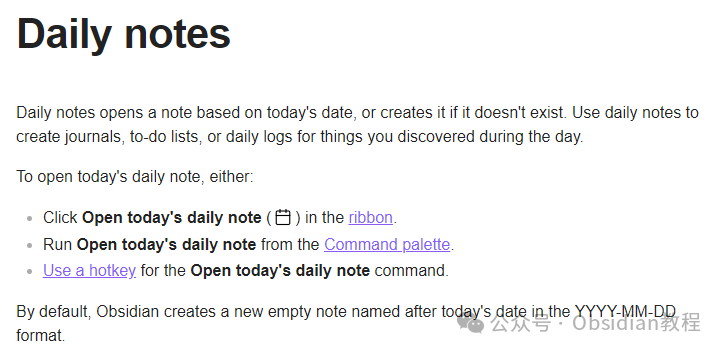
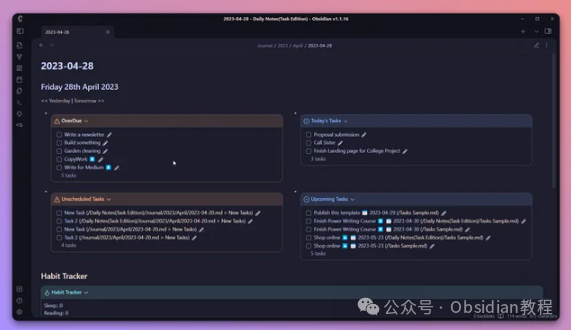
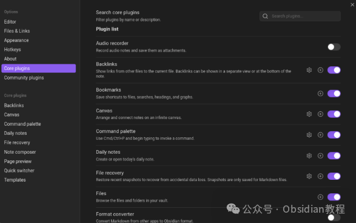

# 为日常事务列一个清单：Obsidian Daily notes插件详解

嗨，大家好，我是何老师。  
我作为一个程序员，整天都在和代码打交道，面临的不是“bug”就是“优化”。不过，我发现在这种紧张忙碌的节奏中，很多时候我都没时间去停下来好好记录一下我的工作进度和心情变化。

于是，最近我发现了一个挺有意思的工具——**Daily Notes** ，它完全改变了我记录日常事务的方式。今天就来和大家聊聊这个插件以及我个人的一些使用感受。  

### 为什么需要“Daily Notes”？

我们程序员常常面对海量的任务和信息，有时感觉自己就像是无数个线条交织的网络中游走的节点，每个任务都是一个没有终点的循环。以前，我总是把“记笔记”这件事当成不紧急的任务，心想：“今天太忙，先不记了，明天再说。”

然而，不知不觉中，我发现自己有时候已经记不清昨天的工作内容了，更别提做总结或复盘了。尤其是当涉及到一些细节或重要决策时，记笔记显得尤其重要。

于是，我开始寻找一个能让我有效记录每天工作的工具。**Daily Notes** 插件恰好满足了我的需求。这个插件会在每天自动生成一篇笔记，你可以用它来记录当天的任务清单、遇到的技术难题、或者简单的心情感悟。对于我来说，它不仅是工作上的备忘录，更像是一个能让我放松、整理思绪的小角落。

### “Daily Notes”插件的优势

**自动生成每日笔记**  
最吸引我的是这个插件的自动化功能。你只需要安装插件，设置好模板，接下来每天打开Obsidian时，它会自动为你生成一个新的日记文件。

这个文件里包含当天的日期，格式非常简洁，一切都已经准备好，你只需要填充内容即可。对于我这种喜欢省事的人来说，自动化带来的便利感真的是无法用言语表达。

**可定制化模板**  
Daily Notes不仅仅是一个简单的文本记录工具，它还支持模板功能。你可以自定义模板，添加常用的标签、字段甚至代码块。

对于程序员来说，这点尤为重要。比如，我在模板中加入了“今日任务”、“解决方案”和“遇到的问题”这几个部分。每当我完成一项任务后，我就可以在相应的地方记录下进展和解决方法，第二天回顾时就能轻松地看到昨天的工作重点。

更重要的是，这种习惯能帮我提高工作效率，因为我可以迅速回溯问题，而不需要浪费时间去重新梳理思路。

**日常任务与日志的记录**  
“Daily Notes”不仅仅可以记录工作上的细节，它还非常适合做个人日志。我开始用它来记录每天的心情、感悟，甚至一些突发的灵感。

比如，当我突然想到某个可能用到的技术点时，我可以快速地把它记录下来，避免在忙碌中遗忘。写一些轻松的内容，不仅能帮助我放松心情，还能提高我对待工作的自信心，因为每当我回顾过去的工作时，都会发现自己成长了不少。

**回顾与反思**  
说实话，我以前总是对“复盘”这件事很排斥，觉得它太过繁琐，没什么实际意义。但是自从使用Daily Notes之后，我才意识到回顾和反思有多重要。

通过回顾每天的笔记，我能够清晰地看到自己每天都做了些什么，哪些是值得表扬的地方，哪些又是值得改进的。我常常会通过复盘自己的笔记，发现之前的疏漏，也能更清晰地规划接下来的任务。

再者，这种反思不仅局限于工作内容，有时我也会记录一些对自己心态的思考。比如，在面对挑战时，我是如何应对的，什么策略比较有效，哪些方法让我感到不舒服。长期积累下去，这些笔记不仅成为了我的知识库，还帮助我积累了个人成长的轨迹。

### 让我来告诉你如何用Daily Notes做得更好

作为一个程序员，我发现Daily Notes不仅是记录日常工作的一种好方式，它也能让我更好地管理复杂的工作流程。这里有几个小技巧，或许能帮助你更高效地使用Daily Notes：

**将待办事项清单放入Daily Notes**  
很多人都会在每天的开始写一份待办事项清单。而Obsidian里的Daily Notes插件，让我能够随时追踪今天的任务和进度。在笔记的开头，我通常会列出当天的目标清单和时间安排，这样做能让我在忙碌的工作中保持清晰的思路。完成一项任务后，我会划掉对应的项，给自己一些成就感。这样一来，任务管理变得更加高效，工作也更有条理。

**添加代码段和参考资料**  
由于我是程序员，我每天都需要处理大量的代码，偶尔还会遇到一些难题。这个时候，Daily Notes就成了一个极好的知识记录本。在遇到问题时，我会将相关的代码段或者解决方案直接记录到当日的笔记里。如果有类似问题出现，我就可以直接打开笔记查看，避免重新搜索，节省了很多时间。

**使用标签功能**  
我还喜欢给笔记加上一些标签，这样在未来回顾时能更容易找到相关内容。比如我会为每天的任务添加标签，如“#bug修复”、“#优化”、“#学习”，通过标签，我可以快速定位到我曾经处理过的具体问题或学习过的知识点。这使得我的笔记库变得井井有条。

**日常心情记录**  
除了工作任务，记录心情也是Daily Notes一个非常好的功能。我发现，很多时候我的工作效率与心情有着密切关系。比如，当我心情不好时，效率就会显著降低，遇到问题也会感到烦躁。通过记录每天的心情，我能够识别出自己情绪波动的规律，避免不必要的情绪干扰，更专注地完成工作。

### 最后的感悟

通过使用Obsidian的**Daily Notes** 插件，我的工作和生活变得更加有条理。我不仅能够高效地完成每日的任务，还能通过记录和反思，提升自己在工作中的表现。这种简单、直接的记录方式，不仅让我提升了工作效率，还帮助我在日常工作中找到了一些乐趣。也许每个人的工作方式都不同，但我觉得，使用Daily Notes插件，不管是程序员还是其他职业的人，都能从中受益。

说实话，有了Daily Notes之后，我觉得自己已经不再是那个经常丢三落四的程序员了。现在每天的工作都变得更加有计划，心情也更加愉快。希望大家也能试试看这个插件，说不定它也能帮你提高工作效率，找到更多的乐趣呢！

# **Obsidian交流社群来了**

[**我们搞了一个专门分享Obsidian的交流社群：****玩转效率笔记****社群的主要内容包括使用技巧、模板主题和插件等，** 帮助更多人提升效率，实现自我管理的目标。](http://mp.weixin.qq.com/s?__biz=MzkyMDUyMDM2Mg==&mid=2247485997&idx=1&sn=9a528871be62e4c74a1df3807b28f2bd&chksm=c190d9e8f6e750fe9df7a333b666fdd8561fdeb928d1df1f367d2374742efa34727a3f91cbc0&scene=21#wechat_redirect)

  
如果你对Obsidian有热情，这个社群绝对不容错过！
