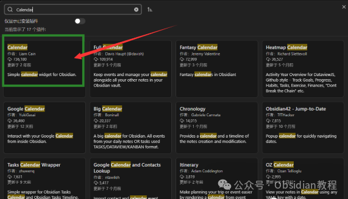
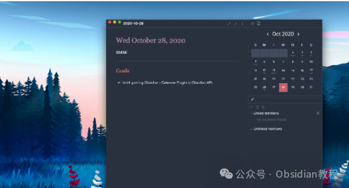
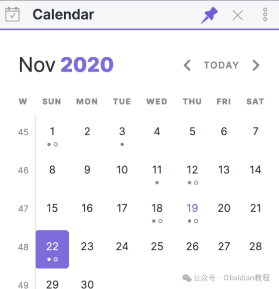

# 使你的笔记管理更直观：Obsidian Calendar插件使用详解

Obsidian 作为一款以知识管理为核心的工具，凭借其灵活的插件生态，迅速在知识工作者中获得了高度认可。

其中，备受推崇的 Calendar 插件为 Obsidian 增添了强大的日期和日历功能，使得与日期相关的笔记管理变得更加直观和高效。本文将详细介绍 Calendar 插件的功能、使用场景以及其在知识管理中所发挥的重要作用。

### 一、Calendar 插件的核心功能

Calendar 插件围绕日期管理提供了诸多实用功能，主要包括日历视图、与已有笔记的链接、日期文件命名、快捷键支持以及与其他插件的集成。这些功能使得用户在管理基于日期的笔记时更加得心应手，具体如下：

#### 1\. 日历视图

Calendar 插件为 Obsidian 提供了一个便捷的月视图日历。用户可以在侧边栏清晰地看到整个月的日期，从而方便地查看、创建或回顾特定日期的笔记。

  * **点击创建或打开笔记** ：在日历上点击某个日期，用户可以直接打开与该日期相关的笔记。如果该日期还没有关联的笔记，点击后会自动创建一个新笔记。对于那些习惯每天记录或回顾生活、工作或会议内容的用户来说，这一功能极大地简化了笔记创建的步骤，帮助他们更高效地管理日常事项。

#### 2\. 与已有笔记的链接

Calendar 插件提供了“已有笔记提醒”功能，使用户能够一眼看到哪些日期已有笔记记录。当某个日期有对应的笔记时，日历上会以不同的颜色或样式加以区分，这样用户可以一目了然地分辨出已记录的日期。

这种视觉上的提示对于日常计划、日记以及会议记录等内容尤为有用，不仅便于查看，还能帮助用户追踪和回顾重要信息。

#### 3\. 日期文件命名

Calendar 插件提供了自定义日期命名的选项。用户可以按照自己的喜好设置日期格式，比如“2023-08-28”或“August 28, 2023”。这种灵活的设置方式便于用户以自己熟悉的格式管理文件，从而实现更加清晰和有条理的笔记管理。

#### 4\. 快捷键支持

为了提升操作效率，Calendar 插件支持一系列快捷键。用户可以通过快捷键快速在日历中切换日期，比如跳转到上一个月、下一个月，或直接跳转到今天的日期。对于需要频繁查看和记录日期内容的用户来说，快捷键功能让操作变得更加简便，大大节省了时间。

#### 5\. 与其他插件的集成

Calendar 插件支持与 Obsidian 中的其他插件进行集成。举例来说，很多用户会同时使用任务管理插件，此时 Calendar 插件可以在日历上显示任务的截止日期或事件，从而实现日期与任务的直观结合。

这种集成功能极大地提升了用户的时间管理体验，帮助用户轻松管理工作安排和任务进度。

很多同学无法在线下载该插件，这里已经把安装包准备好了，点击下方公众号，回复”**插件** “，即可获取安装包

### 二、Calendar 插件的实际使用场景

凭借丰富的功能，Calendar 插件适用于多种知识管理和时间管理场景，不论是个人用户还是团队用户都能从中受益。以下是几种典型的使用场景：

#### 1\. 日记和日常记录

对于喜欢每天记录生活点滴、工作动态或个人成长的用户来说，Calendar 插件为他们提供了极为方便的日记管理方式。

用户可以通过日历上的日期进入或创建对应的日记笔记，而不必繁琐地创建单独的文件夹或手动管理多个文件。同时，月视图日历可以帮助用户快速查看已记录的日期，轻松实现日常记录和回顾，让日记管理更为系统化。

#### 2\. 计划和目标管理

Calendar 插件不仅适合日常记录，对于需要进行计划和目标管理的用户来说也是一款得力工具。用户可以通过日历视图来规划未来的任务和活动，将工作安排与生活安排直观地显示在日历上。

特别是配合任务管理插件的集成功能，用户可以在日历上标记任务的开始时间和截止时间，从而一目了然地掌握自己的任务优先级和完成情况，提高时间管理和目标达成的效率。

#### 3\. 会议和事件记录

对于企业和团队用户来说，Calendar 插件在记录会议和事件方面表现出色。通过 Calendar 插件，用户可以在特定日期创建会议笔记或事件笔记，以确保所有会议内容都可以通过日历方便地追溯。

尤其对于需要频繁参加会议的管理者来说，Calendar 插件帮助他们有效地管理会议安排，避免遗忘重要内容，并且方便对过往会议进行系统的回顾和总结。

### 三、Calendar 插件的优势

#### 1\. 直观易用的界面

Calendar 插件的界面设计直观，用户可以轻松上手操作。在 Obsidian 的侧边栏嵌入一个月视图日历，用户可以随时浏览和管理每日笔记，避免了手动查找和创建笔记的繁琐操作。这种直观的设计不仅提升了用户体验，还使得日常的知识管理和时间管理更加便捷。

#### 2\. 多功能集成，提升工作效率

Calendar 插件的集成功能非常丰富，特别是与任务管理插件的配合使用，能够将日历与任务管理合二为一，实现高效的时间和任务管理。

用户可以直接在日历上查看任务的截止日期或完成情况，方便地掌握工作进展。这种多功能集成不仅适合需要高效时间管理的个人用户，对于需要跟踪任务进展的团队成员来说也具有极大的便利性。

#### 3\. 高度自定义的功能设置

Calendar 插件允许用户根据需求进行高度自定义，比如日期格式、快捷键、日期链接样式等，用户可以按照自己的操作习惯对插件进行个性化设置。

特别是对于工作流程复杂的用户，插件的高度自定义选项可以帮助他们量身定制管理方式，提高工作和知识管理的便捷性。

### 总结

作为 Obsidian 插件生态的一部分，Calendar 插件为 Obsidian 用户提供了便捷的日期和日历管理功能。

它的月视图、已有笔记链接提示、灵活的文件命名、自定义快捷键和多功能插件集成，使其在知识管理和时间管理方面展现出独特的优势。无论是个人用户还是团队用户，都能从中获益。

对个人用户而言，Calendar 插件可以帮助他们更好地记录和管理每日笔记，使日常生活和工作更加有条理；对于团队用户来说，这款插件能够帮助团队成员更好地管理和跟踪会议记录与任务进度，从而提升协作效率。

总之，Calendar 插件不仅为用户带来了更直观的日期管理方式，也为日常的知识管理和计划安排提供了更多可能性。

********

****-END****-****

  

**ok，今天先说到这，如果你想更深入的了解Obsidian，现在只要购买我们的《Obsidian实操案例课》，便可免费加入「玩转效率笔记」社群，与一群人交流效率提升的经验，实现自我管理的目标。** 如果你对Obsidian有热情，这个课程绝对不容错过！
