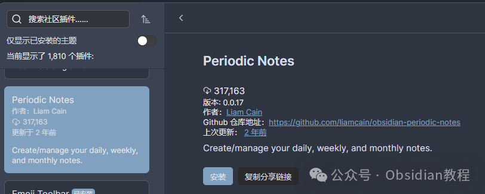
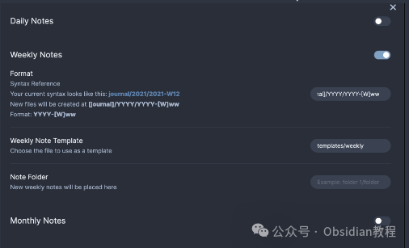

# 告别杂乱笔记！Periodic Notes插件让你的Obsidian更高效

今天咱们聊聊Obsidian的一个超实用插件——Periodic Notes。作为一个每天都要写点东西的笔记狂魔，我发现单纯的每日笔记有时候不够用，周笔记和月笔记才是真正的救星。  
今天咱们就深入聊聊这个插件，看看它是如何让我们的笔记系统更上一层楼的。  

### **Periodic Notes 插件介绍**

  
Periodic Notes 插件拓展了每日笔记的概念，新增了每周和每月笔记功能。这意味着你可以更好地管理和回顾一周或一个月的工作、生活。  
每周和每月的笔记不仅让你的记录更系统，还能帮助你更好地规划未来的任务和目标。  

### **每周笔记功能**

####   

#### **主要命令**

**  
**

  * **Open Weekly Note** ：打开当前周的笔记。如果还没有创建过，会自动为你创建一个。
  * **Next Weekly Note** ：跳转到下一周的笔记。如果中间有周没有笔记文件，会自动跳过。
  * **Previous Weekly Note** ：跳转到上一周的笔记。如果中间有周没有笔记文件，也会自动跳过。

> **注意** ：这些命令只有在当前聚焦的笔记是周笔记时才可用。

####   

#### **与Calendar插件的集成**

  
如果你在使用Calendar插件并启用了“Week numbers”功能，那么Calendar会自动使用你的周笔记设置，提供无缝的体验。  

#### **迁移**

  
如果你之前用Calendar插件管理周笔记，不用担心，设置会自动迁移到Periodic Notes，Calendar插件仍会像以前一样工作。  

#### **每周设置**

**  
**

  * **Folder** ：设置周笔记存放的文件夹，可以与每日笔记相同或不同。默认存放在你的笔记库根目录。
  * **Template** ：配置周笔记的模板。周笔记有不同于每日笔记的模板标签，详见支持的周笔记模板标签列表。
  * **Format** ：设置周笔记文件名的日期格式。默认是`gggg-[W]ww`。如果在周格式中使用`DD`，则表示一周的第一天（根据你的设置是周日或周一）。

####   

#### **每周模板标签**

**  
**

  * **title** ：与每日笔记的`{{title}}`相同，插入笔记的标题。
  * **date, time** ：与每日笔记的`{{date}}`和`{{time}}`相同，插入一周第一天的日期和时间。适用于创建标题（如`# {{date:gggg [Week] ww}}`）。
  * **sunday, monday, tuesday, wednesday, thursday, friday, saturday** ：由于周标签指向主要日期，你可以像这样引用单独的日期`{{sunday:YYYY-MM-DD}}`来自动插入该特定日期。

###   

### **每月笔记功能**

####   

#### **主要命令**

**  
**

  * **Open Monthly Note** ：打开当前月的笔记。如果还没有创建过，会自动为你创建一个。
  * **Next Monthly Note** ：跳转到下一个月的笔记。如果中间有月没有笔记文件，会自动跳过。
  * **Previous Monthly Note** ：跳转到上一个月的笔记。如果中间有月没有笔记文件，也会自动跳过。

> **注意** ：这些命令只有在当前聚焦的笔记是月笔记时才可用。

####   

#### **每月设置**

**  
**

  * **Folder** ：设置月笔记存放的文件夹，可以与每日笔记相同或不同。默认存放在你的笔记库根目录。
  * **Template** ：配置月笔记的模板。月笔记有不同于每日笔记的模板标签，详见支持的月笔记模板标签列表。
  * **Format** ：设置月笔记文件名的日期格式。默认是`YYYY-MM`。如果在周格式中使用`DD`，则表示一周的第一天（根据你的设置是周日或周一）。

####   

#### **每月模板标签**

  

  * **title** ：与每日笔记的`{{title}}`相同，插入笔记的标题。
  * **date, time** ：与每日笔记的`{{date}}`和`{{time}}`相同，插入一周第一天的日期和时间。适用于创建标题（如`# {{date:MMM YYYY}}`）。

###   

虽然说了这么多，还是要教大家如何下载和安装这个神器。  
**1.在线安装**  
如何安装 Obsidian 插件，通常可以通过以下步骤进行安装：  

  1. 打开 Obsidian 的设置页面。
  2. 导航到“社区插件”部分。
  3. 点击“浏览”按钮，搜索“Periodic Notes”。
  4. 找到插件后，点击“安装”按钮。
  5. 安装完成后，返回插件列表，启用该插件。

### 

**  
****2.离线安装：****  
****很多同学无法直接在线安装obsidian插件，这里我已经把obsidian所有热门插件下载好了**  
只需要关注下方公众号，后台回复：**插件** 即可获取

### 

### **  
**

### **FAQ**

**  
****如何在文件夹路径中使用变量？**  
如果你希望新的每日笔记显示在`Journal/2021/`文件夹中，可以在“Format”字段中包含该文件夹。例如：
      
      * 
    
    
    
    Journal/{{date:YYYY}}/

**为什么周笔记标题的周数是错的？**  
根据你使用的语言环境和操作系统，可能采用的是ISO周（每年的第一周从该年的第一个星期四开始）或年份周（每年的第一周从该年的第一天开始）。Obsidian Periodic Notes默认使用年份周（`ww`），但你可以通过使用`WW`改为ISO周。  
如果你也和我一样，每天都需要写点东西，强烈推荐你试试这个插件，绝对会让你的笔记管理事半功倍。  

> **对obsidian感兴趣的同学，可以链接我微信：hls404 拉你进入“obsidian交流社群”。**

  
**热门推荐**  
**  
**

  * [Obsidian插件Checklist ：告别任务混乱，管理笔记任务更高效！](http://mp.weixin.qq.com/s?__biz=MzkyMDUyMDM2Mg==&mid=2247485918&idx=1&sn=01d5a599debc683af26537c24d89cd13&chksm=c190da1bf6e7530d2f52a94b57e3853be7dc4b607474180870eef6bef32370ccd053b949dd5a&scene=21#wechat_redirect)

  * [Obsidian神级插件：Natural Language Dates ，助你高效管理笔记!](http://mp.weixin.qq.com/s?__biz=MzkyMDUyMDM2Mg==&mid=2247485907&idx=1&sn=ab5a21e4c9b9b0329309b5757615e988&chksm=c190da16f6e753009c66ae6da91b7d7ba7c6310ab8f1cb002c17e85d5382ff422548a3181816&scene=21#wechat_redirect)

  * [Obsidian插件：Make.md为你量身打造一个完美的个人系统。](http://mp.weixin.qq.com/s?__biz=MzkyMDUyMDM2Mg==&mid=2247485896&idx=1&sn=a13c9fcd01a0693dafef7a6edce5de8f&chksm=c190da0df6e7531b4890c7b581bf793c4255ea4183c567405b920a407f802ff338b1e86cbb3c&scene=21#wechat_redirect)  

